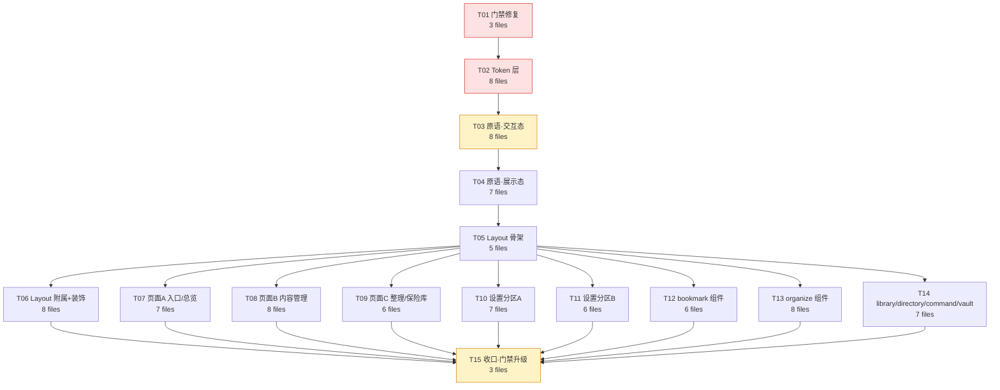

# TagNest 全站 UI 设计系统审计与规范

> 阶段：只读审计 + 规范设计（未修改任何 `src/` 文件）
> 审计范围：`src/` 下 85 个非测试 `.tsx` / `.css` 文件（17 页面 + 14 设置分区 + 10 UI 原语 + 7 功能组件目录 + 3 样式表），以及 `extension/` 调色板镜像、`tools/eslint/`、`scripts/`
> 证据格式：`文件路径:行号`，编号 `C/T/S/R/I/N/B/D/A/G-xx` 供第三部分任务引用
> 度量方式：静态扫描（全量字符串字面量，含 `cx()` 参数与模块级常量）+ WCAG 2.x 对比度实算（oklch→sRGB→相对亮度）+ 实跑 `npx eslint src`

---

## 摘要：三个必须先知道的结论

| # | 结论 | 影响 |
|---|---|---|
| **1** | **`tagnest/no-magic-tokens` 门禁当前实际输出 0 条警告，形同不存在。** 实跑 `npx eslint src` → 151 个文件、0 条消息。规则的 `classFragments()` 只解析 `className="字面量"` 与 `` className={`模板`} ``，遇到 `className={cx(...)}`（`CallExpression`）直接返回空数组（规则第 58 行注释明确写了"not parsed deeply"）。而**全部 10 个 `ui/` 原语 + 40 个文件里的 103 处条件类名**都走 `cx()` —— 恰恰是设计系统最需要约束的地方。用探针文件验证：同样的 token 写成字面量触发 4 条警告，写成 `cx()` 触发 0 条。 | 设计系统失去唯一的自动化护栏。任何后续重构都无法用门禁验收，违规会持续回流。 |
| **2** | **`theme.css:59-75` 定义的语义字号阶梯（`text-display/h1/h2/h3/body/caption`）采用率为 0。** 全仓 `.tsx` 中这 6 个 token 出现 **0 次**；实际使用的是 `text-2xs`(208) / `text-xs`(130) / `text-sm`(112) / `text-panel`(12)。同一份文件里存在两套互不相通的排版体系。 | "统一字体层级"若只改页面类名而不先决定用哪套阶梯，等于把混乱换个写法。 |
| **3** | **`--color-focus` token 已定义（`theme.css:159`）但组件层零消费。** 组件各自手写 `ring-brand/25`、`ring-brand/30`、`ring-brand/40` 三种焦点环，实算对比度 **1.47 ~ 2.00**，全部低于 WCAG 2.2 SC 1.4.11 要求的 3:1。同时 **28 个含交互元素的文件完全没有 `focus-visible`**（`SuggestionReview` 12 个交互元素、`CategoryView` 8 个、`Sidebar` 5 个）。 | 键盘用户实际上看不到焦点位置。这是本次审计中唯一的"功能性缺陷"而非"审美不一致"。 |

---

# 第一部分：现状审计

## 维度 0 · 治理与门禁（G）

> 这一维度不在原始要求里，但它是其余 9 个维度能否被守住的前提，故置于首位。

### G-01 ESLint 规则对 `cx()` 完全失明（阻断级）

**证据链：**

- `tools/eslint/no-magic-tokens.js:46-62` — `classFragments()` 只处理三种节点：
  ```js
  if (valueNode.type === 'Literal' && typeof valueNode.value === 'string') return [valueNode.value];
  if (valueNode.type === 'JSXExpressionContainer') {
    const expr = valueNode.expression;
    if (expr.type === 'TemplateLiteral') { return expr.quasis.map(...) }
    // Conditional / member expressions: not parsed deeply to avoid false positives.
    return [];          // <-- cx(...) 走到这里，返回空数组
  }
  ```
- `tools/eslint/no-magic-tokens.js:101-112` — 唯一的 visitor 是 `JSXAttribute`，且只把 `node.value` 交给 `classFragments`。
- 实跑结果：`npx eslint src -f json` → `files: 151, total messages: 0, byRule: {}`。
- 探针验证（临时文件，已删除）：
  ```tsx
  export const A = () => <div className="bg-surface/85 text-[10px] p-[13px] rounded-[7px]" />;  // → 4 warnings
  export const B = () => <div className={cx('bg-surface/85', 'text-[10px]', 'rounded-[7px]')} />; // → 0 warnings
  ```
- 项目实际写法统计（非测试 `.tsx`，`grep -o` 计数）：

  | 写法 | 出现次数 | 规则能否看见 |
  |---|---|---|
  | `className="字面量"` | **1576** | ✅ 能 |
  | `className={cx(...)}` | **103**（分布在 **40** 个文件） | ❌ 不能 |
  | `` className={`模板`} `` | **5** | ⚠️ 只看见 `quasis` 静态段，插值段丢失 |

  关键在于**这 103 处的位置**：`src/components/ui/` 下 **10 个原语全部使用 `cx()`**（Button / IconButton / Card / Display / Field / Menu / Modal / PageHeader / RemoteImage / Toast），加上 `BookmarkCard` / `CategoryView` / `SuggestionReview` / `Sidebar` / `AppLayout` / `CommandPalette` / `DirectoryView` 等核心组件。也就是说：**设计系统的"变体表"（`VARIANT` / `SIZE` / `CONTROL_BASE` 等模块级常量）100% 落在规则盲区里**，而规则能看见的 1576 处字面量大多是页面里的一次性布局类名。

**忠实重放规则逻辑后的量化：**

| 项 | 数量 |
|---|---|
| 规则**本意**应捕获的违规 token | **6** |
| 规则**实际**捕获 | **0** |
| 被 `backdrop-blur` 兄弟 token 豁免（设计如此） | 28 |
| 被 `eslint-disable` 注释豁免 | 1（`MobileTabBar.tsx:38`） |
| **门禁失明率** | **100%** |

规则本意应捕获却漏掉的 6 条：

```
src/components/bookmark/BookmarkCard.tsx:410  magicValue   rounded-[5px]        （在 cx() 内）
src/components/ui/Field.tsx:275               magicValue   rounded-[5px]        （在 cx() 内）
src/components/ui/Field.tsx:230               magicValue   bg-[length:14px]     （在 cx() 内）
src/components/ui/Field.tsx:230               magicValue   bg-[right_0.6rem_center]（在 cx() 内）
src/pages/OrganizePage.tsx:277                semiSurface  bg-surface/85        （在 cx() 内）
src/components/layout/MobileTabBar.tsx:39     semiSurface  bg-surface/95        （字面量，但被 :38 的 disable 豁免）
```

### G-02 规则的 `SEMI_SURFACE` 只覆盖 `bg-surface/`，其余 21 个半透明家族全是盲区

`tools/eslint/no-magic-tokens.js:26`：
```js
const SEMI_SURFACE = /^bg-surface\//;
```

全仓半透明 token 实测 **112 处 / 22 个家族**，按家族分布（规则只认第一行）：

> 复现：`grep -rnoE "\b(bg|text|border|ring|from|to|via|shadow|divide)-[a-z0-9-]+/[0-9]{1,3}\b" src --include=*.tsx | grep -v "\.test\." | sed 's/.*://' | sed -E 's#/[0-9]+$##' | sort | uniq -c | sort -rn`

| 家族 | 处数 | 规则覆盖 | 代表位置 |
|---|---|---|---|
| `bg-surface/NN` | **31** | ✅（其中 28 被 blur 豁免、1 被 disable 豁免、1 是注释文本 → 净 0） | `settings/Card.tsx:14` |
| `bg-brand-soft/NN` | 13 | ❌ | `BookmarkCard.tsx:493` |
| `bg-sunken/NN` | 9 | ❌ | `DirectoryView.tsx:292` |
| `border-line/NN` | 8 | ❌ | `Sidebar.tsx:377` |
| `ring-brand/NN` | 7 | ❌ | `BookmarkCard.tsx:414` |
| `border-brand/NN` | 7 | ❌ | `BookmarkCard.tsx:412` |
| `bg-brand/NN` | 7 | ❌ | `AiMetricsPanel.tsx:162` |
| `text-white/NN` | 6 | ❌ | `AuthPage.tsx:115` |
| `border-critical/NN` | 3 | ❌ | `BookmarkEditor.tsx:109` |
| `border-caution/NN` | 3 | ❌ | `SuggestionReview.tsx:496` |
| `bg-black/NN` | 3 | ❌ | `BookmarkCard.tsx:578` |
| `bg-white/NN` | 2 | ❌ | `DashboardPage.tsx:190` |
| `bg-rose-400/NN` | 2 | ❌ | `AiMetricsPanel.tsx:108` |
| `bg-amber-300/NN` | 2 | ❌ | `AiMetricsPanel.tsx:109` |
| `bg-brand-accent/NN` | 2 | ❌ | `AppLayout.tsx:65` |
| 其余 7 个家族 | 各 1 | ❌ | `ring-white` `ring-critical` `ring-black` `border-white` `border-brand-soft` `bg-surface-hover` `bg-glass-canvas` |
| **合计** | **112** | **规则可见 31，净报出 0** | |

### G-03 `check-theme-consistency.mjs` 对 light / dark 两套主主题空转

`scripts/check-theme-consistency.mjs:57`：
```js
const blocks = css.split(/\[data-theme='([^']+)'\]\s*\{/g);
```

该正则只能匹配**单一属性选择器**开头的块。而 SPA 的两套主主题写法是：

- `theme.css:174` → `:root {`（light）— **不匹配**
- `theme.css:249-250` → `[data-theme='dark'],\n.dark {`（dark，复合选择器 + 换行）— **不匹配**（正则要求 `'dark']` 后紧跟 `\s*{`，实际中间有 `,\n.dark`）

结果：脚本只校验 `aurora` / `blossom` / `starlight` 三套备选主题，**用户 99% 时间所处的 light/dark 完全不在校验范围内**。

**这个盲区里藏着真实的漂移（G-04）。**

### G-04 扩展（extension）的 light/dark 是琥珀色系，SPA 是靛蓝色系

| Token | SPA `src/styles/theme.css` | 扩展 `extension/popup/popup.css` | 是否一致 |
|---|---|---|---|
| light `brand` | `:200-201` `#4F46E5` / `oklch(0.511 0.230 **277**)` 靛蓝 | `:15` `oklch(0.63 0.15 **62**)` 琥珀 | ❌ 色相差 215° |
| light `canvas` | `:176-177` `#F8FAFC` / `oklch(0.984 0.003 **247.9**)` 冷板岩 | `:3` `oklch(0.985 0.003 **85**)` 暖白 | ❌ |
| light `ink` | `:185-186` `#0F172A` / `oklch(0.208 0.040 265.8)` | `:8` `oklch(0.24 0.012 **65**)` | ❌ |
| dark `brand` | `:276-277` `#818CF8` / `oklch(0.680 0.158 **276.9**)` | `:60` `oklch(0.755 0.145 **68**)` | ❌ |
| dark `canvas` | `:252-253` `#0B1120` / `oklch(0.180 0.032 266.6)` | `:48` `oklch(0.175 0.006 **70**)` | ❌ |
| `aurora` / `blossom` / `starlight` | `:331` / `:403` / `:475` | `:85` / `:114` / `:143` | ✅（脚本能看到的这三套确实一致） |

扩展 popup 停留在旧的"暖白 + 琥珀金"设计语言，SPA 已迁移到"冷板岩 + 靛蓝"。`popup.css:2` 的注释仍写着 `mirrors src/styles/theme.css → p-*`，但已不成立。

### G-05 `themes.ts` 的主题选择器色板与实际渲染值漂移

`src/lib/themes.ts:27-70` 的 `swatch` 字段（设置 → 外观里给用户看的预览色块）：

| 主题 | `themes.ts` swatch | `theme.css` 实际值 | 偏差 |
|---|---|---|---|
| light | `:33` `canvas:#fbf8f2`（暖白）`accent:#d98324`（琥珀） | `:176` `#F8FAFC`（冷白）`:200` `#4F46E5`（靛蓝） | 色相完全不符 |
| dark | `:54` `canvas:#22262e` `accent:#d8a34c`（琥珀金） | `:252` `#0B1120` `:276` `#818CF8`（靛蓝） | 色相完全不符 |
| aurora | `:61` `accent:#4fd0c7` | `:355` `#4eccd3` | 接近，可接受 |
| blossom | `:47` `accent:#e88aa4` | `:427` `#d36a96` | 明显偏浅 |
| starlight | `:40` `accent:#e8b34b` | `:499` `#d09945` | 明显偏亮 |

`hint` 文案同样过期：`:52` dark 写"暗色 · **琥珀金**辨识"，实际是靛蓝。用户在设置里看到的预览与切换后的真实界面不是同一套配色。

### G-06 `--spacing` 基数只在注释里存在，未实际声明

`theme.css:13` 注释写 `--spacing -> the base unit for p-*, gap-*, m-*, w-*, h-*`，但 `@theme` 块（`:16-167`）内**没有 `--spacing` 声明**，实际沿用 Tailwind 默认 `0.25rem`。间距节奏因此没有任何可被引用/校验的单一来源（详见 S-01）。

---

## 维度 1 · 配色（C）

### C-01 硬编码 hex 调色板绕过语义层（42 个 hex 值 / 8 个文件 / 30 行）

> 复现：`grep -rnoE "#[0-9A-Fa-f]{3,8}\b" src --include=*.tsx | grep -v "\.test\." | wc -l` → **42**（按值计）；按行计（排除 `href=` / `url(` / `id="`）→ **30**；涉及文件 → **8**：`DashboardPage` `BookmarkCard` `CartoonMascot` `decor/index` `Atmosphere` `AuthPage` `AppLayout` `AppearanceSection`。
> 其中 **2 处属合法**：`AppLayout.tsx:56,58` 的 `#000` 是 `mask-image` 的不透明端（CSS 遮罩语义要求，非配色）；`AppearanceSection.tsx:33` 的 `#00000033` 是主题色板的描边（应改为 `--color-line`，见 T10）。**真正需要治理的是 40 处。**

| 位置 | 内容 | 问题 |
|---|---|---|
| `DashboardPage.tsx:22` | `const TILE = ['#6366f1','#8b5cf6','#ec4899','#06b6d4','#14b8a6','#f59e0b','#f97316','#ef4444']` | 8 个磁贴底色硬编码，不随主题切换；在 `:133`/`:187`/`:339` 上叠 `text-white` |
| `DashboardPage.tsx:325,327,328` | `{ color: '#14b8a6' }` / `'#f59e0b'` / `'#ef4444'` | 健康度语义色硬编码，本应用 `--color-positive/caution/critical` |
| `BookmarkCard.tsx:69-79` | 11 个 hex（`#8b5cf6` `#3b82f6` `#06b6d4` …） | 与 `Display.tsx:71` 的 `TAG_HUES = [62,145,205,262,320,18,95,240]`（oklch 色相）是**两套并行的标签配色实现** |
| `CartoonMascot.tsx:32,36,127,129` | `PASTEL = ['#ff6b81',...]`、`fill="#4a3b32"` | 装饰组件，可豁免但需登记 |
| `decor/index.tsx:44` | `color = '#ffd43b'` | 默认参数硬编码 |
| `Atmosphere.tsx:46-47` | `readColor('--color-brand', '#6366f1')` | fallback 值硬编码（可接受，但 `#6366f1` ≠ 当前 `--p-brand` `#4F46E5`） |
| `AuthPage.tsx:104` | `color-mix(..., var(--color-canvas) 55%, #0b0f1a)` | 渐变终点硬编码深色 |
| `AppearanceSection.tsx:33` | `borderColor: t.family === 'dark' ? '#00000033' : undefined` | 主题色板描边硬编码，应走 `--color-line`；且用 `family === 'dark'` 做分支，新增主题时静默失效 |
| `AppLayout.tsx:56,58` | `maskImage: 'radial-gradient(... #000 40%, transparent 100%)'` | **合法豁免** —— CSS `mask-image` 的 alpha 通道语义要求不透明色，与配色无关。需在门禁里登记为白名单 |

**`TILE` 白字对比度实算（图标磁贴，WCAG 非文本 3:1 门槛）：**

| hex | 白字对比度 | 判定 |
|---|---|---|
| `#6366f1` | 4.47 | ✅ |
| `#8b5cf6` | 4.23 | ✅ |
| `#ef4444` | 3.76 | ✅ |
| `#ec4899` | 3.53 | ✅ |
| `#f97316` | 2.80 | ❌ |
| `#14b8a6` | 2.49 | ❌ |
| `#06b6d4` | 2.43 | ❌ |
| `#f59e0b` | 2.15 | ❌ |

8 个磁贴中 **4 个白字不达标**（`DashboardPage.tsx:133`、`:187`、`:339` 三处消费点）。

### C-02 直接使用 Tailwind 原始调色板，绕过语义 token

`AiMetricsPanel.tsx`：
```
:108  { key: 'rejected', value: outcome.rejected, className: 'bg-rose-400/70' },
:109  { key: 'pending',  value: outcome.pending,  className: 'bg-amber-300/70' },
:114  <span className="... bg-rose-400/70 ..." />已拒绝
:115  <span className="... bg-amber-300/70 ..." />待确认
```
同一组件的 `:107`/`:113` 用的是 `bg-brand`（语义 token）。"已拒绝"本应 `bg-critical`、"待确认"本应 `bg-caution`。这 4 处是**全仓唯一**的原始调色板用法，且 `rose-400/70` 在 light 下合成色为 `#fc9caa`，与 `--color-critical` `#DC2626` 视觉语义强度完全不同。

### C-03 tone 文字色 `-ink` 后缀使用不一致（对比度风险）

`theme.css` 为每个 tone 提供两档：base（`--color-critical`）与 ink（`--color-critical-ink`，更深，用于文字）。实算 light 主题：

| 组合 | 对比度 | AA 正文(4.5) | 用途 |
|---|---|---|---|
| `critical-ink` on `critical-soft` | 8.20 | ✅ | Badge（`Display.tsx:18`） |
| `critical` on `critical-soft` | 3.95 | ❌ | — |
| `critical` on `surface` | 4.83 | ✅ | `IconButton.tsx:12` danger |
| `caution-ink` on `caution-soft` | 8.15 | ✅ | Badge |
| **`caution` on `caution-soft`** | **2.86** | ❌ | — |
| **`caution` on `surface`** | **3.19** | ❌ | `Toast.tsx:57` 图标（非文本，3:1 → ✅） |
| `positive-ink` on `positive-soft` | 8.30 | ✅ | Badge |
| `positive` on `positive-soft` | 3.00 | ❌ | — |
| `positive` on `surface` | 3.30 | ❌（文本）/ ✅（图标） | `Toast.tsx:56` |

**问题在于 base 与 ink 的选择没有规则，逐处凭手感：**

用 base（`text-critical` / `text-caution` / `text-positive`）承载**文本**的位置：
```
HealthPanel.tsx:195   <span className="text-critical"> · {deadCount} 失效</span>
HealthPanel.tsx:196   <span className="text-caution"> · {suspiciousCount} 存疑</span>
HealthPanel.tsx:231   <li className="text-2xs text-positive">这批书签都能正常访问。</li>
HealthPanel.tsx:101,103,104  ? 'text-positive' : ? 'text-caution' : 'text-critical'   （数值文本）
ImportPage.tsx:271    <span className="text-critical">失败 {n}</span>
SuggestionReview.tsx:496  <span className="... text-2xs text-caution">
BookmarkEditor.tsx:109    <div className="... bg-critical-soft ... text-critical">   ← soft 底 + base 字 = 3.95 ❌
Field.tsx:35          <span className="ml-0.5 text-critical" aria-hidden>*</span>
```

用 ink 的（正确）：`Display.tsx:16-18`、`RunPanel.tsx:406-407`、`JobsSection.tsx:24-25`、`AiSection.tsx:97-222`、`AuthPage.tsx:166`、`LibraryPage.tsx:446`、`SharePage.tsx:160`、`ShareTargetPage.tsx:94`…

**同一个 `HealthPanel.tsx` 内部就同时存在两种写法**：`:195-196` 用 base，`:231` 用 base，而 `RunPanel.tsx:197,221,230` 全用 ink。

### C-04 `text-white` / `bg-white` / `bg-black` 硬编码（25 个 token / 23 行 / 7 个文件）

> 复现：`grep -rnoE "\b(text|bg|border|ring|from|via|to|divide|shadow|outline|decoration|fill|stroke)-(white|black)\b" src --include=*.tsx | grep -v "\.test\." | wc -l` → **25**。涉及文件：`AuthPage` `DashboardPage` `BookmarkCard` `Button` `CategoryView` `Modal` `Sidebar`。

| 位置 | 内容 |
|---|---|
| `AuthPage.tsx:111,115,116,119,125,126,135,136,138,140` | 左侧品牌面板全套 `text-white` / `text-white/70` / `/80` / `/50` / `/30` / `bg-white/10` / `ring-white/15` / `border-white/15` |
| `DashboardPage.tsx:133,187,190,339` | `text-white`（磁贴图标）、`bg-white/90`（状态点） |
| `BookmarkCard.tsx:155,578,630` | `text-white`、`bg-black/50 text-white` |
| `Button.tsx:24` | `danger: 'btn-ripple bg-critical text-white ...'` ← **原语层**用了 `text-white` 而非 `--color-on-brand` 语义 |
| `CategoryView.tsx:743` | `'bg-critical text-white'` |
| `Modal.tsx:140` / `Sidebar.tsx:607` | `bg-black/45` / `bg-black/35` 遮罩 |

`AuthPage` 的白色系是**合理的特例**（该面板在 light/dark 下都是深色渐变底，`:104`），但对比度需校验：

| token | 合成色 | 对比度 | 判定 |
|---|---|---|---|
| `text-white/80` | `#cecfd1` | 12.27 | ✅ |
| `text-white/70` | `#b6b7ba` | 9.54 | ✅ |
| `text-white/50` | `#85878d` | 5.33 | ✅ |
| **`text-white/30`** | `#54575f` | **2.65** | ❌（`AuthPage.tsx:140` 的 `/` 分隔符） |

`Button.tsx:24` 的 `text-white` 是真正的问题：`--color-on-brand` 在 light 下是 `#FFFFFF`（`:208`），但在 dark 下是 `#0B1120`（`:284`）。danger 按钮写死 `text-white`，在 dark 主题下 `bg-critical` `#EF4444` 配白字对比度 3.76（勉强），而语义上应该走 `on-brand` 或专门的 `on-critical`。

### C-05 半透明 surface 滥用（112 处，其中 2 处真实代码无 blur 支撑）

> 复现：`grep -rnoE "\b(bg|text|border|ring|from|to|via|shadow|divide)-[a-z0-9-]+/[0-9]{1,3}\b" src --include=*.tsx | grep -v "\.test\." | wc -l` → **112**。其中 `bg-surface/NN` **31** 处，其余家族 **81** 处。

规则的设计意图（`no-magic-tokens.js:80-81`）：*"cards should use solid bg-surface; reserve opacity for glass overlays only"*，并用 `backdrop-blur` 兄弟 token 作为"这是合法玻璃"的判据（`:43,107`）。

实测 `bg-surface/NN` 共 **31** 处，其中 **28** 处同行有 `backdrop-blur`（合法玻璃），**3** 处没有 —— 但这 3 处里有 1 处是注释：

```
MobileTabBar.tsx:21   注释文本 "Solid bg-surface/95 instead of .glass"   ← 非代码，不计
MobileTabBar.tsx:39   bg-surface/95 shadow-float        ← 真实代码，无 blur；:21 注释解释
                                                            "backdrop-filter forces the compositing layer"，
                                                            :38 有 eslint-disable，属有意的性能决策
OrganizePage.tsx:277  'border-brand/30 bg-surface/85'   ← 真实代码，在 cx() 内；blur 在 :275 的
                                                            另一个 cx 参数里（规则按 fragment 判定 → 漏判）
```

即：**真实代码里只有 2 处无同行 blur**，且两处都有正当理由（性能 / blur 在兄弟参数）。这说明 `bg-surface/NN` 家族本身治理得不错 —— 问题在规则的判定粒度（应按整个 `className` 拼接后判定，见 T01 改动 4）。

真正的问题是**规则管不到的另外 81 处**（G-02），它们没有"必须是玻璃"的约束：

```
bg-brand-soft/30   BookmarkCard.tsx:493,549,560,566 · DashboardPage.tsx:418
bg-brand-soft/35   AppearanceSection.tsx:26
bg-brand-soft/40   OnboardingCard.tsx:55
bg-brand-soft/50   AppLayout.tsx:62 · NotFoundPage.tsx:12
bg-brand-soft/60   DashboardPage.tsx:40
bg-brand-soft/70   BookmarkEditor.tsx:184 · CommandPalette.tsx:307 · Menu.tsx:162
bg-sunken/40       EvaluationPanel.tsx:131 · HealthPanel.tsx:131,173 · ReportPage.tsx:304 · SharesSection.tsx:407
bg-sunken/50       PrivateVaultPage.tsx:530
bg-sunken/60       DirectoryView.tsx:292 · CategoryView.tsx:885,979
bg-surface-hover/40 TagsPage.tsx:276
bg-glass-canvas/85 CategoryView.tsx:280
```

**同一视觉意图（"凹陷的次级容器"）出现了 40 / 50 / 60 三种透明度**，且分布在 9 个文件里，彼此无法对齐。

### C-06 `--p-*` 原始层被组件级 CSS 直接消费（53 处）

架构约定是两层：`--p-*`（主题原始调色板，随 `[data-theme]` 切换）→ `--color-*`（`@theme` 语义层，生成 Tailwind 工具类）。`theme.css:117-159` 完成了这个映射。

但 `CategoryView.css` **绕过语义层直接读原始层**，53 处：
```
CategoryView.css:12,13,14,15,24,25,40,53,54,69,70,78,87,88,105,106,111,132,133,140,
                 150,151,157,179,180,181,185,186,187,191,192,193,207,232,233,234,240,
                 245,246,247,267,268,269,273,274,275,279,280,281,326,327,337,339
```
例：`:69` `background: var(--p-surface);` 应为 `var(--color-surface)`。

后果：若将来在 `@theme` 层对某个语义 token 做加工（如 `--color-surface` 加纹理/混色），`CategoryView` 不会跟随。这也是 `CategoryView` 与其他页面"看起来像两个产品"的技术根因之一。

`atelier.css` 与 `index.css` 则**正确地**只用 `--color-*`（`atelier.css:283,290,293,374,382,386,397,417,428,429,433,434,435,445,455,461,462`；`index.css:9,20,21,31,40,41,83,93,146,153,156,170,181,182,186,193`）。

---

## 维度 2 · 字体层级（T）

### T-01 语义字号阶梯采用率 0%（阻断级）

`theme.css:59-75` 定义了完整的六级语义阶梯，注释写明意图：
```css
/* ---- Semantic type scale (UI Design System v2) -------------------
 * Single-source-of-truth aliases for the six intended tiers. Pages
 * adopt these instead of ad-hoc text-* sizes so headings stay on one
 * consistent ladder: display > h1 > h2 > h3 > body > caption.
 */
--text-display: 1.75rem;   /* 28 — empty-state / hero (rare)   */
--text-h1: 1.375rem;       /* 22 — page title (one per page)   */
--text-h2: 1.0625rem;      /* 17 — section title               */
--text-h3: 0.9375rem;      /* 15 — card title                  */
--text-body: 0.9375rem;    /* 15 — default body copy           */
--text-caption: 0.75rem;   /* 12 — caption / count / tag       */
```

**全仓 `.tsx` 中 `text-display` / `text-h1` / `text-h2` / `text-h3` / `text-body` / `text-caption` 出现次数：0。**

实际使用分布（非测试 `.tsx`）：

| 工具类 | 次数 | 对应 px |
|---|---|---|
| `text-2xs` | 208 | 11 |
| `text-xs` | 130 | 12 |
| `text-sm` | 112 | 13 |
| `text-panel` | 12 | 15.2 |
| `text-lg` | 11 | 18 |
| `text-base` | 8 | 15 |
| `text-2xl` | 4 | 32 |
| `text-xl` | 2 | 24 |
| `text-3xl` | 2 | 40 |

即：项目实际运行的是 `theme.css:26-44` 的**旧十级阶梯**（`2xs…2xl` + display 家族 `3xl/4xl/5xl`），而 `:59-75` 的**新六级语义阶梯是死代码**。两套阶梯的 px 值还不重合：

| 语义阶梯 | px | 旧阶梯最接近值 | 是否重合 |
|---|---|---|---|
| `display` 28 | 28 | 无（`2xl`=32） | ❌ |
| `h1` 22 | 22 | 无（`lg`=18 / `xl`=24） | ❌ |
| `h2` 17 | 17 | 无（`panel`=15.2 / `lg`=18） | ❌ |
| `h3` 15 | 15 | `base`=15 | ✅ |
| `body` 15 | 15 | `base`=15 | ✅ |
| `caption` 12 | 12 | `xs`=12 | ✅ |

**这是本次重构必须先做的决策**：是启用语义阶梯（则 462 处 `text-*` 需重新映射，且 `display`/`h1`/`h2` 三级会改变现有像素），还是删除语义阶梯、把旧阶梯文档化为正式规范（零像素变动）。第二部分给出推荐方案。

### T-02 面板标题三套写法并存

同一个视觉角色（"卡片/区块标题"）有三种实现：

**A. `font-display text-panel font-semibold tracking-tight text-ink`（12 处，最规范）**
```
settings/Card.tsx:15        OrganizePage.tsx:285       FeedsPage.tsx:97,136
ImportPage.tsx:132          AiMetricsPanel.tsx:75,150  AutoGroupPanel.tsx:36
CategoryExportPanel.tsx:90  EvaluationPanel.tsx:60     HealthPanel.tsx:95
RunPanel.tsx:96
```

**B. `font-display text-sm font-semibold tracking-tight text-ink`（4 处，字号小一档）**
```
TaxonomyPanel.tsx:80,156,192,267
PrivateVaultPage.tsx:485
TimelinePage.tsx:90   （font-bold 而非 semibold）
```

**C. `text-sm font-semibold text-ink`（24 处，无 display 字体、无 tracking）**
```
ui/Card.tsx:64（CardHeader 原语！）   CategoryView.tsx:444,564,716,810,972
ImportPage.tsx:158,180,210,244,363    Display.tsx:360（QueryErrorState，text-lg）
SharePage.tsx:150（h1 + text-lg）     ErrorBoundary.tsx:71（h1 + text-lg）
```

**关键问题：`ui/Card.tsx:64` 的 `CardHeader` 原语本身用的是 C 套**，而 `settings/Card.tsx:15` 用的是 A 套。两个"卡片标题"原语视觉不一致，导致 14 个设置分区（走 A）与其他所有卡片（走 C）标题字号/字体不同。

### T-03 `<h1>` 层级混乱

| 位置 | 标签 | 类名 | 问题 |
|---|---|---|---|
| `PageHeader.tsx:63` | `h1` | `atelier-display atelier-display--3` | ✅ 规范来源 |
| `CategoryView.tsx:391` | `h1` | `atelier-display atelier-display--3` | ⚠️ LibraryPage 同时渲染 `PageHeader`(`:368`) 与 `CategoryView` → **同页双 h1** |
| `DashboardPage.tsx:49` | `h1` | `atelier-display atelier-display--1` | ⚠️ 未走 PageHeader，自建标题 |
| `AuthPage.tsx:116` | `h1` | `atelier-display--1 text-white` | ✅（独立布局） |
| `AuthPage.tsx:157` | `h2` | `atelier-display--3` | ⚠️ 同页 h1 在左栏、h2 在右栏，DOM 顺序上 h2 先出现于主内容 |
| `NotFoundPage.tsx:18` | `h1` | `atelier-display--1` | ✅ |
| `SettingsPage.tsx:60` | `h1` | `atelier-display--3` | ✅ |
| `TabGroupsPage.tsx:227` | `h1` | `atelier-display--3` | ⚠️ 在右栏详情内，左栏 `:61` 是 `h2.nav-section` → h2 先于 h1 |
| **`ErrorBoundary.tsx:71`** | `h1` | `text-lg font-semibold` | ❌ 完全脱离 display 体系 |
| **`SharePage.tsx:150`** | `h1` | `text-lg font-semibold tracking-tight` | ❌ 同上 |
| **`ShareTargetPage.tsx:77`** | `h1` | `text-xl font-semibold tracking-tight` | ❌ 同上，且字号与 SharePage 不同 |
| `PrivateVaultPage.tsx:260` | `h2` | `atelier-display text-lg` | ⚠️ `atelier-display` 无 `--N` 修饰符，字号靠 `text-lg` 覆盖 |
| `Modal.tsx:167` | `h2` | `atelier-display truncate text-xl` | ⚠️ 同上模式 |
| `Display.tsx:316` | `h3` | `atelier-display atelier-display--3` | ⚠️ EmptyState 标题用 h3，但常作为页面唯一标题出现 |
| `Display.tsx:360` | `h3` | `text-lg font-semibold` | ❌ QueryErrorState 与 EmptyState（`:316`）是姊妹组件，标题体系却不同 |
| `OnboardingCard.tsx:57` | `h2` | `text-base font-extrabold` | ❌ 全仓 4 处 `font-extrabold` 之一 |
| `DashboardPage.tsx:206` | `h2` | `text-base font-extrabold` | ❌ 同上 |
| `BookmarkCard.tsx:595` | `h3` | `font-bold leading-snug` | ❌ 无字号类，继承父级 |
| `BookmarkCard.tsx:668` | `h3` | `font-semibold leading-snug` | ❌ 同上，且与 `:595` 字重不同（同一组件的两种视图） |
| `BookmarkCard.tsx:518` | `h3` | `text-sm text-ink` | ❌ 无字重类，靠 `index.css:44-51` 的 `h3{font-weight:600}` 兜底 |
| `DirectoryView.tsx:405` | `h4` | `text-2xs font-semibold` | ⚠️ 11px 的 h4 |
| `AliasSuggestions.tsx:127` | `h4` | `text-2xs font-semibold` | ⚠️ 同上 |

`index.css:44-51` 对 `h1-h4` 统一设了 `font-weight:600; letter-spacing:-0.011em`，但组件层又叠加 `font-bold`(14处) / `font-extrabold`(4处) / `font-medium`(93处) 覆盖，导致同一标签层级出现 4 种字重。

### T-04 eyebrow（眉标）两套实现

**A. `atelier-eyebrow` 类（`atelier.css:78-95`，含 `::before` 装饰性短横线）**
- 消费点：`PageHeader.tsx:58`、`AuthPage.tsx:115`

**B. 手写 `text-2xs font-medium uppercase tracking-wide text-ink-faint`（7 处）**
```
BulkActionBar.tsx:228        text-2xs font-medium uppercase tracking-wide text-ink-faint
TagPicker.tsx:102            text-2xs font-medium uppercase tracking-wide text-ink-faint
TagsPage.tsx:488             text-2xs font-medium uppercase tracking-wide text-ink-faint
SimilarBookmarks.tsx:30      text-2xs font-semibold uppercase tracking-wide text-ink-faint  ← semibold
CategoryPrivateBookmarkEditor.tsx:176  text-2xs font-semibold uppercase tracking-wide text-brand-ink ← 不同色
DirectoryView.tsx:349        <h3> text-xs font-semibold uppercase tracking-wider text-ink-soft ← xs/wider/soft
CategoryView.tsx:920         <h3> text-xs font-semibold uppercase tracking-wider text-ink-soft ← 同上
```

7 处手写 eyebrow 里出现了 `font-medium`/`font-semibold` × `tracking-wide`/`tracking-wider` × `text-2xs`/`text-xs` × `ink-faint`/`ink-soft`/`brand-ink` = **6 种组合**。

`atelier-eyebrow`（`atelier.css:78-87`）的实际值是 `font-mono` + `0.6875rem` + `letter-spacing:0.22em` + `uppercase` + `--color-ink-faint`，与手写版的 `font-sans` + `tracking-wide`(0.025em) 差异显著（字距差 8.8 倍）。

### T-05 `nav-section` 与 eyebrow 角色重叠

`atelier.css:411-418` 的 `.nav-section`：`font-mono` + `0.75rem` + `font-weight:700` + `letter-spacing:0.28em` + `uppercase` + `--color-ink-soft`。
消费点：`Sidebar.tsx:200`、`TabGroupsPage.tsx:61`。

它与 `.atelier-eyebrow`（`:78`）是同一视觉角色（等宽大写小标签）的两个实现，字号 12 vs 11、字距 0.28em vs 0.22em、颜色 ink-soft vs ink-faint、字重 700 vs 500，全部不同。

### T-06 `font-display` 与 `atelier-display` 职责不清

- `atelier.css:34-43` `.atelier-display` = `font-family: var(--font-display)` + `font-weight:700` + `letter-spacing:-0.035em` + 流体字号 `--display-1/2/3`
- Tailwind 的 `font-display` 工具类 = 仅 `font-family: var(--font-display)`

混用模式：
```
PageHeader.tsx:63       atelier-display atelier-display--3            （完整）
settings/Card.tsx:15    font-display text-panel font-semibold tracking-tight  （拼装）
Modal.tsx:167           atelier-display truncate text-xl              （拼装：atelier-display 但用 text-xl 覆盖字号）
PrivateVaultPage.tsx:260 atelier-display text-lg                      （同上）
Display.tsx:316         atelier-display atelier-display--3            （完整）
```
`atelier-display` 已含 `font-weight:700`，但 `settings/Card.tsx:15` 用 `font-display` + `font-semibold`(600)，`Modal.tsx:167` 用 `atelier-display`(700) → 同为"标题"，字重 600/700 不一致。

---

## 维度 3 · 间距节奏（S）

### S-01 无 4px 基数约束，档位爆炸

`--spacing` 未声明（G-06），沿用 Tailwind 默认 `0.25rem`。实际使用：

**`gap-*` 14 档：**
| 值 | 次数 | px | | 值 | 次数 | px |
|---|---|---|---|---|---|---|
| `gap-2` | 141 | 8 | | `gap-3.5` | 17 | 14 |
| `gap-3` | 109 | 12 | | `gap-6` | 10 | 24 |
| `gap-1.5` | 74 | 6 | | `gap-5` | 4 | 20 |
| `gap-1` | 70 | 4 | | `gap-8` | 2 | 32 |
| `gap-2.5` | 35 | 10 | | `gap-7` | 1 | 28 |
| `gap-4` | 29 | 16 | | `gap-12` | 1 | 48 |
| `gap-0.5` | 24 | 2 | | `gap-10` | 1 | 40 |

**`p-*` / `px-*` / `py-*` 40+ 档**（前 20）：
`px-3`(48) `py-2`(37) `px-4`(33) `px-2`(30) `py-0.5`(23) `px-1`(21) `py-3`(20) `py-2.5`(19) `px-2.5`(19) `p-5`(17) `px-1.5`(15) `p-3`(15) `p-1`(14) `py-1.5`(12) `py-1`(11) `p-3.5`(11) `px-6`(9) `px-3.5`(9) `p-4`(9) `py-3.5`(8) …

**同类容器内边距不一致的实证：**

| 视觉角色 | 出现的值 | 位置 |
|---|---|---|
| 卡片内边距 | `p-5` | `settings/Card.tsx:14` |
| | `p-4` | `ui/Card.tsx:83`（CardBody `px-4 py-4`） |
| | `p-3` | `CategoryView.tsx:344,438,559`（`.cat-section p-3`） |
| | `p-5` + `sm:p-6` | `PrivateVaultPage.tsx:254` |
| | `p-6` + `sm:p-9` | `DashboardPage.tsx:38` |
| | `px-4 py-3.5` | `AiMetricsPanel.tsx:147` |
| 区块间距 | `gap-6` | `DashboardPage.tsx:414`、`FeedsPage.tsx:87`、`ImportPage.tsx:66`、`SettingsPage.tsx:57`、`TimelinePage.tsx:48` |
| | `gap-4` | `CollectionDetail.tsx:83,106`、`CollectionsPage.tsx:44`、`OrganizePage.tsx:136`、`PrivateVaultPage.tsx:144`、`ReportPage.tsx:51`、`TagsPage.tsx:95` |
| | `gap-3` | `ImportPage.tsx:179`、`TimelinePage.tsx:58,84` |
| 列表项内边距 | `px-3 py-2.5` | `DashboardPage.tsx:248` |
| | `px-3 py-2` | `TimelinePage.tsx:103`、`TabGroupsPage.tsx:60` |
| | `px-2 py-2` | `TagsPage.tsx:275` |
| | `px-2.5 py-2` | `TabGroupsPage.tsx:100` |
| | `px-4 py-3` | `TabGroupsPage.tsx:221`、`ui/Card.tsx:59`（CardHeader） |

**"卡片"这一角色有 6 种内边距，"区块间距"有 3 种，"列表项"有 5 种。**

### S-02 页面容器宽度 5 套

| 模式 | 页面 | 证据 |
|---|---|---|
| `max-w-7xl`（80rem） | DashboardPage | `:414` `relative mx-auto flex max-w-7xl flex-col gap-6 pb-14 pt-2` |
| `max-w-4xl`（56rem）+ 双栏 | SettingsPage | `:57` `mx-auto flex max-w-4xl flex-col gap-6 lg:flex-row lg:gap-10` |
| `max-w-3xl`（48rem） | FeedsPage `:87`、ImportPage `:66`、TimelinePage `:48` | `mx-auto flex max-w-3xl flex-col gap-6` |
| **无 `max-w`**（撑满 AppLayout 的 `max-w-7xl`） | LibraryPage、TagsPage `:95`、CollectionsPage `:44`、OrganizePage `:136`、ReportPage `:51`、CollectionDetail `:83`、TabGroupsPage、PrivateVaultPage `:144` | `flex flex-col gap-4` |
| `max-w-sm` / `max-w-md`（居中窄栏） | AuthPage `:148-149`、SharePage `:144`、ShareTargetPage `:72-73`、NotFoundPage `:10` | 独立布局 |

同时 `AppLayout.tsx:95` 已给 `<main>` 设了 `mx-auto w-full max-w-7xl px-3 pb-24 pt-3 sm:px-5 md:pb-8 md:pt-5 xl:px-8 xl:pt-6`。

**冲突点：** DashboardPage 在 `<main max-w-7xl>` 内又套一层 `mx-auto max-w-7xl`（`:414`）——冗余但无害；而 SettingsPage 套 `max-w-4xl`、FeedsPage 套 `max-w-3xl`，导致**从 Dashboard 走到 Settings 再到 Feeds，内容宽度跳变三次**（1280 → 896 → 768），且左右留白随之突变。

页面外层 padding 也不一致：`TimelinePage.tsx:48` 自带 `px-4 pb-16 pt-2`，与 `AppLayout` 的 `px-3 sm:px-5 xl:px-8` **叠加**，移动端实际左右 padding = 12 + 16 = 28px，而其他页面是 12px。

### S-03 控件高度阶梯无规范

`h-*` 分布：`h-7`(23) `h-9`(22) `h-6`(21) `h-16`(12) `h-14`(8) `h-12`(8) `h-8`(7) `h-11`(7) `h-10`(3)

原语已定义阶梯：
- `Button.tsx:29-31` → `sm:h-8` / `md:h-9` / `lg:h-11`
- `IconButton.tsx:16-18` → `sm:h-7 w-7` / `md:h-9 w-9` / `lg:h-11 w-11`
- `Field.tsx:82-84` → `sm:h-8` / `md:h-9` / `lg:h-11`

**但 `Button` 的 sm 是 h-8，`IconButton` 的 sm 是 h-7** —— 同名 size 不同高度，并排时错位 4px。

原语外的手写高度：
```
h-10（3 处）    ← 不在任何阶梯内
h-12 w-12       DashboardPage.tsx:133,339（磁贴图标）
h-14 w-14       Display.tsx:310,351 · CategoryView.tsx:259（EmptyState 图标底座）
h-7.5           Display.tsx:412（SegmentedControl sm）← 30px，不在阶梯
h-6.5 / h-5.5   Display.tsx:188（TagChip）· Field.tsx:269（Checkbox h-4.5 w-4.5）
h-16            TopBar.tsx:51 · Sidebar.tsx:585,609（chrome 高度，一致 ✅）
```

### S-04 触控目标不足（31 处 < 44px）

`h-6 w-6`(24px) / `h-7 w-7`(28px) 的**可交互**元素：

```
BookmarkCard.tsx:299    h-6 w-6  拖拽手柄（cursor-grab）
BookmarkCard.tsx:397    h-6 w-6  选择框
BookmarkCard.tsx:577    h-7 w-7  图片预览按钮
BookmarkEditor.tsx:129  h-7 w-7  标签移除
QuickAddDialog.tsx:145  h-7 w-7  标签移除
TagPicker.tsx:74        h-7 w-7  标签移除
CategoryView.tsx:503    h-6 w-6  取消置顶
NavigationTile.tsx:85   h-6 w-6  收藏切换
Display.tsx:113         h-7 w-7  ColorPicker 色板（aria-pressed）
IconButton.tsx:16       h-7 w-7  ← 原语 sm 尺寸本身
CategoryPrivateBookmarkEditor.tsx:129  h-7 w-7
TaxonomyPanel.tsx:180   h-5 w-5  ← 20px
Field.tsx:269           h-4.5 w-4.5 Checkbox ← 18px
Display.tsx:215         p-0.5 + X size={11}  TagChip 移除（role="button" tabIndex=0）← 约 15px
```

WCAG 2.5.8（AA）要求 24×24 CSS px 最小目标；2.5.5（AAA）要求 44×44。`h-5 w-5`(20px)、`h-4.5`(18px)、TagChip 移除(≈15px) **连 AA 都不达标**。

`MobileTabBar.tsx:39` 设了 `min-h-14`(56px) ✅，`Sidebar.tsx:143` 的 `ROW_LAYOUT` 有 `tall && 'h-11'` 移动端加高 ✅ —— 说明团队已有此意识，但未系统化。

---

## 维度 4 · 圆角与阴影（R）

### R-01 圆角：四档体系被 8 档实际使用绕过

`theme.css:77-87` 声明"four steps"（注释），实际声明了 **6 个** token：
```css
--radius-sm: 0.375rem;   /* 6  */
--radius-md: 0.75rem;    /* 12 */
--radius-lg: 1.125rem;   /* 18 */
--radius-xl: 1.375rem;   /* 22 */
--radius-2xl: 1.75rem;   /* 28 */
--radius-full: 9999px;
```

实际使用分布：
| 值 | 次数 | px | 在 token 体系内？ |
|---|---|---|---|
| `rounded-md` | 114 | 12 | ✅ |
| `rounded-full` | 78 | ∞ | ✅ |
| `rounded-xl` | 43 | 22 | ✅ |
| **`rounded`（裸）** | **40** | **4** | ❌ **Tailwind 默认值，不在体系内** |
| `rounded-lg` | 33 | 18 | ✅ |
| `rounded-sm` | 27 | 6 | ✅ |
| `rounded-2xl` | 17 | 28 | ✅ |
| `rounded-t` | 3 | 4（上侧） | ❌ 同裸 rounded |
| **`rounded-[5px]`** | **2** | **5** | ❌ 任意值 |

**裸 `rounded`（4px）是体系外的第 7 档，用了 40 次。** 代表位置：
```
BookmarkCard.tsx:170   <FaviconBadge ... className="rounded" />
BookmarkCard.tsx:504   <div className="relative h-6 w-10 overflow-hidden rounded bg-sunken">
BookmarkCard.tsx:542   overflow-hidden rounded-t-lg bg-sunken
Display.tsx:286        Skeleton: 'anim-pulse rounded-sm bg-sunken'   ← sm
Display.tsx:259        Kbd: 'rounded-sm border border-line bg-sunken' ← sm
SuggestionReview.tsx:839,949,1001,1025,845,903,955  'rounded ...' / 'rounded p-1 ...'
RunPanel.tsx:221       'rounded bg-caution-soft px-1.5 py-0.5'
CategoryView.tsx:755   'rounded bg-critical-soft px-1'
Modal.tsx:154          'rounded-t-2xl ... md:rounded-2xl'
```

`rounded-[5px]` 两处是同一个视觉元素的两份拷贝：
```
Field.tsx:275          Checkbox: 'peer absolute inset-0 h-full w-full cursor-pointer appearance-none rounded-[5px]'
BookmarkCard.tsx:410   选择框:   'peer absolute inset-0 h-full w-full cursor-pointer appearance-none rounded-[5px]'
```
`BookmarkCard.tsx:408-416` 是 `Field.tsx:270-283` Checkbox 的**逐字复制**（含 `border-line-strong bg-surface`、`hover:border-brand/60`、`focus-visible:ring-2 focus-visible:ring-brand/30`），未复用原语。

**同类元素圆角不一致：**
| 角色 | 出现的值 |
|---|---|
| 卡片 | `rounded-xl`（`ui/Card.tsx:28`、`settings/Card.tsx:14`）/ `rounded-2xl`（`DashboardPage.tsx:38,130,184,335,418`、`OnboardingCard.tsx:55`）/ `rounded-lg`（`ReportPage.tsx:175`、`ShareTargetPage.tsx:89`） |
| 按钮 | `rounded-md`（sm）/ `rounded-lg`（md、lg）— `Button.tsx:29-31` ✅ 内部一致 |
| 输入框 | `rounded-md` — `Field.tsx:58` ✅ |
| Chip/Badge | `rounded-full` — `Display.tsx:46,187` ✅ |
| 图标底座 | `rounded-md`（`CategoryView.tsx:407,441,561,606,713`）/ `rounded-lg`（`BookmarkCard.tsx:110` 条件）/ `rounded-xl`（`DashboardPage.tsx:187`、`Display.tsx:311`）/ `rounded-2xl`（`DashboardPage.tsx:133,339`、`Display.tsx:310`、`AuthPage.tsx:126`） |

### R-02 阴影：**两套阶梯并行**，且新阶梯注释要求废弃旧阶梯但旧阶梯是主流

**旧四档 + glow（`theme.css:89-101`）：**
```css
--shadow-raised:  0 1px 2px 0 rgb(16 14 10 / 0.05);
--shadow-float:   0 2px 4px -1px /0.04, 0 10px 22px -8px /0.12;
--shadow-overlay: 0 4px 8px -2px /0.06, 0 20px 36px -12px /0.16;
--shadow-modal:   0 8px 14px -6px /0.08, 0 32px 64px -16px /0.22;
--shadow-glow:    0 8px 26px -8px color-mix(in oklab, var(--p-brand) 38%, transparent);
```

**新三档（`theme.css:103-110`），注释明确写"Prefer these over `shadow-float`"：**
```css
/* ---- Elevation (UI Design System v2): three-tier ladder ----------
 * Additive aliases over the existing four-step set above. `xs` is the
 * resting card edge, `sm` the hover lift, `lg` reserved for modal /
 * drawer / popover. Prefer these over `shadow-float` (heavy two-layer).
 */
--shadow-xs: 0 1px 2px 0 rgb(16 14 10 / 0.06);
--shadow-sm: 0 2px 8px -2px rgb(16 14 10 / 0.10);
--shadow-lg: 0 12px 32px -12px rgb(16 14 10 / 0.20);
```

**实际采用率与注释要求完全相反：**

| token | tsx 使用次数 | css 使用次数 |
|---|---|---|
| `shadow-raised` | 37 | 0 |
| `shadow-float` | 11 | 2（`index.css:146,153,170`） |
| `shadow-overlay` | 5 | 0 |
| `shadow-modal` | 4 | 0 |
| `shadow-glow` | 4 | 0 |
| **`shadow-xs`** | **2** | **4**（全在 `CategoryView.css:56,71,89,338`） |
| **`shadow-sm`** | **2** | **4**（全在 `CategoryView.css:16,62,77`） |
| **`shadow-lg`** | **0** | **0** ← 死 token |
| `shadow`（裸，Tailwind 默认） | 3 | 0 |

新三档在 `.tsx` 里只有 4 处：
```
BookmarkCard.tsx:155   'flex shrink-0 ... rounded-full font-bold text-white shadow-sm'
BookmarkCard.tsx:630   '... rounded-full bg-critical px-1.5 py-0.5 text-2xs font-semibold text-white shadow-sm'
CategoryView.tsx:805   'flex h-7 w-7 ... rounded-md bg-surface text-sm shadow-xs'
CategoryView.tsx:969   'flex h-7 w-7 ... rounded-md bg-surface text-brand-accent shadow-xs'
```

**结论：新三档实际是 `CategoryView.css` 的私有阶梯**（该文件 8 处全用 xs/sm），而全站 tsx 用旧四档。`--shadow-lg` 零使用。`theme.css:106` 的"Prefer these"从未被执行。

裸 `shadow`（Tailwind 默认 `0 1px 3px 0 rgb(0 0 0 / 0.1), 0 1px 2px -1px rgb(0 0 0 / 0.1)`）3 处，其黑色基调与体系的暖灰 `rgb(16 14 10 / …)` 不一致。

### R-03 阴影与圆角的层级配对无规则

| 层级 | 应有的配对 | 实际 |
|---|---|---|
| 静置卡片 | `rounded-xl` + `shadow-raised` | `ui/Card.tsx:28` 只有 `rounded-xl border-line bg-surface`，**无阴影**；`settings/Card.tsx:14` 是 `rounded-xl ... shadow-raised` ✅ → 两个卡片原语一个有阴影一个没有 |
| 悬停 | `shadow-float` | `index.css:146` `.card-interactive:hover` ✅、`index.css:170` `.card-lift:hover` ✅、`CategoryView.css:62,77` 用 `--shadow-sm` ❌ 不同族 |
| 弹层 | `shadow-overlay` | `Menu.tsx:142` ✅、`Toast.tsx:73` ✅、`AppLayout.tsx:74`（skip link）✅ |
| 模态 | `shadow-modal` | `Modal.tsx:154` ✅、`Sidebar.tsx:608`（移动抽屉）✅ |
| 浮条 | — | `MobileTabBar.tsx:39` 用 `shadow-float`（应为 overlay 级） |

---

## 维度 5 · 图标风格（I）

### I-01 lucide `size` 22 档，同类场景不一致

全量分布（非测试 `.tsx`）：

| size | 次数 | | size | 次数 |
|---|---|---|---|---|
| **15** | **93** | | 18 | 9 |
| **14** | **84** | | 56 | 3 |
| **16** | **34** | | 40 | 3 |
| **13** | **30** | | 24 | 3 |
| **22** | **24** | | 10 | 3 |
| **12** | **23** | | 28 | 2 |
| **11** | **23** | | 19 | 2 |
| **17** | **20** | | 9 / 48 / 42 / 36 / 21 / 120 | 各 1 |
| 20 | 13 | | | |

**同类场景不同尺寸的实证：**

| 场景 | 出现的 size | 位置 |
|---|---|---|
| 下拉菜单项图标 | **15** | `BookmarkCard.tsx:319,325,332,333,334,338,345,355,363,372,379`（11 处全 15） |
| | **16** | `TopBar.tsx:101`（`iconLeft={<Plus size={16}/>}`） |
| | **15** | `TopBar.tsx:126,130,137`（账户菜单项） |
| | **17** | `Sidebar.tsx:611`（`<X size={17}/>`）、`TopBar.tsx:114`（主题切换） |
| | **19** | `TopBar.tsx:54`（`<MenuIcon size={19}/>`） |
| 关闭按钮 | **14** | `TopBar.tsx:87`（搜索框清除） |
| | **13** | `Toast.tsx:102` |
| | **17** | `Sidebar.tsx:611` |
| | **11** | `Display.tsx:217`（TagChip 移除） |
| 收藏星标 | **15** | `BookmarkCard.tsx:442` |
| | **11** | `BookmarkEditor.tsx:206`、`PrivateVaultPage.tsx:572`、`CategoryPrivateBookmarkEditor.tsx:199` |
| Toast 状态图标 | **16** | `Toast.tsx:55-58`（4 个 tone 全 16）✅ 内部一致 |
| 表单校验图标 | **15** | `AiSection.tsx:205,207,221` |
| | **16** | `AiSection.tsx:97,111` |
| | **14** | `ImportPage.tsx:223,225` |
| 面板标题图标 | **13** | `CategoryView.tsx:346,442,562,630` |
| | **15** | `OrganizePage.tsx:283`、`CategoryView.tsx:268,395,396,397` |
| | **16** | `TopBar.tsx:61`（搜索） |
| 空状态图标 | **22** | `CategoryView.tsx:260` |
| | **18** | `Display.tsx:353`（QueryErrorState 内联 svg） |
| 侧栏导航图标 | **17** | `Sidebar.tsx:146`（`ROW_LAYOUT` 统一）✅ |
| | **12/14** | `Sidebar.tsx:196,494`（折叠箭头，`tall ? 14 : 12`） |
| 移动端 TabBar | **19** | `MobileTabBar.tsx:77` ✅ |
| | **21** | `MobileTabBar.tsx:52`（中央 + 号） |

`Button.tsx:34` 定义了 `ICON_SIZE = { sm: 14, md: 15, lg: 17 }` —— 这是**唯一**成文的图标尺寸规范，但只作用于 Button 内部，且 `IconButton` 没有对应定义（`IconButton.tsx` 全文无 `ICON_SIZE`，图标尺寸由调用方传入，于是出现上表的 11/13/14/15/16/17/19 混用）。

### I-02 `strokeWidth` 不统一

```
MobileTabBar.tsx:77   strokeWidth={isActive ? 2.3 : 1.9}   ← 唯一动态字重
Display.tsx:288       strokeWidth={3.5}（Checkbox 勾）
Field.tsx:371         strokeWidth={4}（Switch 勾）← 与 Checkbox 的 3.5 不同
Display.tsx:353,370   strokeWidth="2"（内联 svg）
CategoryView / 其余    默认 2
```
`Field.tsx:288`（Checkbox）与 `:371`（Switch）是同一产品里的两个勾选标记，`strokeWidth` 3.5 vs 4。

### I-03 内联 SVG 与 lucide 混用

`Display.tsx:353-357`（警告三角）、`:370-375`（重试箭头）、`Field.tsx:284-299`（勾）、`:362-376`（勾）使用手写内联 `<svg>`，而 `Toast.tsx:55-58` 的同类图标用 lucide（`CheckCircle2`/`AlertTriangle`/`XCircle`/`Info`）。`Display.tsx:353` 的警告三角与 `Toast.tsx:57` 的 `AlertTriangle` 是同一语义的两个不同图形。

---

## 维度 6 · 组件状态（N）

### N-01 `Button` / `IconButton` 原语缺 `focus-visible`

`Button.tsx` 全文 90 行，**无 `focus-visible` / `focus:` 任何声明**。状态覆盖：

| 状态 | primary | secondary | ghost | danger | link |
|---|---|---|---|---|---|
| default | ✅ `:19` | ✅ `:21` | ✅ `:22` | ✅ `:24` | ✅ `:25` |
| hover | ✅ `-translate-y-px shadow-overlay` | ✅ `bg-surface-hover border-line-strong` | ✅ `bg-surface-hover text-ink` | ✅ `bg-critical-hover` | ✅ `underline` |
| active | ✅ `translate-y-0 brightness-[0.97]` | ✅ `bg-sunken` | ✅ `bg-sunken` | ✅ `bg-critical-hover`（与 hover 同值，**无视觉差异**） | ❌ |
| **focus-visible** | ❌ | ❌ | ❌ | ❌ | ❌ |
| disabled | ✅ `opacity-60`（`:19` 与 `:73` 重复声明） | ⚠️ 仅 `:73` 的 `opacity-60` | ⚠️ 同 | ⚠️ 同 | ⚠️ 同 |
| loading | ✅ `:81-85` `Loader2` + `aria-busy`(`:69`) | ✅ | ✅ | ✅ | ✅ |

`IconButton.tsx` 全文 55 行，同样**无 `focus-visible`**：

| 状态 | ghost | solid | outline | danger |
|---|---|---|---|---|
| default | ✅ `:9` | ✅ `:10` | ✅ `:11` | ✅ `:12` |
| hover | ✅ | ✅ `brightness-[0.97]` | ✅ | ✅ |
| active | ✅ `bg-sunken` | ❌ | ❌ | ✅ `bg-critical-soft`（与 hover 同值） |
| **focus-visible** | ❌ | ❌ | ❌ | ❌ |
| disabled | ✅ `:44` `opacity-50` | ✅ | ✅ | ✅ |
| pressed | ✅ `:47` `bg-sunken text-ink`（仅 ghost） | ❌ | ❌ | ❌ |

两者都依赖 `index.css:30-34` 的全局兜底：
```css
:focus-visible { outline: 2px solid var(--color-focus); outline-offset: 2px; border-radius: var(--radius-sm); }
```
这个兜底**是有效的**（`--color-focus` 在 light 下 `#4F46E5` 对 surface 6.29:1 ✅），但：
1. `border-radius: var(--radius-sm)` 强制把焦点环圆角设为 6px，与 `rounded-full` 的按钮（`MobileTabBar.tsx:50`）/ `rounded-lg`(18px) 的按钮不匹配 → 焦点环与元素轮廓错位。
2. 组件层一旦写了 `focus-visible:outline-none`（如 `Field.tsx:279`、`Display.tsx:428`、`BookmarkCard.tsx:414`），全局兜底被移除，就必须自带 ring —— 而自带的 ring 全是不达标的 `ring-brand/NN`（A-01）。

**`disabled` 透明度两个值：** `Button.tsx:73` `opacity-60`、`IconButton.tsx:44` `opacity-50`、`Field.tsx:62` 用 `disabled:bg-sunken disabled:text-ink-faint`（不用 opacity）、`Menu.tsx:158` `disabled:opacity-45`、`QuickAddDialog.tsx:145` `disabled:opacity-40`。**5 种禁用态表达。**

### N-02 `Field` 用 `focus:` 而非 `focus-visible:`

`Field.tsx:57-64`：
```js
const CONTROL_BASE =
  'w-full bg-surface text-ink placeholder:text-ink-faint border border-line rounded-md ' +
  'transition-colors duration-150 ' +
  'hover:border-line-strong ' +
  'focus:border-brand focus:outline-none focus:ring-2 focus:ring-brand/25 ' +   // <-- focus: 非 focus-visible:
  'disabled:bg-sunken disabled:text-ink-faint disabled:cursor-not-allowed';

const CONTROL_INVALID = 'border-critical focus:border-critical focus:ring-critical/25';
```

对文本输入框，`focus:` 是**正确的**（点击聚焦也应显示环，符合 WCAG 与用户预期）。但同文件的 `Checkbox`(`:279`) 与 `Switch`(`:342`) 用 `focus-visible:` —— 同一原语文件内两种策略。

`ring-brand/25` 对比度 **1.47**（light）/ **1.50**（dark），远低于 3:1（详见 A-01）。

`Field.tsx:230` 的 Select 箭头用两个任意值定位：`bg-[length:14px] bg-[right_0.6rem_center]`，且 `:236-238` 的 `backgroundImage` 内联 data-URI 里硬编码了 `stroke='%2394A3B8'`（= `#94A3B8`，light 主题的 `--p-ink-faint`）→ **dark 主题下箭头颜色不跟随**（仍是浅灰，在深色 `bg-surface` `#111827` 上对比度尚可，但在 `aurora`/`blossom` 等主题下会失配）。

### N-03 `Card` 原语缺状态与阴影

`ui/Card.tsx:25-37`：
```jsx
<div className={cx(
  'rounded-xl border border-line bg-surface',
  interactive && 'card-interactive cursor-pointer',
  className,
)} {...rest}>
```
- 无 `shadow-*`（对比 `settings/Card.tsx:14` 有 `shadow-raised`）
- `interactive` 时**无 `focus-visible`**，而 `card-interactive`（`index.css:140-147`）只定义了 hover，没有 focus/active
- `interactive` 卡片是可点击的，但 `Card` 渲染的是 `<div>`，**无 `role` / `tabIndex` / 键盘处理** → 键盘用户无法激活（`BookmarkCard.tsx:487-491` 同样用 `card-lift` + `<div>`，但内部另有 `<button>`，属正确做法）

`CardHeader`(`:57-68`) 与 `CardBody`(`:83`) 的内边距 `px-4 py-3` / `px-4 py-4` 与 `settings/Card.tsx:14` 的 `p-5` 不同（S-01）。

### N-04 72 处裸 `<button>` 未走原语，状态覆盖靠手写

| 文件 | 裸 button 数 |
|---|---|
| `SuggestionReview.tsx` | 10 |
| `CategoryView.tsx` | 7 |
| `BookmarkCard.tsx` | 7 |
| `Sidebar.tsx` | 5 |
| `DirectoryView.tsx` | 4 |
| `OrganizePage.tsx` / `Display.tsx` / `TopBar.tsx` | 各 3 |
| `TagsPage` / `TabGroupsPage` / `PrivateVaultPage` / `CollectionDetail` / `Toast` / `AutoGroupPanel` / `QuickAddDialog` | 各 2 |
| 其余 10 个文件 | 各 1 |
| **合计** | **72** |

这些裸 button 的状态覆盖参差不齐：
```
✅ 完整：CategoryView.tsx:447-451（hover + transition-colors）
❌ 无 hover：Display.tsx:105-116（ColorPicker 色板，只有 hover:scale-105，无 focus-visible）
❌ 无 focus-visible：Toast.tsx:84-93（action 按钮，只有 hover:underline）
❌ 无 focus-visible：Toast.tsx:96-103（关闭按钮）
❌ 无 focus-visible：Display.tsx:365-377（QueryErrorState 重试按钮，手写了一整套 secondary Button 样式）
❌ 无 focus-visible：Sidebar.tsx:598（chrome-btn，靠 atelier.css:448-465，该 CSS 也无 :focus-visible）
```

`Display.tsx:365-377` 的重试按钮是 `Button variant="secondary" size="md"` 的**逐字手写复制**：
```jsx
className="mt-1 inline-flex h-9 items-center gap-2 rounded-lg border border-line bg-surface px-3.5
           text-sm font-medium text-ink shadow-raised transition-all
           hover:border-line-strong hover:bg-surface-hover"
```
对比 `Button.tsx:21,30`：`'bg-surface text-ink border border-line hover:bg-surface-hover hover:border-line-strong active:bg-sunken shadow-raised hover:shadow-float'` + `'h-9 px-3.5 text-sm gap-2 rounded-lg'` —— 缺 `active:bg-sunken` 与 `hover:shadow-float`。

### N-05 列表项 / Tab / Chip 状态无统一约定

**列表项（`hover:bg-surface-hover` 家族）：**
```
TimelinePage.tsx:103    hover:border-brand/40 hover:bg-surface-hover   transition-colors
TagsPage.tsx:275        hover:border-line-strong                        transition-colors（无 bg 变化）
DashboardPage.tsx:248   hover:border-brand-accent                       transition-colors
TabGroupsPage.tsx:100   （cx 内条件，active 用 nav-row）
CategoryView.tsx:604    .cat-recent-row（CSS 类，:232-247 定义 hover/active）
BookmarkCard.tsx:487-491 card-lift + hover:border-line-strong
```
6 种列表项 hover 表达：`bg-surface-hover` / `border-line-strong` / `border-brand/40` / `border-brand-accent` / CSS 类 / `card-lift`。

**Tab：**
- `SegmentedControl`（`Display.tsx:393-441`）：`role="radiogroup"` + `role="radio"` + `aria-checked`，有 `focus-visible:ring-brand/40`(`:428`)、`active:scale-95`(`:429`)、`transition-all duration-200 ease-out-soft`(`:427`) —— **最完整的实现**
- `CategoryView.tsx:280-297` 的标签页：`cat-chip` / `cat-chip-active` / `cat-chip-inactive`（`CategoryView.css:262-281`），无 `role="tab"` / `aria-selected`
- `SettingsPage.tsx:67` 的侧栏导航：`nav-row h-9 px-3`（`atelier.css:365-407`），无 `aria-current`
- `MobileTabBar.tsx:65-80`：`NavLink` + `isActive`，无 `aria-current`（React Router 的 `NavLink` 默认会加 `aria-current="page"` ✅）
- `TabGroupsPage.tsx:100`：手写 `cx(...)`，无 `aria-current`

**Chip：**
- `TagChip`（`Display.tsx:168-222`）：`aria-pressed`(`:185`) ✅、`hover:brightness-97 dark:hover:brightness-125`(`:191`)、`active` 时 `ring-2 ring-[var(--tag-dot)] ring-offset-1`(`:192`)，**无 `focus-visible`**
- `cat-chip`（`CategoryView.css:262-281`）：`:279-281` 有 `:hover`，`:245-247` 有 `:focus-visible`（`box-shadow: 0 0 0 3px color-mix(... --p-brand 20%)` → 对比度约 1.3，不达标）
- `LibraryPage.tsx:432`：手写 `inline-flex h-5.5 items-center gap-1 rounded-full border border-line px-2 text-2xs font-medium text-ink-faint transition-colors hover:bg-surface-hover hover:text-ink` —— 无 `focus-visible`，且 `h-5.5`(22px) 触控目标不足
- `HealthPanel.tsx:173`：手写 `rounded-full border border-line bg-sunken/40 px-2 py-0.5 text-2xs transition-colors hover:border-critical/40 hover:text-critical`

### N-06 `loading` / `aria-busy` 覆盖极低

- `aria-busy` 全站仅 **2 处**：`Button.tsx:69`、另一处待查
- `aria-disabled` **0 处**
- `Spinner`（`Display.tsx:269-283`）有 `role="status"` + `aria-label` ✅
- `Skeleton`（`Display.tsx:285-287`）有 `aria-hidden` ✅ 但**无 `role="presentation"` 或容器级 `aria-busy`** → 屏幕阅读器在加载期间会读到空容器
- 加载态表达：`LibraryPage.tsx:607` `<p className="py-4 text-center text-xs text-ink-faint">正在加载更多…</p>`（纯文本）vs `FeedsPage.tsx:150` `<div className="flex items-center justify-center py-10 text-ink-faint">`（图标）vs `PrivateVaultPage.tsx:354` `aria-label="正在加载私密书签"` + Skeleton vs `DashboardPage.tsx:227-229` Skeleton 网格 —— **4 种加载态**

---

## 维度 7 · 边框与分隔线（B）

### B-01 `border-line` vs `border-line-strong` 无使用规则

计数：`border-line` **136** 处，`border-line-strong` **18** 处。

`theme.css` 未文档化两者的语义分工。实际用法归纳：

| 用法 | 位置 | 是否一致 |
|---|---|---|
| 卡片静置边框 → `border-line` | `ui/Card.tsx:28`、`settings/Card.tsx:14`、`DashboardPage.tsx:130,184,236,248,335,490` | ✅ |
| 卡片 hover → `border-line-strong` | `index.css:142`（`.card-interactive`）、`CategoryView.css:78,140,193,281,337` | ✅ |
| 输入框静置 → `border-line` | `Field.tsx:58` | ✅ |
| 输入框 hover → `border-line-strong` | `Field.tsx:60` | ✅ |
| **Checkbox 静置 → `border-line-strong`** | `Field.tsx:276`、`BookmarkCard.tsx:411` | ❌ **与输入框相反**（小控件需要更强边框，是有意为之但未文档化） |
| Switch OFF 轨道 → `border-line-strong` | `Field.tsx:346,358` | ❌ 同上 |
| 分隔线 → `border-line` | `ui/Card.tsx:59`（CardHeader `border-b`）、`TabGroupsPage.tsx:60,221`、`TimelinePage.tsx:81`（`border-l`） | ✅ |
| **分隔线 → `border-line/NN` 半透明** | `Sidebar.tsx:377,395`（`/70`）、`:609`（`/60`）、`TopBar.tsx:51`（`/40`）、`HealthPanel.tsx:131,188`（`/60`）、`DashboardPage.tsx:490`（`/60`）、`AuthPage.tsx:98`（`/50`） | ❌ **6 个文件用了 4 种透明度** |
| 虚线边框 → `border-dashed border-line` | `DirectoryView.tsx:292`、`CategoryView.tsx:885,979`、`PrivateVaultPage.tsx:530`（`border-line-strong`） | ⚠️ 3 处 `line` + 1 处 `line-strong` |

**半透明边框的 4 档：** `/40`（TopBar 底边）、`/50`（AuthPage 分栏）、`/60`（Sidebar 抽屉头、HealthPanel、DashboardPage）、`/70`（Sidebar 分组线）。视觉意图都是"比 border-line 更轻的分隔"，但没有统一值。

### B-02 `divide-*` 零使用

全仓 `divide-*` 工具类出现 **0 次**。所有列表分隔都靠逐项 `border-b`（如 `ui/Card.tsx:59`）或 `gap` + 独立卡片（如 `TagsPage.tsx:143` `flex flex-col gap-1.5`）实现。

后果：`TabGroupsPage.tsx:262` `<ul className="flex flex-col gap-1">`、`Sidebar.tsx:206` `<ul className="mt-1 flex flex-col gap-1">`、`CollectionDetail.tsx:189` `<ul className="flex flex-col gap-1">` 用 gap 分隔；而 `SettingsPage` 各分区用 `mb-4`（`settings/Card.tsx:13`）分隔；`ImportPage.tsx:179` 用 `gap-3.5`。**列表项分隔有 gap-1 / gap-1.5 / gap-2 / gap-3 / mb-4 五种节奏。**

### B-03 `ring-*` 与 `border-*` 职责混用

`ring` 在本项目承担三种不同职责：
1. **焦点环**：`Field.tsx:61,279,342`、`Display.tsx:428`、`BookmarkCard.tsx:414`（`ring-2 ring-brand/NN`）
2. **选中态描边**：`BookmarkCard.tsx:494`（`isDragOver && 'border-brand ring-2 ring-brand/50'`）、`AppearanceSection.tsx:26`（`'border-brand bg-brand-soft/35 ring-1 ring-brand/50'`）、`Display.tsx:192`（TagChip active `ring-2 ring-[var(--tag-dot)] ring-offset-1`）
3. **装饰性描边**：`AuthPage.tsx:126`（`bg-white/10 ring-1 ring-white/15`）、`BookmarkCard.tsx:590`（`ring-black/20`）

`ring-1` 与 `ring-2` 混用（`AppearanceSection.tsx:26` 用 1，其余用 2），且选中态与焦点态用**完全相同的视觉**（`ring-2 ring-brand/50` vs `ring-2 ring-brand/30|40`）→ 用户无法区分"这个被选中了"和"这个有焦点"。

### B-04 `index.css:8-10` 的全局 `border-color` 兜底

```css
@layer base {
  * { border-color: var(--color-line); }
}
```
这是 Tailwind v3 的 preflight 行为在 v4 的手动补写（v4 默认 `border-color: currentColor`）。它意味着**任何写了 `border` 但没写 `border-<color>` 的元素都会得到 `--color-line`**。

副作用：`Field.tsx:230` 的 Select、`Display.tsx:113` 的 ColorPicker（`border-2` + 条件 `border-ink`/`border-transparent`）等依赖此兜底。若将来移除，会静默改变多处外观。**这是隐式契约，未在文档中登记。**

---

## 维度 8 · 响应式与深色模式（D）

### D-01 42 个文件零响应式前缀

`src/pages` + `src/components` 下非测试 `.tsx` 共 **79** 个（另有 3 个 `.ts` 无 JSX，不计），其中 **42 个（53%）完全没有 `sm:` / `md:` / `lg:` / `xl:` / `2xl:` 前缀**。

零响应式的文件（全部 42 个，按目录）：
```
components/atelier/    Atmosphere, KineticText, Magnetic, Reveal, ScrambleText, TiltCard   （6，纯动效，可豁免）
components/bookmark/   BookmarkEditor, QuickAddDialog, SimilarBookmarks, TagPicker          （4）
components/decor/      CartoonMascot, Logo, OnboardingCard, index                           （4，装饰，可豁免）
components/layout/     ErrorBoundary, InstallBanner, OfflineBanner                          （3）
components/library/    NavigationTile                                                       （1）
components/organize/   AliasSuggestions, AutoGroupPanel, CategoryExportPanel,
                       EvaluationPanel, HealthPanel, RunPanel                               （6）
components/ui/         Card, Menu, RemoteImage                                              （3）
components/vault/      CategoryPrivateBookmarkEditor                                        （1）
pages/                 CollectionDetail, FeedsPage, NotFoundPage,
                       ShareTargetPage, TimelinePage                                        （5）★ 整页无断点
pages/settings/        AboutSection, AiSection, ApiKeysSection, AutoClearSection,
                       Card, JobsSection, SharesSection, ShortcutsSection,
                       SnapshotsSection                                                     （9）
```

> ★ **5 个整页完全没有断点**（`CollectionDetail` `FeedsPage` `NotFoundPage` `ShareTargetPage` `TimelinePage`）—— 这不是"小组件不需要响应式"，而是页面级布局在移动端只能靠 `AppLayout` 的兜底 padding。其中 `ShareTargetPage` / `NotFoundPage` 是**外部入口页**（分享链接、404），移动端首访概率最高，优先级应高于内部页面。
> 9 个设置分区零断点，但 `SettingsPage.tsx` 本身有 `md:` 侧栏布局 → 分区内部的多列网格（如 `ApiKeysSection` 的表格、`SharesSection` 的列表）在窄屏会溢出。

**问题最严重的：**
- `ErrorBoundary.tsx` — 全屏错误页，`:67` `h-12 w-12` 图标 + `:71` `text-lg` 标题，移动端无缩放
- `OnboardingCard.tsx:55` — `rounded-2xl border border-brand/30 bg-brand-soft/40 p-5 shadow-float`，`p-5` 在 320px 屏上占去 40px
- `RunPanel.tsx` / `HealthPanel.tsx` / `EvaluationPanel.tsx` — OrganizePage 的核心面板，`:211` 有 `transition-[width]` 但无断点
- `BookmarkEditor.tsx` / `QuickAddDialog.tsx` — 表单弹窗，移动端字段会挤压

对比：`AiMetricsPanel.tsx:169` 有 `sm:grid-cols-4`、`SuggestionReview.tsx` 有多处 `sm:`/`md:` → **同一 `organize/` 目录内响应式覆盖不一致**。

### D-02 断点跳跃与容器查询缺失

`theme.css:161-166` 定义 5 档断点：`sm:480` `md:768` `lg:1024` `xl:1280` `2xl:1536`。

实际使用：`2xl:` **0 次**（死 token）。`xl:` 仅 `AppLayout.tsx:85,95`、`TopBar.tsx:51`。

`AppLayout.tsx:85` 的 padding 逻辑有断点缺口：
```jsx
collapsed ? 'md:pl-[4.25rem]' : 'md:pl-[4.25rem] lg:pl-[15.75rem]'
```
- `collapsed=true`：`md` 起 68px，**`lg` 不变** → 侧栏展开宽度 252px 但内容只让出 68px？（需确认 `collapsed` 时侧栏实际宽度）
- `collapsed=false`：`md` 68px → `lg` 252px
- 两个分支在 `md` 处值相同（`md:pl-[4.25rem]`），三元表达式的 `collapsed` 判断在 `md` 断点上是**冗余的**

`Sidebar.tsx:608` 移动抽屉 `w-[18rem] max-w-[85vw]`（288px / 85vw）—— 在 320px 屏上是 272px，几乎全屏；`Modal.tsx:153` `max-h-[92dvh]`；`CommandPalette.tsx:287` `max-h-[min(60dvh,26rem)]` —— **三个浮层用三种视口约束表达式**。

无 `@container` 查询使用。`BookmarkCard.tsx:169` 用了 `min-[420px]:flex` —— 全仓唯一的任意断点，且是容器宽度而非视口宽度语义（卡片在网格里的实际宽度与视口宽度不成正比 → 该断点行为不可预测）。

### D-03 `dark:` 变体仅 1 处，主题切换全靠 token

`index.css:5`：
```css
@custom-variant dark (&:where([data-theme='dark'], [data-theme='dark'] *));
```

**关键缺陷：`dark:` 变体只对 `[data-theme='dark']` 生效，对 `aurora` / `blossom` / `starlight` 三套备选主题不生效。**

而 `aurora`（`theme.css:331`，`--p-canvas: #000f1a`）是**深色主题**，`blossom`（`:403`，`#fef4f8`）与 `starlight`（`:475`，`#f5f9fc`）是浅色主题。

后果：`Display.tsx:190` 的 TagChip 是全仓唯一的 `dark:` 用法：
```jsx
'dark:bg-[color-mix(in_oklab,var(--tag-dot)_22%,transparent)] dark:text-[color-mix(in_oklab,var(--tag-dot)_88%,white)]'
```
在 `aurora` 主题下（深色画布），TagChip 走的是 light 分支的 `bg-[var(--tag-bg)]`（`Display.tsx:76` `oklch(0.955 0.035 hue)` = 95.5% 亮度）→ **深色背景上出现极浅的标签芯片，刺眼且与周围对比过强**。

`tagColorVars`（`Display.tsx:73-80`）生成的三个变量全部按浅色主题调校：
```js
'--tag-bg':  `oklch(0.955 0.035 ${hue})`,   // L=95.5% 极浅
'--tag-fg':  `oklch(0.44 0.12 ${hue})`,     // L=44% 中深
'--tag-dot': `oklch(0.63 0.15 ${hue})`,     // L=63%
```
消费点 12 处：`Display.tsx:113,189,190,192,196`、`CollectionDetail.tsx:119,349`、`CollectionsPage.tsx:96`、`PrivateVaultPage.tsx:544`、`TabGroupsPage.tsx:108,224`、`TagsPage.tsx:296`、`AutoGroupPanel.tsx:126`、`BookmarkCard.tsx:844`。

`index.css:184-187` 试图为 dark 修正 `.favicon-badge`，但两个分支值相同（无操作）：
```css
[data-theme='dark'] .favicon-badge,
[data-theme='aurora'] .favicon-badge {
  background: var(--color-brand-soft);   /* 与 :181 的基础规则完全相同 */
}
```
这是一段**死代码**，且暴露了"aurora 被当作 dark 处理"的意图与 `index.css:5` 的 `dark:` 定义不一致。

### D-04 深色模式对比度隐患

dark 主题实算（`theme.css:249-329`）：

| 组合 | 对比度 | AA 正文 | 备注 |
|---|---|---|---|
| `ink` on `canvas` | 18.02 | ✅ | |
| `ink-soft` on `surface` | 11.95 | ✅ | |
| **`ink-faint` on `surface`** | **3.73** | ❌ | caption/2xs 默认色，dark 下仍不达标（light 下 2.56 更差） |
| `ink-faint` on `canvas` | 3.96 | ❌ | |
| `ink-faint` on `sunken` | 4.23 | ❌ | Kbd（`Display.tsx:259`） |
| `brand` on `surface` | 5.95 | ✅ | |
| `on-brand` on `brand` | 6.31 | ✅ | |
| **`critical` on `critical-soft`** | **4.29** | ❌ | dark 下 `--p-critical-soft: #450A0A` 系 |
| `caution` on `caution-soft` | 6.79 | ✅ | dark 下反而达标（light 2.86 ❌） |
| `positive` on `positive-soft` | 6.54 | ✅ | |
| **`line` on `surface`** | **1.21** | ❌ | 1px 边框，非文本需 3:1 → **不达标** |
| **`line-strong` on `surface`** | **1.72** | ❌ | 同上 |

light 主题对应值：`line` on `surface` **1.23**、`line-strong` on `surface` **1.48** —— **两个主题的边框都低于 WCAG 1.4.11 的 3:1**。

这意味着：卡片边界、输入框边界、表格分隔线在**纯视觉层面几乎不可见**（1.2:1 是"几乎与背景同色"）。项目实际依赖 `shadow-raised`（`0 1px 2px rgb(16 14 10 / 0.05)`，本身也极淡）来暗示边界 → **卡片与背景的分离度整体不足**。

`ui/Card.tsx:28` 甚至没有阴影，只有 `border-line`（1.23:1）→ 该原语渲染出的卡片在 light 下**视觉上与页面背景融为一体**。

### D-05 半透明合成后的对比度衰减

| 合成 | 结果色 | 其上 `ink-faint` 文本对比度 |
|---|---|---|
| `bg-surface/85` over `canvas`（light） | `#fefeff` | 2.54（vs 纯 surface 的 2.56，衰减可忽略） |
| `bg-surface/70` over `canvas`（light） | `#fdfefe` | 2.54 |
| `bg-surface/85` over `canvas`（dark） | `#101726` | 3.76 |
| `bg-surface/70` over `canvas`（dark） | `#0f1625` | 3.80 |

结论：半透明 surface 本身**不显著恶化**对比度（因为 canvas 与 surface 明度接近）。真正的问题是 `ink-faint` 本身（A-03）。

但 `bg-rose-400/70`（`AiMetricsPanel.tsx:108`）合成后为 `#fc9caa`，其上若放 `ink-faint` 文本对比度仅 **1.28** —— 该处是图表色块无文本，暂无实际问题，但属高危模式。

---

## 维度 9 · 可访问性（A）

### A-01 焦点环三套并存，全部低于 WCAG 3:1（阻断级）

**全站焦点环实现盘点：**

| 实现 | 位置 | 对比度（light / dark） | 判定 |
|---|---|---|---|
| `outline: 2px solid var(--color-focus)` + `offset 2px` | `index.css:30-34`（全局兜底） | **6.29 / 5.95** | ✅ **唯一达标的** |
| `.atelier-focus:focus-visible` `outline: 2px solid var(--color-brand-accent)` + `offset 3px` | `atelier.css:282-286` | light `#7C3AED` on surface ≈ 5.1 ✅ | ✅ 但**零消费**（全仓无 `atelier-focus` 类名使用） |
| `focus:ring-2 focus:ring-brand/25` | `Field.tsx:61`（Input/Textarea/Select 基类） | **1.47 / 1.50** | ❌ |
| `focus:ring-critical/25` | `Field.tsx:64`（invalid 态） | ≈1.6 | ❌ |
| `focus-visible:ring-2 focus-visible:ring-brand/30` | `Field.tsx:279`（Checkbox）、`BookmarkCard.tsx:414` | **1.60 / 1.65** | ❌ |
| `focus-visible:ring-2 focus-visible:ring-brand/40` | `Field.tsx:342`（Switch）、`Display.tsx:428`（SegmentedControl） | **1.91 / 2.00** | ❌ |
| `focus:ring-brand`（无透明度） | `SuggestionReview.tsx:839,949` | 6.29 ✅ | ✅ 但用 `focus:` 非 `focus-visible:`，且配 `outline-none` |
| `box-shadow: 0 0 0 4px color-mix(--color-brand 16%)` | `atelier.css:434`（`.atelier-search:focus-within`） | ≈1.2 | ❌ |
| `box-shadow: 0 0 0 3px color-mix(--p-brand 20%)` | `CategoryView.css:246`（`.cat-chip:focus-visible`） | ≈1.3 | ❌ |
| `ring-1 ring-brand/50`（选中态，非焦点） | `AppearanceSection.tsx:26` | ≈2.1 | ❌ |

**实算明细（`ring-brand/NN` 合成后 vs `--color-surface`）：**
```
LIGHT  ring-brand/25 = #d3d1f9  → 1.47   FAIL
LIGHT  ring-brand/30 = #cac8f7  → 1.60   FAIL
LIGHT  ring-brand/40 = #b9b5f5  → 1.91   FAIL
DARK   ring-brand/25 = #2d355b  → 1.50   FAIL
DARK   ring-brand/30 = #333b66  → 1.65   FAIL
DARK   ring-brand/40 = #3e467b  → 2.00   FAIL
```

**根因：** `--color-focus` token 已在 `theme.css:159` 定义、在 5 套主题里都给了值（`:238,314,391,463,535`），且 `index.css:31` 的全局规则用它产出了**唯一达标**的焦点环。但组件层为了"更精致"的观感，全部改用低透明度 `ring`，反而把自己降级到不达标。

**修复方向明确：组件层不应自绘焦点环，应统一走 `--color-focus`。**

### A-02 28 个含交互元素的文件零 `focus-visible`

全站 `focus-visible` 出现 **34 次**，分布在 **13 个文件**；`outline-none` / `outline-hidden` 出现 **12 次**。

**含交互元素但完全无 `focus-visible` 的文件（28 个）：**

| 文件 | 交互元素数 | 风险 |
|---|---|---|
| `components/organize/SuggestionReview.tsx` | **12** | 极高 — AI 建议审核的核心交互，含 `:839,949` 两处 `outline-none` + `focus:ring-brand`（用 `focus:` 非 `focus-visible:`） |
| `components/library/CategoryView.tsx` | **8** | 极高 — 图书馆主视图，`:447,499` 等裸 button 无焦点样式 |
| `components/layout/Sidebar.tsx` | **5** | 高 — 主导航；`.nav-row`（`atelier.css:365-407`）**无 `:focus-visible` 规则**，仅靠全局兜底 |
| `components/layout/TopBar.tsx` | **4** | 高 — `.chrome-btn`（`atelier.css:448-465`）**无 `:focus-visible`**；`:85` 搜索清除按钮无焦点样式 |
| `components/command/CommandPalette.tsx` | 2 | 高 — 键盘驱动的组件却无焦点环（用 `activeIndex` 高亮代替，`:307`） |
| `components/ui/Button.tsx` | 1 | **极高 — 原语层** |
| `components/ui/IconButton.tsx` | 1 | **极高 — 原语层** |
| `components/ui/Menu.tsx` | 1 | 高 — 用 `activeIndex` 高亮（`:160-163`）代替焦点环，键盘导航时看不到焦点 |
| `components/ui/Toast.tsx` | 2 | 中 |
| `components/bookmark/QuickAddDialog.tsx` | 2 | 中 |
| `components/organize/AutoGroupPanel.tsx` | 2 | 中 |
| `pages/OrganizePage.tsx` | 3 | 中 |
| `pages/CollectionDetail.tsx` / `PrivateVaultPage.tsx` / `TabGroupsPage.tsx` / `TagsPage.tsx` | 各 2 | 中 |
| `pages/CollectionsPage.tsx` / `ImportPage.tsx` / `LibraryPage.tsx` | 各 1 | 中 |
| `pages/settings/ApiKeysSection.tsx` / `JobsSection.tsx` / `SharesSection.tsx` | 各 1 | 中 |
| `components/bookmark/SimilarBookmarks.tsx` / `TagPicker.tsx` | 各 1 | 低 |
| `components/layout/MobileTabBar.tsx` | 1 | 中 — 移动端主导航 |
| `components/library/NavigationTile.tsx` | 1 | 低 |
| `components/organize/AliasSuggestions.tsx` / `HealthPanel.tsx` | 各 1 | 低 |

**注意：** 这些元素仍会获得 `index.css:30-34` 的全局 `outline`，所以**不是完全无焦点指示**。但：
1. 全局 outline 的 `border-radius: var(--radius-sm)`（6px）与元素自身圆角不匹配（`rounded-full` 的按钮会得到方角焦点环）
2. 任何写了 `focus-visible:outline-none` 或 `outline-none` 的元素（12 处）会**丢失**全局兜底，其中 `SuggestionReview.tsx:839,949` 补了 `focus:ring-brand`（达标），但 `Display.tsx:428`、`Field.tsx:279,342`、`BookmarkCard.tsx:414` 补的是不达标的 `ring-brand/NN`
3. `.nav-row` / `.chrome-btn` 这类 CSS 类组件的焦点环会被 `atelier.css` 的 `transition` 影响（`:375-378` 只 transition color/background/transform，outline 不在其中 → 焦点环突现，与其他元素的 150ms 过渡不一致）

### A-03 `text-ink-faint` 作为文本色全站不达标（268 处）

`--p-ink-faint`：light `#94A3B8`（`theme.css:189-190`）、dark `#64748B`（`:265-266`）、aurora `#607985`（`:345-346`）、blossom `#98828c`（`:417-418`）、starlight `#828e98`（`:489-490`）。

| 主题 | 背景 | 对比度 | AA 正文(4.5) |
|---|---|---|---|
| light | `surface` `#FFFFFF` | **2.56** | ❌ |
| light | `canvas` | **2.45** | ❌ |
| light | `sunken` `#E2E8F0` | **2.08** | ❌ |
| dark | `surface` `#111827` | **3.73** | ❌ |
| dark | `canvas` | **3.96** | ❌ |
| dark | `sunken` `#030712` | **4.23** | ❌ |
| aurora | `surface` `#011925` | **3.92** | ❌ |
| aurora | `sunken` `#000a12` | **4.34** | ❌ |
| blossom | `surface` `#ffffff` | **3.56** | ❌ |
| blossom | `sunken` `#f9eaf1` | **3.06** | ❌ |
| starlight | `surface` `#ffffff` | **3.35** | ❌ |
| starlight | `sunken` `#ecf1f6` | **2.95** | ❌ |

> **12 个「主题 × 背景」组合全部不达标**，无一例外。这不是"某处用错了 token"，而是 `ink-faint` 这个 token 的**定义值本身**就不适合承载文本 —— 它在 5 套主题里都被调到了"装饰级"明度。修复方式不是调 `ink-faint`（那会破坏它作为装饰色的既有用途），而是**新增 `ink-muted` 作为文本地板**（§1.2 已给出 5 套主题的实算值）。

`text-ink-faint` 全站使用 **268 次**，其中 **130 次与 `text-2xs`（11px）同行出现** —— 即"最小字号 + 最低对比度"叠加，是最难读的组合。

代表位置：
```
ui/Card.tsx:65          CardHeader hint:  'mt-0.5 text-xs text-ink-faint'      ← 原语层
ui/Field.tsx:48         hint:             'text-xs text-ink-faint'             ← 原语层
ui/Field.tsx:303,327    Checkbox/Switch hint: 'mt-0.5 block text-xs text-ink-faint' ← 原语层
ui/Display.tsx:259      Kbd:              '... bg-sunken ... text-ink-faint'   ← 2.08:1 最差
ui/Display.tsx:433      SegmentedControl 未选中: 'text-ink-faint hover:text-ink-soft'
ui/Menu.tsx:182,191     菜单图标/trailing: 'text-ink-faint'
ui/Toast.tsx:100        关闭按钮:         'text-ink-faint'
DashboardPage.tsx:236   空态文本:         'text-sm text-ink-faint'             ← 正文用 faint
LibraryPage.tsx:375,432,607  计数/芯片/加载提示
CategoryView.tsx:411,458,538,567,627     统计标签/说明/访问数
Sidebar.tsx:330,425     空态提示
PrivateVaultPage.tsx:183 说明文本
```

**`DashboardPage.tsx:236` 与 `LibraryPage.tsx:607` 用 `text-ink-faint` 承载正文级信息**（"暂无数据"/"正在加载更多…"），这是最严重的误用 —— 它们不是装饰，是用户需要读到的内容。

### A-04 键盘操作断点

| 问题 | 位置 | 说明 |
|---|---|---|
| `Card interactive` 无键盘支持 | `ui/Card.tsx:29-30` | `interactive` 加 `cursor-pointer` 但渲染 `<div>`，无 `role="button"` / `tabIndex` / `onKeyDown` |
| `TagChip` 移除按钮用 `<span role="button">` | `Display.tsx:200-218` | ✅ 有 `tabIndex={0}` + `onKeyDown`（Enter/Space）+ `aria-label`，实现正确；但嵌套在 `<button>`（`:182` `Wrapper`）内 → **button 里嵌 button**，HTML 无效，屏幕阅读器行为未定义 |
| `Menu` 无焦点环，靠 `activeIndex` | `Menu.tsx:160-163` | 有 `role="menu"`/`role="menuitem"` ✅，但键盘导航时焦点在 DOM 上移动而视觉高亮由 `activeIndex` 控制，两者可能不同步 |
| `CommandPalette` 同上 | `CommandPalette.tsx:307` | `index === activeIndex ? 'bg-brand-soft/70 text-ink' : 'text-ink-soft'` |
| `ColorPicker` 色板无焦点环 | `Display.tsx:105-116` | 有 `aria-label`(`:109`) + `aria-pressed`(`:110`) ✅，但无 `focus-visible`，且 `h-7 w-7`(28px) 触控偏小 |
| `Sidebar` 折叠按钮 | `Sidebar.tsx:190-202` | 有 `aria-expanded`（推断）+ `aria-controls`(`:206` `id={bodyId}`)，但无 `focus-visible` |
| `Modal` 焦点管理 | `Modal.tsx:118-133` | ✅ **实现完整**：`initialFocusRef` → `FOCUSABLE` 查询 → `raf` 聚焦；卸载时 `restoreRef.current?.focus?.()`；`handleKeyDown` 捕获阶段监听（trap）；`unlockScroll()` |
| Skip link | `AppLayout.tsx:72-77` | ✅ `sr-only focus:not-sr-only focus:fixed focus:left-3 focus:top-3 focus:z-[70] ...`，实现正确 |
| `<main tabIndex={-1}>` | `AppLayout.tsx:94` | ✅ 配合 skip link |
| `aria-live` | `Toast.tsx:120-121` | ✅ `aria-live="polite" aria-atomic="false"` |
| `role="alert"` | `Field.tsx:43`、`LibraryPage.tsx:446`、`AuthPage.tsx:166`、`Display.tsx:349`、`DashboardPage.tsx:424` | ✅ 错误提示一致使用 |
| **`aria-current` 缺失** | `SettingsPage.tsx:67`、`TabGroupsPage.tsx:100`、`CategoryView.tsx:355-359` | 导航/标签选中态未暴露给 AT（`MobileTabBar` 靠 React Router `NavLink` 自动获得 ✅） |
| **`aria-selected` 缺失** | `CategoryView.tsx:280-297` 标签页 | 用 `cat-chip-active` 类名表达选中，无 `role="tab"`/`aria-selected` |

### A-05 `prefers-reduced-motion` 覆盖不完整

`index.css:462-471` 有全局降级 ✅：
```css
@media (prefers-reduced-motion: reduce) {
  *, *::before, *::after {
    animation-duration: 0.01ms !important;
    animation-iteration-count: 1 !important;
    transition-duration: 0.01ms !important;
    scroll-behavior: auto !important;
  }
}
```
`atelier.css:340,349` 另有针对 `.atelier-grain` / `.anim-atelier-enter` 的 `animation: none` ✅。

**缺口：**
- `CategoryView.css` **无** `prefers-reduced-motion` 块，但含 `:26` `animation: cat-hero-drift 18s ease-in-out infinite`（无限循环动画）→ 被 `index.css:462` 的全局规则降级为 0.01ms，实际等于静止 ✅（全局规则救了这个文件，但这是巧合而非设计）
- `Magnetic.tsx` / `TiltCard.tsx` / `AmbientGlow.tsx` 用 JS 驱动 `transform`（非 CSS animation），**不受 `prefers-reduced-motion` 媒体查询影响** → 需确认组件内是否读取 `matchMedia`
- `Atmosphere.tsx` 同上

### A-06 `sr-only` 与 `aria-hidden` 使用

- `.sr-only` 定义于 `index.css:107-117` ✅，消费点：`AppLayout.tsx:74`、`AiMetricsPanel.tsx:117`
- `aria-hidden` 在装饰性图标上覆盖良好（`Sidebar.tsx:146,197`、`Display.tsx:53,196`、`Toast.tsx:75` 等）
- **`Display.tsx:198`** `<span className="shrink-0 opacity-65 tabular-nums">{count}</span>` — TagChip 的计数无 `aria-label`，屏幕阅读器读到裸数字
- **`DashboardPage.tsx:190`** `<span className="block h-2 w-2 rounded-full bg-white/90" aria-hidden />` ✅
- **`CategoryView.tsx:538`** `<span className="text-2xs tabular-nums text-ink-faint">{b.visitCount ?? 0} 次访问</span>` — 有文本 ✅ 但对比度 2.56 ❌

---

## 审计发现汇总

| 维度 | 编号 | 发现数 | 阻断级 | 高 | 中 |
|---|---|---|---|---|---|
| 0 治理与门禁 | G-01…G-06 | 6 | **2**（G-01, G-02） | 3 | 1 |
| 1 配色 | C-01…C-06 | 6 | 0 | 4 | 2 |
| 2 字体层级 | T-01…T-06 | 6 | **1**（T-01） | 3 | 2 |
| 3 间距节奏 | S-01…S-04 | 4 | 0 | 2 | 2 |
| 4 圆角与阴影 | R-01…R-03 | 3 | 0 | 2 | 1 |
| 5 图标风格 | I-01…I-03 | 3 | 0 | 1 | 2 |
| 6 组件状态 | N-01…N-06 | 6 | 0 | 4 | 2 |
| 7 边框与分隔线 | B-01…B-04 | 4 | 0 | 1 | 3 |
| 8 响应式与深色 | D-01…D-05 | 5 | 0 | 3 | 2 |
| 9 可访问性 | A-01…A-06 | 6 | **2**（A-01, A-03） | 3 | 1 |
| **合计** | | **49** | **5** | **26** | **18** |

**量化指标（可作为重构前后的验收基线）：**

| 指标 | 当前值 | 目标 |
|---|---|---|
| ESLint `no-magic-tokens` 实际警告数 | **0**（门禁失效） | 先修规则 → 暴露 6 条 → 清零 → 升级为 error |
| 半透明 token 总数 | **112**（22 个家族） | ≤ 20（仅保留合法玻璃 + 遮罩） |
| 任意值 token 总数 | **67**（15 个 `var(--tag-*)` 合法 + 52 个硬值；52 中仅 **9** 属设计 token 家族，其余 43 为布局值 `w/h/max-w/grid-cols/z/blur`） | 设计 token 家族 9 → 0；布局值按需保留 |
| 硬编码 hex（tsx） | **42 值 / 30 行 / 8 文件**（2 处合法：`AppLayout` mask、`AppearanceSection` 描边） | ≤ 8（仅装饰组件 `CartoonMascot` / `decor`） |
| `text-white`/`bg-white`/`bg-black` | **25** | ≤ 6（仅 `AuthPage` 深色品牌面板特例） |
| 语义字号阶梯采用率 | **0%** | 100%（或删除该阶梯，见 T-01 决策） |
| 面板标题写法 | **3 套** | 1 套 |
| 焦点环实现 | **10 套**（仅 2 套达标） | 1 套（`--color-focus`） |
| 零 `focus-visible` 的交互文件 | **28** | 0 |
| `text-ink-faint` 承载文本 | **268**（130 处配 `text-2xs`） | 仅装饰/禁用态；文本改用新增 `text-ink-muted` |
| 阴影阶梯 | **2 套并行**（`--shadow-lg` 死 token） | 1 套 + 1 个文档化的局部例外 |
| 裸 `rounded`（体系外 4px） | **40** | 0（新增 `--radius-xs` 收编） |
| 裸 `<button>` | **72** | ≤ 25（保留确有理由的，其余走原语） |
| 触控目标 < 24px | **31** | 0（AA 底线） |
| 零响应式文件 | **42 / 79** | ≤ 12（仅纯动效/装饰组件） |
| `border-line` 对比度 | **1.23（light）/ 1.21（dark）** | ≥ 1.8（视觉可辨）；关键边界 ≥ 3:1 |
| 扩展 popup 调色板 | **琥珀系（与 SPA 靛蓝系不符）** | 与 SPA 一致，且被脚本校验 |
| `themes.ts` swatch | **5 套中 4 套漂移** | 全部与 `theme.css` 一致，且被脚本校验 |

---

# 第二部分：设计规范

## 0. 前置决策（必须先定，否则后续任务无法验收）

### 决策 D1：语义字号阶梯 —— **删除 `--text-display/h1/h2/h3/body/caption`，正式化现有阶梯**

**理由：**
1. 采用率 0%，删除是零风险（无任何消费点）
2. 启用它需要重映射 462 处 `text-*`，且 `display`(28) / `h1`(22) / `h2`(17) 三级在现有阶梯里**没有对应值**（最近的是 `2xl`=32 / `xl`=24 / `lg`=18），启用即意味着全站标题像素变化 —— 违反"不改变功能行为、仅调整样式"的约束里"可预期"这一条
3. 现有阶梯（`2xs`/`xs`/`sm`/`base`/`panel`/`lg`/`xl`/`2xl` + display 家族 `3xl`/`4xl`/`5xl`）已被 462 处使用，是事实标准
4. `atelier-display--1/2/3`（流体字号）已承担 hero 级标题，与语义阶梯的 `display` 职责重叠

**替代方案：** 不新增 token，而是**文档化角色映射**（见 §3.1），把"哪个角色用哪个 `text-*`"写成契约，并用 ESLint 规则约束标题元素。

> ⚠️ 若主理人/产品倾向"启用语义阶梯"，则 T02 需改为"重映射 462 处"，工作量 ×3，且必须逐页人工视觉确认。**这是本次审计中唯一需要产品决策的分叉点。**

### 决策 D2：阴影 —— **保留旧四档为唯一语义阶梯，新三档降级为 `CategoryView.css` 私有**

**理由：** 旧四档 61 处使用 vs 新三档 5 处；`CategoryView.css` 刚做过视觉精修且有独立测试（`CategoryView.test.tsx`），强行迁移风险高于收益。

**执行：**
- `theme.css` 删除 `--shadow-lg`（0 使用）
- `--shadow-xs` / `--shadow-sm` 保留，但注释改为"**仅供 `CategoryView.css` 密集数据视图使用，tsx 禁用**"
- tsx 中 4 处迁移：`BookmarkCard.tsx:155,630` `shadow-sm` → `shadow-raised`；`CategoryView.tsx:805,969` `shadow-xs` **保留**（与其 `.css` 同族）
- 裸 `shadow`（3 处）→ `shadow-raised`

### 决策 D3：焦点环 —— **组件层不再自绘，统一走 `--color-focus`**

见 §2.1。这是 A-01 的修复方案，也是本次重构**收益最高、风险最低**的一项（纯增量，不改布局）。

### 决策 D4：`dark:` 变体扩展为"所有深色主题"

`index.css:5` 改为：
```css
@custom-variant dark (&:where([data-theme='dark'], [data-theme='dark'] *,
                            [data-theme='aurora'], [data-theme='aurora'] *));
```
并在 `theme.css` 为每套主题新增 `--p-is-dark: 1|0` 标记位（供 JS 读取），同时修正 `index.css:184-187` 的死代码。

> `aurora` 是当前唯一的深色系备选主题（`--p-canvas: #000f1a`）。`blossom`/`starlight` 是浅色系，不纳入。

---

## 1. Token 增补清单（精确 CSS）

### 1.1 `src/styles/theme.css` — `@theme` 块内新增

插入位置：`:159`（`--color-focus`）之后、`:161`（Breakpoints 注释）之前。

```css
  /* ================================================================
   * UI Design System v3 — 增补 token
   *
   * 原则：每一个新增 token 都对应审计中一类"手写变体"，目的是把
   * N 种透明度/色值收敛为 1 个可被主题切换、可被门禁校验的名字。
   * 命名沿用既有 --color-* 语义层，值一律从 --p-* 原始层派生，
   * 因此 5 套主题（light/dark/aurora/blossom/starlight）自动生效。
   * ================================================================ */

  /* ---- 焦点环（A-01）--------------------------------------------
   * 唯一达标的焦点色。组件层禁止再写 ring-brand/NN。
   * ring-focus  = 2px 实线，light 6.29:1 / dark 5.95:1（WCAG 1.4.11 ≥3:1 ✅）
   * ring-offset 用 surface，保证环与元素之间有 2px 呼吸。
   */
  --color-ring: var(--p-focus);
  --color-ring-offset: var(--p-surface);

  /* ---- 文本对比度地板（A-03）------------------------------------
   * ink-faint 保留给"装饰/禁用/图标"；任何承载信息的文本最低用 ink-muted。
   * 具体值见 §1.2（5 套主题各一个 --p-ink-muted，均实算 ≥4.8:1）。
   * light #586579 on surface = 5.91:1 ✅ / on sunken = 4.80:1 ✅
   * dark  #78869B on surface = 4.80:1 ✅ / on sunken = 5.45:1 ✅
   * ⚠️ 必须同时校验 surface 与 sunken 两个背景 —— Display.tsx:259 的 Kbd 是
   *    bg-sunken + 文本，只按 surface 求解会漏掉这个最严苛的组合。
   */
  --color-ink-muted: var(--p-ink-muted);

  /* ---- 玻璃阶梯（C-05）------------------------------------------
   * 既有 --color-glass(72%) / --color-glass-canvas(82%) 之外补两档，
   * 收编手写的 bg-surface/85、/90、/95。
   */
  --color-glass-raised: color-mix(in oklab, var(--p-surface) 85%, transparent);
  --color-glass-solid: color-mix(in oklab, var(--p-surface) 95%, transparent);

  /* ---- 凹陷容器（C-05）------------------------------------------
   * 收编 bg-sunken/40、/50、/60（9 处，3 种透明度 → 1 个名字）。
   */
  --color-sunken-wash: color-mix(in oklab, var(--p-sunken) 50%, transparent);

  /* ---- 轻分隔线（B-01）------------------------------------------
   * 收编 border-line/40、/50、/60、/70（8 处，4 种透明度 → 1 个名字）。
   */
  --color-line-soft: color-mix(in oklab, var(--p-line) 60%, transparent);

  /* ---- 品牌淡染（C-05）------------------------------------------
   * brand-wash 收编 bg-brand-soft/30…/70（13 处，5 种透明度）
   * brand-tint 收编 bg-brand/5、/10（3 处）
   */
  --color-brand-wash: color-mix(in oklab, var(--p-brand-soft) 45%, transparent);
  --color-brand-tint: color-mix(in oklab, var(--p-brand) 10%, transparent);

  /* ---- 遮罩（C-04）----------------------------------------------
   * 收编 bg-black/35（Sidebar 抽屉）、/45（Modal）、/50（BookmarkCard 图片遮罩）。
   * 用固定的深蓝黑而非纯黑，与 --p-canvas 色相一致，避免"死黑"。
   */
  --color-scrim: rgb(3 7 18 / 0.45);
  --color-scrim-soft: rgb(3 7 18 / 0.35);
  --color-scrim-strong: rgb(3 7 18 / 0.55);

  /* ---- 深底面板上的前景（C-04，AuthPage 专用）-------------------
   * AuthPage 左栏在 light/dark 下都是深色渐变，需要一套不随主题反转的
   * 白色系前景。对比度实算：on-dark 15.3 / soft 9.9 / faint 7.0（全部 ✅）
   * 取代 text-white、text-white/80、/70、/50、/30（/30 实测 2.65 ❌）
   */
  --color-on-dark: #ffffff;
  --color-on-dark-soft: rgb(255 255 255 / 0.78);
  --color-on-dark-faint: rgb(255 255 255 / 0.56);
  --color-on-dark-line: rgb(255 255 255 / 0.18);
  --color-on-dark-wash: rgb(255 255 255 / 0.10);

  /* ---- 圆角：补 xs 档，收编 40 处裸 `rounded`（R-01）------------
   * 裸 rounded = Tailwind 默认 0.25rem = 4px，不在既有六档内。
   * 新增 xs 保持像素完全不变（零视觉风险），但让它进入 token 体系、
   * 可被门禁识别、可被主题统一调整。
   */
  --radius-xs: 0.25rem;

  /* ---- 间距基数：显式声明（G-06 / S-01）-------------------------
   * 之前只在注释里提到，实际沿用 Tailwind 默认。显式声明后：
   *   p-1 = 4px, p-2 = 8px, p-3 = 12px, p-4 = 16px, p-5 = 20px, p-6 = 24px
   * 半步（.5 后缀 = 2px）合法，但仅限图标/文字的光学对齐。
   */
  --spacing: 0.25rem;

  /* ---- 层级阶梯（R-03 / 收编 z-[35] z-[60] z-[70]）--------------
   * Tailwind v4 的 z-* 接受裸数字，故这里只作文档化契约 +
   * 门禁禁止 z-[...] 任意值。
   *   z-0   基础流
   *   z-10  卡片内浮起元素（BookmarkCard 选择框 :397）
   *   z-20  TopBar（sticky）
   *   z-30  MobileTabBar（fixed）
   *   z-40  Sidebar 移动抽屉
   *   z-50  Modal / Menu / CommandPalette
   *   z-60  Toast（必须盖过 Modal）
   *   z-70  Skip link（必须盖过一切）
   */
```

### 1.2 `src/styles/theme.css` — 5 套调色板各新增 `--p-ink-muted`

> **求解约束（重要）：** 必须同时对 `--p-surface` **和** `--p-sunken` 达到 ≥4.5:1，并留 0.3 余量（目标 ≥4.8）。
> 只按 `surface` 求解会漏掉 `Display.tsx:259` 的 `Kbd`（`bg-sunken` + 文本）这个最严苛组合 —— 初版提案的 light `#64748B` 在 `sunken` 上只有 **3.86**，会直接不达标。
> 下表数值由 oklch→sRGB→WCAG 相对亮度实算得出，保持各主题原有 `ink-faint` 的色相与彩度，只调明度 L。

| 块 | 行号 | 新增内容 | surface | sunken |
|---|---|---|---|---|
| `:root`（light） | `:190` 之后 | `--p-ink-muted: #586579;`<br>`--p-ink-muted: oklch(0.504 0.036 257.3);` | **5.91** ✅ | **4.80** ✅ |
| `[data-theme='dark'], .dark` | `:266` 之后 | `--p-ink-muted: #78869B;`<br>`--p-ink-muted: oklch(0.617 0.035 256.8);` | **4.80** ✅ | **5.45** ✅ |
| `[data-theme='aurora']` | `:346` 之后 | `--p-ink-muted: #79868E;`<br>`--p-ink-muted: oklch(0.612 0.02 235);` | **4.81** ✅ | **5.34** ✅ |
| `[data-theme='blossom']` | `:418` 之后 | `--p-ink-muted: #77626C;`<br>`--p-ink-muted: oklch(0.521 0.03 350);` | **5.60** ✅ | **4.82** ✅ |
| `[data-theme='starlight']` | `:490` 之后 | `--p-ink-muted: #616A75;`<br>`--p-ink-muted: oklch(0.521 0.02 250);` | **5.49** ✅ | **4.83** ✅ |

**与现有 `ink-faint` 的对比（说明为什么必须新增而不是调 faint）：**

| 主题 | `ink-faint` on surface | `ink-faint` on sunken | 新 `ink-muted` on surface | 新 `ink-muted` on sunken |
|---|---|---|---|---|
| light | 2.56 ❌ | 2.08 ❌ | 5.91 ✅ | 4.80 ✅ |
| dark | 3.73 ❌ | 4.23 ❌ | 4.80 ✅ | 5.45 ✅ |
| aurora | 3.92 ❌ | 4.34 ❌ | 4.81 ✅ | 5.34 ✅ |
| blossom | 3.56 ❌ | 3.06 ❌ | 5.60 ✅ | 4.82 ✅ |
| starlight | 3.35 ❌ | 2.95 ❌ | 5.49 ✅ | 4.83 ✅ |

> **`ink-faint` 在全部 5 套主题、两个背景上共 10 个组合里 10 个不达标。** 这印证了 A-03 的结论：`ink-faint` 只能用于装饰/图标/禁用态，任何承载信息的文本必须走 `ink-muted`。
> 阶梯顺序校验：light `ink`(17.85) → `ink-soft`(10.35) → **`ink-muted`(5.91)** → `ink-faint`(2.56)；dark `ink`(18.02) → `ink-soft`(11.95) → **`ink-muted`(4.80)** → `ink-faint`(3.73)。两套都是单调递减，新 token 正好落在 `ink-soft` 与 `ink-faint` 之间的空档（light 原本从 10.35 直接跳到 2.56，跨度过大是 A-03 的根因）。

### 1.3 `src/styles/theme.css` — 删除

```css
/* 删除 :59-75 整段（决策 D1：语义字号阶梯，采用率 0%） */
--text-display / --text-display--line-height
--text-h1 / --text-h1--line-height
--text-h2 / --text-h2--line-height
--text-h3 / --text-h3--line-height
--text-body / --text-body--line-height
--text-caption / --text-caption--line-height

/* 删除 :110（决策 D2：0 使用） */
--shadow-lg: 0 12px 32px -12px rgb(16 14 10 / 0.20);
```

### 1.4 `src/styles/theme.css` — 修改注释

```css
/* :103-107 改为： */
  /* ---- Elevation（密集数据视图专用）------------------------------
   * xs / sm 是 CategoryView.css 的私有发丝级阶梯，用于图书馆密集网格。
   * ⚠️ .tsx 文件禁止使用 shadow-xs / shadow-sm —— 组件与页面层一律用
   * 上面的 raised / float / overlay / modal / glow 五档语义阶梯。
   */
```

### 1.5 `src/styles/index.css` — 新增工具类

插入位置：`:196`（`.glass` 之后）、`:197`（`}` 闭合 `@layer utilities` 之前）。

```css
  /* ================================================================
   * 玻璃阶梯 —— bg + blur 必须成对，故封装为工具类而非裸 token。
   * 这样"忘记加 backdrop-blur"在结构上不可能发生（C-05 / G-02）。
   * ================================================================ */
  .glass-raised {
    background-color: var(--color-glass-raised);
    backdrop-filter: blur(12px) saturate(1.3);
    -webkit-backdrop-filter: blur(12px) saturate(1.3);
  }
  .glass-solid {
    background-color: var(--color-glass-solid);
    backdrop-filter: blur(16px) saturate(1.4);
    -webkit-backdrop-filter: blur(16px) saturate(1.4);
  }

  /* ================================================================
   * 焦点环 —— 全站唯一实现（A-01 / D3）。
   *
   * 为什么是 outline 而不是 box-shadow/ring：
   *   1. outline 不占布局，不会因聚焦导致 1px 抖动
   *   2. outline 跟随 border-radius（现代浏览器），无需手配圆角
   *   3. --color-focus 在 5 套主题下都 ≥ 5.9:1，是唯一达标的焦点色
   *
   * 用法：交互组件的基类里加 .focus-ring，然后**不要**再写
   * focus-visible:outline-none。既有 12 处 outline-none 需一并移除。
   * ================================================================ */
  .focus-ring:focus-visible {
    outline: 2px solid var(--color-focus);
    outline-offset: 2px;
  }
  /* 圆形元素（IconButton rounded-full、ColorPicker 色板）需要更大 offset
   * 才能让环与元素分离，否则 2px 环紧贴圆形边缘视觉上像描边。 */
  .focus-ring-round:focus-visible {
    outline: 2px solid var(--color-focus);
    outline-offset: 3px;
  }
  /* 凹陷/深色容器内的焦点环需要反向 offset 色，否则环与容器同色看不见。 */
  .focus-ring-inset:focus-visible {
    outline: 2px solid var(--color-focus);
    outline-offset: -2px;
  }

  /* ================================================================
   * 分隔线 —— 取代手写 border-t/border-b + 4 种透明度（B-01 / B-02）
   * ================================================================ */
  .divider-soft {
    border-top: 1px solid var(--color-line-soft);
  }
  .divider {
    border-top: 1px solid var(--color-line);
  }

  /* ================================================================
   * 列表项交互态 —— 取代 6 种手写 hover 表达（N-05）
   * ================================================================ */
  .list-row {
    @apply transition-colors duration-150;
    @apply hover:bg-surface-hover;
  }
  .list-row-bordered {
    @apply transition-colors duration-150;
    @apply border-line hover:border-line-strong hover:bg-surface-hover;
  }
```

修改 `:30-34`（全局焦点兜底）—— 移除强制圆角，避免与 `rounded-full` 元素错位（A-01 根因 1）：
```css
  /* 改前 */
  :focus-visible {
    outline: 2px solid var(--color-focus);
    outline-offset: 2px;
    border-radius: var(--radius-sm);   /* ← 删除此行 */
  }
```

修改 `:5`（决策 D4）：
```css
@custom-variant dark (&:where([data-theme='dark'], [data-theme='dark'] *,
                            [data-theme='aurora'], [data-theme='aurora'] *));
```

修改 `:184-187`（D-03 死代码）：
```css
  /* 改前（两个分支值与 :181 基础规则相同，是 no-op） */
  [data-theme='dark'] .favicon-badge,
  [data-theme='aurora'] .favicon-badge {
    background: var(--color-brand-soft);
  }
  /* 改后：深色主题下 brand-soft 本身已是深色（theme.css:280 #1E1B4B），
   * 需要提高与图标的对比，故改用 brand-tint 并加内描边 */
  [data-theme='dark'] .favicon-badge,
  [data-theme='aurora'] .favicon-badge {
    background: var(--color-brand-tint);
    box-shadow: inset 0 0 0 1px var(--color-line-soft);
  }
```

### 1.6 `src/styles/atelier.css` — 修改

```css
/* :282-286 .atelier-focus —— 零消费，删除或改为 .focus-ring 的别名。
 * 建议删除，避免"两个看起来都对的焦点类"继续误导。 */

/* :365-407 .nav-row —— 补 :focus-visible（A-02，Sidebar 5 个交互元素） */
  .nav-row:focus-visible {
    outline: 2px solid var(--color-focus);
    outline-offset: 2px;
  }

/* :448-465 .chrome-btn —— 补 :focus-visible（A-02，TopBar 4 个交互元素） */
.chrome-btn:focus-visible {
  outline: 2px solid var(--color-focus);
  outline-offset: 2px;
}

/* :432-436 .atelier-search:focus-within —— box-shadow 16% 对比度 ≈1.2 ❌
 * 改为达标的焦点色 */
.atelier-search:focus-within {
  border-color: var(--color-brand);
  box-shadow: 0 0 0 2px var(--color-focus);   /* 改前：0 0 0 4px color-mix(... 16%) */
  background: var(--color-surface);
}
```

### 1.7 `src/components/library/CategoryView.css` — 修改（C-06）

53 处 `var(--p-*)` → `var(--color-*)` 机械替换：

| 原 | 新 |
|---|---|
| `var(--p-surface)` | `var(--color-surface)` |
| `var(--p-canvas)` | `var(--color-canvas)` |
| `var(--p-sunken)` | `var(--color-sunken)` |
| `var(--p-line)` | `var(--color-line)` |
| `var(--p-line-strong)` | `var(--color-line-strong)` |
| `var(--p-brand)` | `var(--color-brand)` |
| `var(--p-brand-soft)` | `var(--color-brand-soft)` |
| `var(--p-brand-accent)` | `var(--color-brand-accent)` |
| `var(--p-brand-ink)` | `var(--color-brand-ink)` |
| `var(--p-ink)` | `var(--color-ink)` |
| `var(--p-ink-soft)` | `var(--color-ink-soft)` |
| `var(--p-on-brand)` | `var(--color-on-brand)` |
| `var(--p-surface-hover)` | `var(--color-surface-hover)` |

并修正 `:245-247` 的焦点环（A-01）：
```css
  /* 改前 */
  border-color: var(--p-brand);
  box-shadow: 0 0 0 3px color-mix(in oklab, var(--p-brand) 20%, transparent);  /* ≈1.3 ❌ */
  /* 改后 */
  border-color: var(--color-brand);
  outline: 2px solid var(--color-focus);
  outline-offset: 2px;
```

补 `prefers-reduced-motion` 块（A-05，`:26` 的 18s 无限动画）：
```css
@media (prefers-reduced-motion: reduce) {
  .cat-hero::before { animation: none; }
  .cat-stat-card, .cat-section, .cat-block { transition: none; }
  .cat-stat-card:hover, .cat-section:hover, .cat-block:hover { transform: none; }
}
```

### 1.8 `src/lib/themes.ts` — 修正 swatch（G-05）

```ts
export const THEMES: ThemeOption[] = [
  {
    value: 'light',
    label: '冷白经典',                    // 改前：'暖白经典'
    hint: '冷板岩底 · 靛蓝主色',           // 改前：'柔和暖白，护眼常读'
    family: 'light',
    swatch: { canvas: '#F8FAFC', surface: '#FFFFFF', accent: '#4F46E5', ink: '#0F172A' },
  },
  {
    value: 'starlight',
    label: '星空白昼',
    hint: '亮白清爽 · 暖星金点缀',
    family: 'light',
    swatch: { canvas: '#f5f9fc', surface: '#ffffff', accent: '#d09945', ink: '#1f2937' },
  },
  {
    value: 'blossom',
    label: '暖白樱粉',
    hint: '温柔水粉 · 樱花粉强调',
    family: 'light',
    swatch: { canvas: '#fef4f8', surface: '#ffffff', accent: '#d36a96', ink: '#3f2a35' },
  },
  {
    value: 'dark',
    label: '深空午夜',
    hint: '暗色 · 靛蓝辨识',               // 改前：'暗色 · 琥珀金辨识'
    family: 'dark',
    swatch: { canvas: '#0B1120', surface: '#111827', accent: '#818CF8', ink: '#F9FAFB' },
  },
  {
    value: 'aurora',
    label: '极夜青蓝',
    hint: '深邃极夜 · 青蓝辉光',
    family: 'dark',
    swatch: { canvas: '#000f1a', surface: '#0a1a26', accent: '#4eccd3', ink: '#e6f2f5' },
  },
  // system 保持不变（它不是真实调色板）
];
```

> 所有 hex 必须逐字取自 `theme.css` 对应块的**第一声明**（hex 行，非 oklch 行），并由 §5.3 的脚本自动校验，杜绝再次漂移。

### 1.9 `extension/popup/popup.css` + `extension/options/options.css` — 同步 light/dark（G-04）

将 `:1-45`（`:root`）与 `:47-81`（`[data-theme='dark']`）的全部 `--*` 值替换为 `theme.css` 对应块的 oklch 值（去掉 `--p-` 前缀）。`aurora`/`blossom`/`starlight` 三块已一致，不动。

同时补 `--ink-muted`（新增 token 的镜像）。

### 1.10 `scripts/check-theme-consistency.mjs` — 修复解析盲区（G-03）

```js
// 改前 :57
const blocks = css.split(/\[data-theme='([^']+)'\]\s*\{/g);

// 改后：支持 :root、复合选择器、换行
function parsePalettes(css, prefix = '--p-') {
  const palettes = {};
  // 匹配任意以 { 结尾的选择器组，规范化出主题名
  const SELECTOR = /(^|\})\s*([^{}]+?)\s*\{([^{}]*)\}/g;
  let m;
  while ((m = SELECTOR.exec(css)) !== null) {
    const selector = m[2].trim();
    const body = m[3];
    // :root → 'light'；[data-theme='dark'], .dark → 'dark'；[data-theme='x'] → 'x'
    let theme = null;
    if (/^:root$/.test(selector)) theme = 'light';
    else {
      const attr = selector.match(/\[data-theme='([^']+)'\]/);
      if (attr) theme = attr[1];
    }
    if (!theme) continue;
    palettes[theme] = palettes[theme] || {};
    for (const t of TOKENS) {
      const v = body.match(new RegExp(`--${prefix}${t}\\s*:\\s*([^;]+);`, 'g'));
      if (v) palettes[theme][t] = v[v.length - 1].replace(/\s+/g, ' ').trim(); // 取最后一次声明（oklch 覆盖 hex）
    }
  }
  return palettes;
}
```

并在 `TOKENS`（`:26-51`）中新增 `'ink-muted'`、`'brand-accent'`、`'focus'`。

新增校验：`themes.ts` 的 swatch 必须与 `theme.css` 一致（G-05）：
```js
// 新增：读取 src/lib/themes.ts，正则提取 swatch hex，与 theme.css 的 hex 声明比对
const TS = resolve(ROOT, 'src', 'lib', 'themes.ts');
// ... 对每个 value（light/dark/aurora/blossom/starlight）比对 canvas/surface/accent/ink
```

---

## 2. 组件状态规范

### 2.1 焦点环（全站唯一实现）

**契约：**
1. 所有可交互元素的基类里加 `.focus-ring`（圆形元素用 `.focus-ring-round`，凹陷容器内用 `.focus-ring-inset`）
2. **禁止**再写 `focus-visible:outline-none` / `outline-none`（现有 12 处需移除）
3. **禁止**再写 `ring-brand/NN` 作为焦点环（现有 7 处需移除）
4. 选中态用 `border-brand` + `bg-brand-wash`，**不用 ring** —— 让"选中"与"聚焦"视觉可区分（B-03）

**改造清单：**

| 文件:行 | 改前 | 改后 |
|---|---|---|
| `Button.tsx:71` | `'inline-flex shrink-0 select-none items-center justify-center whitespace-nowrap font-medium'` | 追加 `'focus-ring'` |
| `IconButton.tsx:43` | `'inline-flex shrink-0 items-center justify-center transition-colors duration-150'` | 追加 `'focus-ring'`（`rounded-lg`）；若 `className` 含 `rounded-full` 则由调用方覆盖为 `focus-ring-round` |
| `Field.tsx:61` | `'focus:border-brand focus:outline-none focus:ring-2 focus:ring-brand/25 '` | `'focus:border-brand focus-ring-inset '` |
| `Field.tsx:64` | `'border-critical focus:border-critical focus:ring-critical/25'` | `'border-critical focus:border-critical'`（焦点环由 `.focus-ring-inset` 统一提供，错误态只改边框色） |
| `Field.tsx:279` | `'focus-visible:outline-none focus-visible:ring-2 focus-visible:ring-brand/30'` | `'focus-ring'` |
| `Field.tsx:342` | `'focus-visible:outline-none focus-visible:ring-2 focus-visible:ring-brand/40'` | `'focus-ring-round'`（Switch 是 `rounded-full`） |
| `Display.tsx:428` | `'focus-visible:outline-none focus-visible:ring-2 focus-visible:ring-brand/40'` | `'focus-ring'` |
| `BookmarkCard.tsx:414` | `'focus-visible:outline-none focus-visible:ring-2 focus-visible:ring-brand/30'` | `'focus-ring'` |
| `SuggestionReview.tsx:839,949` | `'... outline-none ring-1 ring-line focus:ring-brand'` | `'... ring-1 ring-line focus-ring-inset'` |
| `atelier.css:434` | `box-shadow: 0 0 0 4px color-mix(... 16%)` | `box-shadow: 0 0 0 2px var(--color-focus)` |
| `CategoryView.css:246` | `box-shadow: 0 0 0 3px color-mix(... 20%)` | `outline: 2px solid var(--color-focus); outline-offset: 2px` |
| `atelier.css:282-286` | `.atelier-focus`（零消费） | 删除 |

### 2.2 Button

```
基类（Button.tsx:71-73）
  inline-flex shrink-0 select-none items-center justify-center whitespace-nowrap font-medium
  transition-all duration-150 ease-out-soft          ← 改：ease-out → ease-out-soft（§4）
  focus-ring                                          ← 新增
  disabled:pointer-events-none disabled:opacity-60    ← 保留（统一为 60）
```

| variant | default | hover | active | focus-visible | disabled | loading |
|---|---|---|---|---|---|---|
| `primary` | `btn-ripple cta-glow brand-grad text-on-brand shadow-glow` | `-translate-y-px shadow-overlay` | `translate-y-0 brightness-[0.97]` | `.focus-ring`（2px `--color-focus`，offset 2px） | `opacity-60` | `Loader2` + `aria-busy` |
| `secondary` | `bg-surface text-ink border border-line shadow-raised` | `bg-surface-hover border-line-strong shadow-float` | `bg-sunken shadow-raised` | 同上 | `opacity-60` | 同上 |
| `ghost` | `bg-transparent text-ink-soft` | `bg-surface-hover text-ink` | `bg-sunken text-ink` | 同上 | `opacity-60` | 同上 |
| `danger` | `btn-ripple bg-critical text-on-brand shadow-raised` ← **改 `text-white` → `text-on-brand`**（C-04） | `bg-critical-hover` | `bg-critical-hover brightness-[0.97]` ← **改：加 brightness 让 active 与 hover 可区分**（N-01） | 同上 | `opacity-60` | 同上 |
| `link` | `bg-transparent text-brand-ink underline-offset-4 p-0 h-auto` | `underline` | `opacity-80` ← **新增**（N-01 缺 active） | 同上 | `opacity-60` | 同上 |

**尺寸阶梯（保持不变，已与 Field 对齐）：**
```
sm: h-8  px-3   text-xs   gap-1.5 rounded-md   icon 14
md: h-9  px-3.5 text-sm   gap-2   rounded-lg   icon 15
lg: h-11 px-5   text-base gap-2   rounded-lg   icon 17
```

### 2.3 IconButton

```
基类（IconButton.tsx:43-44）
  inline-flex shrink-0 items-center justify-center
  transition-colors duration-150 ease-out-soft        ← 新增 ease
  focus-ring                                          ← 新增
  disabled:pointer-events-none disabled:opacity-60    ← 改：50 → 60，与 Button 统一（N-01）
```

| variant | default | hover | active | pressed | disabled |
|---|---|---|---|---|---|
| `ghost` | `text-ink-soft` | `bg-surface-hover text-ink` | `bg-sunken text-ink` | `bg-sunken text-ink` | `opacity-60` |
| `solid` | `brand-grad text-on-brand shadow-glow` | `brightness-[0.97]` | `brightness-[0.93]` ← **新增**（N-01 缺 active） | — | `opacity-60` |
| `outline` | `border border-line bg-surface text-ink-soft` | `bg-surface-hover text-ink border-line-strong` | `bg-sunken` ← **新增** | — | `opacity-60` |
| `danger` | `text-critical` | `bg-critical-soft text-critical-ink` ← **改：hover 时文字转 ink 提升对比**（C-03） | `bg-critical-soft brightness-[0.97]` ← **改：与 hover 可区分** | — | `opacity-60` |

**尺寸阶梯 —— 修正 sm 与 Button 不一致（S-03）：**
```
改前  sm: h-7 w-7 rounded-md      ← 28px，与 Button sm(h-8=32px) 错位 4px
改后  sm: h-8 w-8 rounded-md      ← 32px，对齐 Button sm
      md: h-9 w-9 rounded-lg      ← 不变
      lg: h-11 w-11 rounded-lg    ← 不变
```

**新增 `ICON_SIZE`（I-01，IconButton 目前无此定义）：**
```ts
const ICON_SIZE: Record<IconButtonSize, number> = { sm: 14, md: 16, lg: 18 };
```
并在 `IconButtonProps` 增加可选 `iconSize?: number` 覆盖（默认按 size 推导），使调用方不再需要手写 `size={15}` / `size={17}`。

> ⚠️ `h-7 w-7` → `h-8 w-8` 会影响 23 处 `h-7` 的调用点布局。**需人工确认**（见 §6 清单）。若不接受，退而求其次：保留 `h-7`，但在文档中登记"IconButton sm 与 Button sm 高度差 4px 是有意为之（图标按钮视觉重量更轻）"。

### 2.4 Field（Input / Textarea / Select / Checkbox / Switch）

```
CONTROL_BASE（Field.tsx:57-62）改后：
  'w-full bg-surface text-ink placeholder:text-ink-muted border border-line rounded-md ' +
  'transition-colors duration-150 ease-out-soft ' +
  'hover:border-line-strong ' +
  'focus:border-brand focus-ring-inset ' +
  'disabled:bg-sunken disabled:text-ink-muted disabled:cursor-not-allowed disabled:opacity-60'
                                       ↑ 改：placeholder 与 disabled 文字用 ink-muted（A-03）
```

| 控件 | default | hover | focus | invalid | disabled |
|---|---|---|---|---|---|
| Input/Textarea/Select | `bg-surface border-line text-ink` | `border-line-strong` | `border-brand` + `.focus-ring-inset` | `border-critical` + `.focus-ring-inset` | `bg-sunken text-ink-muted opacity-60 cursor-not-allowed` |
| Checkbox | `border-line-strong bg-surface rounded-xs` ← **改 `rounded-[5px]` → `rounded-xs`**（R-01，4px vs 5px 差 1px，需确认） | `border-brand` ← **改 `border-brand/60` → `border-brand`**（C-05） | `.focus-ring` | — | `opacity-60 cursor-not-allowed` |
| Switch | ON `border-brand bg-brand` / OFF `border-line-strong bg-sunken` | ON `bg-brand-hover` / OFF `border-brand` ← **改 `border-brand/50` → `border-brand`** | `.focus-ring-round` | — | `opacity-60 cursor-not-allowed` |

**Select 箭头修复（N-02，dark/多主题下颜色不跟随）：**

`Field.tsx:230` 的 `bg-[length:14px] bg-[right_0.6rem_center]` 与 `:236-238` 的内联 data-URI 改为 CSS 类：

```css
/* index.css @layer utilities 内新增 */
.select-chevron {
  appearance: none;
  background-image: url("data:image/svg+xml,%3Csvg xmlns='http://www.w3.org/2000/svg' width='16' height='16' viewBox='0 0 24 24' fill='none' stroke='currentColor' stroke-width='2' stroke-linecap='round' stroke-linejoin='round'%3E%3Cpath d='m6 9 6 6 6-6'/%3E%3C/svg%3E");
  background-repeat: no-repeat;
  background-position: right 0.6rem center;
  background-size: 14px;
  /* 关键：stroke='currentColor' + 一个继承色的伪元素无法直接生效，
   * 故用两层背景：底层 currentColor 色块被 mask 成箭头形状。
   * 更简单的方案：为每套主题生成 data-URI —— 但那样又回到硬编码。
   * 推荐方案：改用内联 <svg> 作为兄弟元素（见下）。 */
}
```

**推荐方案（更简单、零硬编码）：** 把箭头从 `background-image` 改为真实 DOM 元素：
```tsx
// Field.tsx Select 内，:223 <select> 之后追加：
<ChevronDown
  size={14}
  aria-hidden
  className="pointer-events-none absolute right-2.5 top-1/2 -translate-y-1/2 text-ink-muted"
/>
// 并把 <select> 的 className 里 :230 的两个任意值与 :235-238 的 style 全部删除，
// 外层包一个 relative 容器（与 Input 的 :115 结构一致）
```
收益：箭头颜色自动跟随主题（`text-ink-muted`）、消除 2 个任意值 token、消除 1 处硬编码 hex、与 Input 的 `iconLeft`/`slotRight` 结构统一。

**Checkbox 去重（R-01）：** `BookmarkCard.tsx:408-416` 是 `Field.tsx:270-283` 的逐字复制。改为复用：
```tsx
// BookmarkCard.tsx:406-420 整段替换为
<Checkbox
  checked={selected}
  onChange={() => onToggleSelect(b.id)}
  label={<span className="sr-only">选择书签</span>}
  className="absolute left-2 top-2 z-10"
/>
```
> ⚠️ `Checkbox` 当前签名（`Field.tsx:255-258`）的 `label` 是必填且渲染在右侧，不适合卡片角标场景。需给 `Checkbox` 增加 `labelHidden?: boolean`（与 `Switch` 的 `:316` 一致）或拆出 `BareCheckbox`。**这是原语层的 API 扩展，需在 T03 完成。**

### 2.5 Card

```
ui/Card.tsx:27-32 改后：
  'rounded-xl border border-line bg-surface shadow-raised',     ← 新增 shadow-raised（N-03 / R-03）
  interactive && 'card-interactive cursor-pointer focus-ring',  ← 新增 focus-ring
```

**`interactive` 的键盘可达性（A-04）—— 两个方案，推荐 B：**

- **方案 A（改 Card）：** `interactive` 时渲染 `<div role="button" tabIndex={0} onKeyDown={...}>`。缺点：`role="button"` 的 div 无法承载内部其他交互元素（嵌套按钮），而 `BookmarkCard` 内部有大量按钮。
- **方案 B（约束用法，推荐）：** `Card interactive` **仅用于整卡可点且内部无其他交互元素**的场景；内部有按钮的卡片（如 `BookmarkCard`）不加 `interactive`，改为在卡片内放一个覆盖全卡的 `<button className="absolute inset-0 z-0">` + 内容 `relative z-10`（`BookmarkCard.tsx:519` 已是此模式 ✅）。

在 `Card.tsx` 的 JSDoc（`:11-15`）中把这条约束写死：
```tsx
/**
 * ...
 * ⚠️ `interactive` 仅用于「整卡即一个链接/按钮」且卡内无其他交互元素的场景。
 *    若卡内有按钮/链接/输入框，不要传 interactive —— 改为在卡内放一个
 *    absolute inset-0 的 <button> 承载主点击，其余内容 relative z-10。
 *    原因：role="button" 的容器内嵌套交互元素对屏幕阅读器是未定义行为。
 */
```

**`CardHeader` / `CardBody` 内边距对齐（S-01 / T-02）：**
```
CardHeader（:59）  'flex flex-wrap items-center justify-between gap-2 border-b border-line px-4 py-3'  ← 保持
CardHeader 标题（:64） '<h3 className="text-sm font-semibold text-ink">'
  → 改为 '<h3 className="font-display text-panel font-semibold tracking-tight text-ink">'   （T-02，统一到 A 套）
CardBody（:83）    'px-4 py-4'  ← 保持
```

**`settings/Card.tsx:14` 对齐：**
```
改前  'spotlight rounded-xl border border-line bg-surface/85 p-5 shadow-raised backdrop-blur-sm'
改后  'spotlight glass-raised rounded-xl border border-line p-5 shadow-raised'
```
（`bg-surface/85` + `backdrop-blur-sm` → `.glass-raised`，C-05 / G-02）

**两个 Card 原语的内边距差异（`p-5` vs `px-4 py-4`）保留**，因为角色不同：`settings/Card` 是"设置分区"（宽松），`ui/Card` 是"数据卡片"（紧凑）。在文档中登记这一区分。

### 2.6 列表项

**统一为 `.list-row` / `.list-row-bordered`（§1.5）。**

| 场景 | 类名组合 | 取代 |
|---|---|---|
| 无边框列表项（侧栏、菜单） | `.list-row` + `rounded-md px-3 py-2 text-sm` | `TabGroupsPage.tsx:100`、`Sidebar.tsx` nav-row（保留 `.nav-row`，它有更丰富的动效） |
| 有边框列表项（卡片式行） | `.list-row-bordered` + `rounded-lg border bg-surface px-3 py-2.5` | `TimelinePage.tsx:103`（`hover:border-brand/40`）、`TagsPage.tsx:275`、`DashboardPage.tsx:248`（`hover:border-brand-accent`） |
| 可点击卡片行 | `.card-lift` + `border border-line hover:border-line-strong` | `BookmarkCard.tsx:487-491` ✅ 已正确 |

**hover 边框色统一为 `border-line-strong`**，不再用 `border-brand/40`（`TimelinePage.tsx:103`）或 `border-brand-accent`（`DashboardPage.tsx:248`）。品牌色只用于**选中态**与**焦点态**，不用于 hover —— 否则 hover 与 selected 无法区分（B-03）。

> ⚠️ `DashboardPage.tsx:248` 的 `hover:border-brand-accent` 是 Dashboard 的标志性交互（AI 紫色描边）。改为 `border-line-strong` 会损失品牌感。**需人工确认**（§6）。折中方案：保留 `hover:border-brand-accent`，但把它登记为"Dashboard 专属例外"，并在 `index.css` 里封装为 `.list-row-ai`。

### 2.7 Tab

**统一为 `SegmentedControl`（`Display.tsx:393-441`）—— 它是全仓实现最完整的（`role="radiogroup"` + `aria-checked` + `focus-visible` + `active:scale-95` + `ease-out-soft`）。**

| 现有实现 | 处置 |
|---|---|
| `SegmentedControl`（`Display.tsx:393`） | ✅ 作为标准；焦点环按 §2.1 改为 `.focus-ring` |
| `CategoryView.tsx:280-297` 标签页（`cat-chip`） | 补 `role="tablist"` / `role="tab"` / `aria-selected`；焦点环按 §1.7 修正 |
| `SettingsPage.tsx:67` 侧栏导航（`nav-row`） | 补 `aria-current="page"`（或 `"true"`）；`.nav-row` 补 `:focus-visible`（§1.6） |
| `TabGroupsPage.tsx:100` 分组列表 | 补 `aria-current`；hover 改 `.list-row` |
| `MobileTabBar.tsx:65-80` | ✅ React Router `NavLink` 自动提供 `aria-current="page"`，无需改 |

### 2.8 Chip

| 现有实现 | 处置 |
|---|---|
| `TagChip`（`Display.tsx:168-222`） | ① 补 `.focus-ring-round`；② **修复 button 嵌 button**（A-04）：`:200-218` 的移除 `<span role="button">` 在 `interactive` 时嵌套于 `<button>`（`:182`）内 → 改为：`interactive` 时外层用 `<span>` + 内部两个并列 `<button>`（主点击区 + 移除区），或把移除按钮移到 `Wrapper` 外作为兄弟节点；③ `:198` 计数补 `aria-label={`${count} 个书签`}` |
| `Badge`（`Display.tsx:31-61`） | ✅ 已规范（`BADGE_TONE` 全用 `-ink` 后缀，C-03 的正确示范）；无需改 |
| `cat-chip`（`CategoryView.css:262-281`） | 焦点环按 §1.7 修正 |
| `LibraryPage.tsx:432` 手写 chip | 改用 `Badge` 或 `TagChip`；`h-5.5`(22px) 触控不足 → 最小 `h-6`(24px)（S-04） |
| `HealthPanel.tsx:173` 手写 chip | 改用 `Badge tone="critical"` + 外层 button |

### 2.9 状态覆盖矩阵（验收用）

每个交互组件必须覆盖以下 6 态。**T03 完成后用此表逐行核对：**

| 态 | 视觉表达 | ARIA | 必需性 |
|---|---|---|---|
| default | token 化的 bg/border/text | — | 必需 |
| hover | `bg-surface-hover` 或 `border-line-strong`；`transition-colors duration-150 ease-out-soft` | — | 必需（指针设备） |
| active/pressed | `bg-sunken` 或 `brightness-[0.97]`；必须与 hover **可区分** | `aria-pressed`（切换按钮） | 必需 |
| focus-visible | `.focus-ring`（2px `--color-focus`，offset 2px） | — | **必需，不可省略** |
| disabled | `opacity-60` + `pointer-events-none` + `cursor-not-allowed` | `disabled` 属性（不用 `aria-disabled`，除非需要保持可聚焦） | 必需（若可禁用） |
| loading | `Loader2` + `anim-spin` + 宽度稳定 | `aria-busy="true"` | 必需（若有异步操作） |
| selected | `border-brand` + `bg-brand-wash`（**不用 ring**） | `aria-selected` / `aria-current` / `aria-pressed` | 必需（若可选择） |
| invalid | `border-critical` + 错误文本 `role="alert"` + `text-critical-ink` | `aria-invalid="true"` + `aria-describedby` | 必需（表单） |

---

## 3. 排版与间距规范

### 3.1 字号阶梯（角色 → token 映射表）

**这是 T-01 决策 D1 的落地：不新增 token，而是把现有阶梯文档化为契约。**

| 角色 | token 组合 | px | 行高 | 字重 | 字距 | 唯一性 | 现有消费点（规范来源） |
|---|---|---|---|---|---|---|---|
| **Hero 标题**（落地页/空态） | `atelier-display atelier-display--1` | 流体 ~48-60 | 1.05 | 700 | -0.035em | 每页 ≤1 | `AuthPage.tsx:116`、`DashboardPage.tsx:49`、`NotFoundPage.tsx:18` |
| **页面标题** | `atelier-display atelier-display--3`（由 `PageHeader` 提供） | 流体 ~28-34 | 1.15 | 700 | -0.035em | **每页恰好 1 个 `<h1>`** | `PageHeader.tsx:63` |
| **区块标题**（面板/卡片组） | `font-display text-panel font-semibold tracking-tight text-ink` | 15.2 | 1.45rem | 600 | -0.011em（`index.css:49`）+ `tracking-tight` | 每区块 1 个 | `settings/Card.tsx:15`（**A 套，标准**） |
| **卡片标题** | `text-sm font-semibold text-ink` | 13 | 1.25rem | 600 | 继承 | 每卡 1 个 | `ui/Card.tsx:64` → **改为区块标题样式**（T-02） |
| **正文** | `text-sm text-ink` / `text-sm leading-relaxed text-ink-soft` | 13 | 1.25rem / 1.625 | 400 | 继承 | — | `PageHeader.tsx:65`、`Display.tsx:318` |
| **正文（强调）** | `text-base text-ink` | 15 | 1.5rem | 400 | 继承 | — | `DashboardPage.tsx:53`、`NotFoundPage.tsx:24` |
| **说明/caption** | `text-xs text-ink-muted` ← **改 `ink-faint` → `ink-muted`**（A-03） | 12 | 1.125rem | 400 | 继承 | — | `ui/Card.tsx:65`、`Field.tsx:48` |
| **计数/标签/元数据** | `text-2xs tabular-nums text-ink-muted` ← **同上** | 11 | 1rem | 500 | 继承 | — | `LibraryPage.tsx:375`、`Sidebar.tsx:151` |
| **眉标（eyebrow）** | `.atelier-eyebrow`（等宽大写 + 装饰横线） | 11 | — | 500 | 0.22em | — | `PageHeader.tsx:58`（**标准**） |
| **侧栏分组标签** | `.nav-section` | 12 | — | 700 | 0.28em | — | `Sidebar.tsx:200` |
| **装饰性/禁用态文本** | `text-2xs text-ink-faint` | 11 | 1rem | 400 | — | 仅限非信息性 | `Display.tsx:433`（未选中 tab） |

**标题元素（`<h1>`–`<h4>`）契约：**

| 元素 | 用途 | 允许的类名 | 禁止 |
|---|---|---|---|
| `<h1>` | 页面标题 | 仅由 `PageHeader` 渲染；独立布局页（Auth/NotFound/Share）可用 `atelier-display atelier-display--1` | ❌ `text-lg font-semibold`（`ErrorBoundary.tsx:71`、`SharePage.tsx:150`）<br>❌ 同页多个 h1（`LibraryPage` + `CategoryView.tsx:391`） |
| `<h2>` | 区块标题 / Modal 标题 | `font-display text-panel font-semibold tracking-tight` 或 `atelier-display text-xl`（Modal） | ❌ `text-base font-extrabold`（`DashboardPage.tsx:206`、`OnboardingCard.tsx:57`） |
| `<h3>` | 卡片标题 | `text-sm font-semibold text-ink` | ❌ 无字号类（`BookmarkCard.tsx:595,668`）<br>❌ `atelier-display--3`（`Display.tsx:316` EmptyState — 它是组件内标题，不是页面标题） |
| `<h4>` | 子分组标题 | `text-xs font-semibold uppercase tracking-wider text-ink-soft` | ❌ `text-2xs`（`DirectoryView.tsx:405`、`AliasSuggestions.tsx:127` — 11px 的标题过小） |

**`CategoryView.tsx:391` 的双 h1 修复（T-03）：**
`LibraryPage.tsx:368` 渲染 `<PageHeader>`（含 h1），`:391` 的 `CategoryView` 问候语也渲染 h1。改为：
- 若 `CategoryView` 在 `LibraryPage` 内 → 问候语降为 `<h2 className="atelier-display atelier-display--3">`，且 `PageHeader` 的 title 改为分区名
- 若 `CategoryView` 独立成页 → 移除 `PageHeader`
> **需人工确认信息架构**（§6）。

### 3.2 间距标准值表

**基数：4px（`--spacing: 0.25rem`，§1.1）。半步 2px（`.5` 后缀）仅用于图标/文字光学对齐。**

#### 容器内边距

| 角色 | 值 | px | 应用 |
|---|---|---|---|
| 页面级容器 | `p-6 sm:p-9` | 24 / 36 | Hero 区块（`DashboardPage.tsx:38`） |
| 设置分区 | `p-5` | 20 | `settings/Card.tsx:14` |
| 标准卡片 | `px-4 py-4`（Body）/ `px-4 py-3`（Header） | 16 / 12 | `ui/Card.tsx:59,83` |
| 紧凑卡片 | `p-3` | 12 | `CategoryView.tsx:344,438,559`（密集网格） |
| 数据面板 | `px-4 py-3.5` | 16 / 14 | `AiMetricsPanel.tsx:147` |
| 列表项（标准） | `px-3 py-2.5` | 12 / 10 | `DashboardPage.tsx:248` |
| 列表项（紧凑） | `px-3 py-2` | 12 / 8 | `TimelinePage.tsx:103`、`TabGroupsPage.tsx:60` |
| 列表项（密集） | `px-2.5 py-2` | 10 / 8 | `TabGroupsPage.tsx:100` |
| 按钮 | `px-3`(sm) / `px-3.5`(md) / `px-5`(lg) | 12 / 14 / 20 | `Button.tsx:29-31` |
| Chip/Badge | `px-2 py-0.5`(Badge) / `px-2.5`(TagChip md) | 8 / 10 | `Display.tsx:46,188` |
| 页面外层（`<main>`） | `px-3 sm:px-5 xl:px-8` + `pt-3 md:pt-5 xl:pt-6` + `pb-24 md:pb-8` | — | `AppLayout.tsx:95`（**唯一来源，页面不得再叠加**） |

#### 区块间距（`gap`）

| 层级 | 值 | px | 应用 |
|---|---|---|---|
| 页面区块之间 | `gap-6` | 24 | 所有页面根容器（统一，取代 `gap-4`/`gap-3`） |
| 区块内卡片之间 | `gap-4` | 16 | 卡片网格 |
| 卡片内元素之间 | `gap-3` | 12 | 表单字段组、面板内段落 |
| 紧凑元素之间 | `gap-2` | 8 | 按钮组、图标+文字 |
| 内联元素之间 | `gap-1.5` | 6 | Badge 内图标+文字、Chip 组 |
| 极紧凑 | `gap-1` / `gap-0.5` | 4 / 2 | 列表项之间（`Sidebar.tsx:206`）、SegmentedControl 内（`Display.tsx:411`） |

**页面根容器统一契约（S-02）：**

```tsx
// 标准内容页（Library / Tags / Collections / Organize / Report / CollectionDetail / TabGroups / PrivateVault）
<div className="flex flex-col gap-6">          {/* 改前 gap-4 */}
  <PageHeader ... />
  ...
</div>

// 窄栏阅读页（Feeds / Import / Timeline）
<div className="mx-auto flex w-full max-w-3xl flex-col gap-6">
  <PageHeader ... />
  ...
</div>
// ⚠️ TimelinePage.tsx:48 必须删除自带的 px-4 pb-16 pt-2（与 AppLayout 叠加，S-02）

// 宽幅仪表盘（Dashboard）
<div className="flex flex-col gap-6">          {/* 改前：relative mx-auto max-w-7xl ... pb-14 pt-2 */}
// ⚠️ 删除 max-w-7xl（AppLayout.tsx:95 已提供）与 pb-14 pt-2（同上叠加）

// 双栏设置（Settings）
<div className="flex flex-col gap-6 lg:flex-row lg:gap-10">   {/* 改前 max-w-4xl，删除 */}

// 独立布局页（Auth / Share / ShareTarget / NotFound）—— 不套 AppLayout，自带容器
// 保持现状，但统一为 px-6 py-12（AuthPage.tsx:148 已是 px-5 py-12 → 改 px-6）
```

**内容宽度只由 `AppLayout.tsx:95` 的 `max-w-7xl` 决定**，页面层不再套 `max-w-*`（除窄栏阅读页的 `max-w-3xl`，那是有意的阅读宽度约束）。这样从 Dashboard 走到 Settings 不再发生宽度跳变（S-02）。

> ⚠️ 移除 `SettingsPage` 的 `max-w-4xl` 会让设置页在 1920px 屏上变宽很多。**需人工确认**（§6）。折中：保留 `max-w-4xl` 但登记为"设置页专属阅读宽度"。

#### 控件高度阶梯（S-03）

| 档 | 高度 | px | Button | IconButton | Input | Select | 用途 |
|---|---|---|---|---|---|---|---|
| `xs` | `h-6` | 24 | — | — | — | — | 仅非交互徽标 |
| `sm` | `h-8` | 32 | ✅ | ✅（**改前 h-7**） | ✅ | ✅ | 密集工具栏、表格内操作 |
| `md` | `h-9` | 36 | ✅ | ✅ | ✅ | ✅ | **默认** |
| `lg` | `h-11` | 44 | ✅ | ✅ | ✅ | — | 移动端主操作、表单主提交 |
| `chrome` | `h-16` | 64 | — | — | — | — | TopBar / Sidebar 头（`TopBar.tsx:51`、`Sidebar.tsx:585,609`） |
| `touch` | `min-h-14` | 56 | — | — | — | — | MobileTabBar（`MobileTabBar.tsx:39`） |

**触控目标底线（S-04）：任何可交互元素 ≥ 24×24px（WCAG 2.5.8 AA）；移动端主操作 ≥ 44×44px。**

需修复的 31 处（`h-5 w-5` / `h-6 w-6` / `h-7 w-7` 交互元素）：
- **方案：** 视觉尺寸可保持小（如 `h-6 w-6` 的图标），但用 `::before` 扩展命中区：
  ```css
  /* index.css @layer utilities 新增 */
  .hit-area-lg { position: relative; }
  .hit-area-lg::before {
    content: '';
    position: absolute;
    inset: -8px;              /* 24px 元素 → 40px 命中区 */
    border-radius: inherit;
  }
  ```
  应用点：`Display.tsx:215`（TagChip 移除，≈15px → 31px）、`TaxonomyPanel.tsx:180`（20px → 36px）、`Field.tsx:269`（Checkbox 18px → 34px）、`NavigationTile.tsx:85`、`CategoryView.tsx:503`、`BookmarkCard.tsx:299,397`
- **移动端加高：** 在 `md:` 以下把 `h-7` 交互元素提升为 `h-9`，参照 `Sidebar.tsx:143` 的 `tall && 'h-11'` 既有模式

### 3.3 字重与字距

| 角色 | 字重 | 字距 |
|---|---|---|
| Hero / 页面标题 | 700（`atelier-display` 自带） | -0.035em（自带） |
| 区块标题 | 600（`font-semibold`） | `tracking-tight`(-0.025em) + `index.css:49` 的 -0.011em |
| 卡片标题 | 600 | 继承 |
| 正文 | 400 | 继承 |
| 强调正文 | 500（`font-medium`） | 继承 |
| 眉标/分组标签 | 500（`.atelier-eyebrow`）/ 700（`.nav-section`） | 0.22em / 0.28em |
| 数值 | 继承 + `tabular-nums` | 继承 |

**禁止：** `font-bold`(700) 与 `font-extrabold`(800) 用于非 display 标题。现有 18 处需改：
```
font-extrabold（4 处）  DashboardPage.tsx:206 · OnboardingCard.tsx:57 · 另 2 处  → font-semibold
font-bold（14 处）      BookmarkCard.tsx:125,155,595 · CategoryView.tsx:522,608 ·
                        TimelinePage.tsx:90 · Display.tsx（?） · 其余              → font-semibold
                        例外：atelier-wordmark（Sidebar.tsx:541）已含 700，保留
```

`tracking-*` 现状：`tracking-tight`(20) / `tracking-wide`(8) / `tracking-wider`(2)。
**契约：** `tracking-tight` 仅用于 `font-display` 标题；`tracking-wide`/`wider` 仅用于 uppercase 眉标。统一 `wider` → `wide`（`DirectoryView.tsx:349`、`CategoryView.tsx:920`）。

---

## 4. 动效规范

### 4.1 时长与缓动

`theme.css:112-115` 已定义两个缓动：
```css
--ease-out-soft: cubic-bezier(0.22, 1, 0.36, 1);   /* 标准减速 */
--ease-spring:   cubic-bezier(0.34, 1.56, 0.64, 1); /* 轻微过冲，用于控件滑块 */
```

**现状（`.tsx` 内）：** `transition-colors`(71) `transition-opacity`(17) `transition-all`(15) `duration-150`(9) `duration-200`(8) `transition-transform`(7) `transition`(7) `ease-spring`(4) `ease-out`(2) `ease-out-soft`(1) `duration-300`(1) `duration-250`(1)

**问题：**
1. `duration-*` 只显式声明 19 次，而 `transition-*` 声明 117 次 → **98 处用 Tailwind 默认 150ms**，无法统一调整
2. `ease-*` 只声明 7 次（`ease-spring` 4 + `ease-out` 2 + `ease-out-soft` 1）→ **110 处用 Tailwind 默认 `cubic-bezier(0.4, 0, 0.2, 1)`**，与 `--ease-out-soft` 不一致
3. `duration-250`（`Field.tsx:354` Switch 滑块）与 `duration-300`（1 处）是体系外的值
4. `transition-all`(15 处) 会过渡所有属性，包括 `width`/`height`/`padding` → 触发布局抖动，且性能差

**契约：**

| 交互类型 | property | duration | easing | 类名组合 |
|---|---|---|---|---|
| 颜色变化（hover/focus/selected） | `colors` | 150ms | `ease-out-soft` | `transition-colors duration-150 ease-out-soft` |
| 透明度变化（显隐/淡入） | `opacity` | 150ms | `ease-out-soft` | `transition-opacity duration-150 ease-out-soft` |
| 位移/缩放（卡片抬起、按钮按下） | `transform` | 160ms | `ease-out-soft` | `transition-transform duration-150 ease-out-soft` |
| 卡片抬起（transform + shadow + border） | 显式列举 | 160ms | `ease-out-soft` | `.card-lift`（`index.css:161-171` ✅ 已正确） |
| 控件滑块（Switch thumb、Checkbox 勾） | `all` | 200ms | **`ease-spring`** | `transition-all duration-200 ease-spring` |
| 布局尺寸（侧栏折叠、进度条） | 显式列举 | 200ms | `ease-out-soft` | `transition-[width] duration-200 ease-out-soft`（`Sidebar.tsx:581`、`RunPanel.tsx:211`、`ImportPage.tsx:258`、`JobsSection.tsx:147`） |
| 弹层进入 | — | 200ms（rise）/ 240ms（slide-up）/ 260ms（drawer） | `ease-out-soft` | `.anim-rise` / `.anim-slide-up` / `.anim-drawer-in`（`index.css:248-256` ✅） |
| 页面进入 | — | 320ms | `ease-out-soft` | `.anim-page-enter`（`index.css:403`）/ `.anim-atelier-enter`（`atelier.css:322`） |
| 滚动揭示 | — | 500ms | `ease-out-soft` | `.reveal-card`（`index.css:345-356`）/ `<Reveal>` |

**禁止：**
- ❌ `transition-all`（除 Switch/Checkbox 滑块）—— 改为显式 `transition-colors` / `transition-transform` / `transition-[width]`
- ❌ `duration-250` / `duration-300` —— 归入 150 / 200
- ❌ 裸 `ease-out`（Tailwind 默认曲线）—— 改为 `ease-out-soft`
- ❌ 省略 `duration-*` 与 `ease-*`（依赖 Tailwind 默认）—— 显式声明，便于全站调参

**改造量：** 117 处 `transition-*` 需补 `duration-150 ease-out-soft`（其中 98 处缺 duration、110 处缺 ease）。这是**机械替换**，可用 codemod：
```
transition-colors            → transition-colors duration-150 ease-out-soft
transition-opacity           → transition-opacity duration-150 ease-out-soft
transition-transform         → transition-transform duration-150 ease-out-soft
transition-all               → 逐处人工判断（15 处）
transition（裸）             → transition-colors duration-150 ease-out-soft（7 处，需逐处确认过渡对象）
duration-250 / duration-300  → duration-200
ease-out                     → ease-out-soft
```

### 4.2 必须有动效反馈的交互

| 交互 | 必需反馈 | 现有实现 | 状态 |
|---|---|---|---|
| 按钮 hover | 背景色变化 + （primary）轻微上移 | `Button.tsx:19,21,22` | ✅ |
| 按钮 active | 与 hover **可区分**的按压感 | `Button.tsx:19`（primary ✅）、`:24`（danger ❌ 与 hover 同值） | ⚠️ 修 danger |
| 图标按钮 hover | 背景色变化 | `IconButton.tsx:9-12` | ✅ |
| 卡片 hover（可点击） | 抬起 2px + 阴影加深 + 边框加深 | `.card-lift`（`index.css:161-171`）、`.card-interactive`（`:140-147`） | ✅ |
| 列表项 hover | 背景色变化 | `.list-row`（§1.5 新增） | ⚠️ 6 种手写 → 统一 |
| 输入框 focus | 边框转品牌色 + 焦点环 | `Field.tsx:61` | ⚠️ 焦点环不达标 → §2.1 |
| 切换控件（Switch/Checkbox） | 滑块弹簧移动 + 勾选弹出 | `Field.tsx:354,371`（`ease-spring`）、`:294`（`scale-50 → scale-100`） | ✅ **全仓最佳实践** |
| Tab/Segment 切换 | 选中块背景 + 轻微缩放 | `Display.tsx:427-429`（`active:scale-95`） | ✅ |
| 弹层打开 | 淡入 + 上升 | `.anim-rise` / `.anim-slide-up`（`Modal.tsx:153`） | ✅ |
| 抽屉打开 | 滑入 + 遮罩淡入 | `.anim-drawer-in`（`Sidebar.tsx:608`）+ `.anim-fade`（`:607`） | ✅ |
| Toast 出现 | 上升淡入 | `.anim-rise`（`Toast.tsx:73`） | ✅ |
| 加载 | 旋转 spinner | `.anim-spin`（`Button.tsx:82`、`Display.tsx:272`） | ✅ |
| 骨架屏 | 呼吸脉冲 | `.anim-pulse`（`Display.tsx:286`） | ✅ |
| 页面切换 | 淡入上升 | `.anim-page-enter`（`AppLayout.tsx:83`）+ `.anim-atelier-enter`（`:98`） | ✅ |
| 删除/危险操作 | **无特殊动效**（正确 —— 危险操作不应有愉悦感） | — | ✅ |

### 4.3 `prefers-reduced-motion`

`index.css:462-471` 的全局降级 ✅ 覆盖所有 CSS animation/transition。

**缺口（A-05）：JS 驱动的动效不受媒体查询约束。** 需在以下组件内读取 `matchMedia('(prefers-reduced-motion: reduce)')` 并短路：

| 组件 | 动效 | 修复 |
|---|---|---|
| `atelier/Magnetic.tsx` | 鼠标磁吸位移 | 若 reduce → `strength = 0` |
| `atelier/TiltCard.tsx` | 3D 倾斜 | 若 reduce → 不绑定 `mousemove` |
| `decor/AmbientGlow.tsx` | 光标跟随光晕 | 若 reduce → 不渲染 |
| `atelier/Atmosphere.tsx` | 背景氛围 | 若 reduce → 静态 |
| `atelier/ScrambleText.tsx` | 文字乱码动画 | 若 reduce → 直接显示终态 |
| `atelier/KineticText.tsx` | 跑马灯 | 若 reduce → 静止 |

建议提取共享 hook：
```ts
// src/lib/usePrefersReducedMotion.ts（新文件）
export function usePrefersReducedMotion(): boolean {
  const [reduced, setReduced] = useState(
    () => typeof window !== 'undefined'
      && window.matchMedia('(prefers-reduced-motion: reduce)').matches
  );
  useEffect(() => {
    const mq = window.matchMedia('(prefers-reduced-motion: reduce)');
    const onChange = () => setReduced(mq.matches);
    mq.addEventListener('change', onChange);
    return () => mq.removeEventListener('change', onChange);
  }, []);
  return reduced;
}
```

---

## 5. 样式组织

### 5.1 三层边界（明确"新样式放哪里"）

| 层 | 文件 | 职责 | 允许的内容 | 禁止的内容 |
|---|---|---|---|---|
| **L1 Token 层** | `src/styles/theme.css` | 唯一的值来源。`@theme` 块生成 Tailwind 工具类；`:root` + `[data-theme=*]` 块定义 5 套调色板 | `--color-*` / `--radius-*` / `--shadow-*` / `--text-*` / `--font-*` / `--ease-*` / `--breakpoint-*` / `--spacing` / `--p-*` | ❌ 任何选择器规则（`.foo { }`）<br>❌ `@layer`<br>❌ 具体组件的样式 |
| **L2 全局工具层** | `src/styles/index.css` | 跨组件复用的原子工具与基线 | `@layer base`（reset、全局 focus、selection、标题基线）<br>`@layer utilities`（`.glass*` / `.focus-ring*` / `.card-*` / `.list-row*` / `.divider*` / `.anim-*` / `.sr-only` / `.scrollbar-slim` / `.table-wrap` / `.hit-area-lg` / `.select-chevron`）<br>`@keyframes`<br>`prefers-reduced-motion` | ❌ 单个组件的私有样式<br>❌ 硬编码色值（一律 `var(--color-*)`） |
| **L2.5 设计语言层** | `src/styles/atelier.css` | Editorial Kinetic 语言：display 字体、流体字号、揭示动效、tilt/spotlight、marquee、grain、导航行、chrome 按钮 | `.atelier-*` / `.nav-row*` / `.nav-section` / `.chrome-btn` / `.spotlight` / `.scramble` / `.reveal` / `.marquee` / `.grain` | ❌ 与 L2 重复的工具（如 `.atelier-focus` 与 `.focus-ring` 重复 → 删除前者）<br>❌ 硬编码色值 |
| **L3 组件层** | `src/components/**/*.css` | **仅当一个组件的样式无法用 L1+L2 表达时**才允许新建 | 该组件私有的复杂视觉（渐变网格、多层伪元素、密集网格的发丝投影） | ❌ 直接读 `--p-*`（必须读 `--color-*`，C-06）<br>❌ 重复 L2 已有的工具<br>❌ 被第二个组件消费 |

**当前 L3 只有一个文件：`src/components/library/CategoryView.css`（约 350 行）。这是可接受的**——它承载了图书馆密集网格的私有视觉语言（`.cat-hero` 渐变网格 + 18s 漂移动画、`.cat-stat-card` 玻璃、`.cat-block` 色相顶栏），确实无法用工具类表达。

**约束：**
1. `CategoryView.css` 必须只读 `--color-*`（当前 53 处读 `--p-*`，C-06 需修）
2. `CategoryView.css` 的 `--shadow-xs` / `--shadow-sm` 是**文档化的局部例外**（决策 D2）
3. **本次重构不新建任何 L3 文件**。若某页面需要复杂视觉，优先在 L2 增加通用工具

### 5.2 Tailwind 工具类 vs CSS 类的选择规则

| 情况 | 用 | 理由 |
|---|---|---|
| 一次性布局（flex/grid/间距/尺寸） | Tailwind 工具类 | 就近可读，无命名负担 |
| 单一 token 的颜色/圆角/阴影 | Tailwind 工具类（`bg-surface` / `rounded-xl` / `shadow-raised`） | 门禁可校验 |
| **需要 2 个以上属性协同**的视觉（bg + blur、outline + offset、多层 box-shadow） | **L2 CSS 类**（`.glass-raised` / `.focus-ring` / `.card-lift`） | 避免"忘记其中一个属性"（C-05 的根因就是 `bg-surface/85` 有时配 blur 有时不配） |
| 伪元素（`::before` / `::after`） | L2/L2.5 CSS 类 | Tailwind 伪元素语法冗长且易错 |
| 复杂选择器（`:hover .child`、`peer-checked:`） | L2/L2.5 CSS 类（如 `.nav-row:hover .nav-row__bar`） | `atelier.css:401-407` 已是此模式 |
| 动画 | L2 CSS 类（`.anim-*`） | `@keyframes` 无法内联 |

### 5.3 门禁与校验脚本

#### A. 修复 `tools/eslint/no-magic-tokens.js`（G-01 / G-02）

**完整替换 `:45-62` 的 `classFragments`：**

```js
/**
 * 从任意表达式节点递归提取类名字符串。
 *
 * 修复 G-01：原实现只处理 Literal 与 TemplateLiteral，遇到 cx(...) 这类
 * CallExpression 直接返回 []（原 :58 注释："not parsed deeply"）。而本项目
 * 全部 10 个 ui/ 原语与 40 个文件里的 103 处条件类名都走 cx()，导致规则
 * 实际输出 0 条警告。
 *
 * 现在覆盖：Literal / TemplateLiteral / CallExpression（cx、clsx、twMerge）/
 * ConditionalExpression（a ? b : c）/ LogicalExpression（cond && 'cls'）/
 * Identifier（引用模块级字符串常量，如 Button.tsx:14 的 VARIANT 表、
 * Field.tsx:57 的 CONTROL_BASE）。
 */
function classFragments(valueNode, scope) {
  if (!valueNode) return [];
  if (valueNode.type === 'JSXExpressionContainer') {
    return exprFragments(valueNode.expression, scope);
  }
  return exprFragments(valueNode, scope);
}

function exprFragments(expr, scope) {
  if (!expr) return [];
  switch (expr.type) {
    case 'Literal':
      return typeof expr.value === 'string' ? [expr.value] : [];
    case 'TemplateLiteral':
      // 只取静态部分（quasis）；${} 插值无法静态分析，跳过。
      return expr.quasis.map((q) => (q.value && q.value.raw) || '').filter(Boolean);
    case 'CallExpression': {
      // cx('a', cond && 'b', c ? 'd' : 'e', ...rest)
      // 展开参数里可能含 SpreadElement（无法静态分析），跳过即可。
      return expr.arguments.flatMap((a) => exprFragments(a, scope));
    }
    case 'ConditionalExpression':
      return [...exprFragments(expr.consequent, scope), ...exprFragments(expr.alternate, scope)];
    case 'LogicalExpression':
      return [...exprFragments(expr.left, scope), ...exprFragments(expr.right, scope)];
    case 'ArrayExpression':
      return expr.elements.flatMap((el) => exprFragments(el, scope));
    case 'Identifier': {
      // 解析模块级字符串常量：const CONTROL_BASE = '...' / const VARIANT = { primary: '...' }
      const resolved = scope.resolveStringConst(expr.name);
      return resolved ? [resolved] : [];
    }
    case 'MemberExpression': {
      // VARIANT[variant] —— 无法静态确定键，但可以把该对象的所有值都当作候选。
      // 保守策略：只在对象所有值都违规时才报，避免误报。此处返回 []。
      return [];
    }
    default:
      return [];
  }
}
```

**新增模块级常量收集器（在 `create(context)` 内）：**

```js
create(context) {
  // 收集模块级字符串常量，供 Identifier 解析。
  // 覆盖：const X = 'cls'  以及  const X = { a: 'cls1', b: 'cls2' }（把所有值拼接）
  const stringConsts = new Map();

  function collectConst(node) {
    if (node.type !== 'VariableDeclaration') return;
    for (const d of node.declarations) {
      if (d.id.type !== 'Identifier' || !d.init) continue;
      const joined = joinStringValues(d.init);
      if (joined) stringConsts.set(d.id.name, joined);
    }
  }
  function joinStringValues(node) {
    if (!node) return null;
    if (node.type === 'Literal' && typeof node.value === 'string') return node.value;
    if (node.type === 'TemplateLiteral') {
      return node.quasis.map((q) => (q.value && q.value.raw) || '').join(' ');
    }
    if (node.type === 'ObjectExpression') {
      return node.properties
        .map((p) => joinStringValues(p.value))
        .filter(Boolean)
        .join(' ');
    }
    if (node.type === 'BinaryExpression' && node.operator === '+') {
      return [joinStringValues(node.left), joinStringValues(node.right)].filter(Boolean).join(' ');
    }
    return null;
  }
  const scope = {
    resolveStringConst: (name) => stringConsts.get(name) ?? null,
  };

  // 先扫一遍 Program body 收集常量（规则在 JSXAttribute 触发时常量可能尚未访问）
  const sourceCode = context.sourceCode ?? context.getSourceCode();
  for (const stmt of sourceCode.ast.body) collectConst(stmt);
  // 也收集 export const X = ...
  for (const stmt of sourceCode.ast.body) {
    if (stmt.type === 'ExportNamedDeclaration') collectConst(stmt.declaration);
  }

  // ... 原有 check() 函数不变 ...
```

**扩展 `SEMI_SURFACE`（G-02）—— 替换 `:26`：**

```js
/**
 * 半透明 token。修复 G-02：原正则 /^bg-surface\// 只覆盖 bg-surface/NN，
 * 而实测 112 处半透明 token 分布在 22 个家族里（bg-brand-soft/、bg-sunken/、
 * border-line/、ring-brand/、text-white/ …），其余 21 个家族全是盲区。
 *
 * 现在覆盖任意「语义色 token + /透明度」组合。合法玻璃（配 backdrop-blur）
 * 与新增的不透明玻璃 token（bg-glass-raised / bg-glass-solid，无斜杠）
 * 自然不在匹配范围内。
 */
const SEMI_TRANSPARENT =
  /^(bg|text|border|ring|divide|from|to|via|shadow|fill|stroke|outline|decoration)-[a-z0-9-]+\/[0-9]{1,3}$/;

/**
 * 白名单：这些半透明用法是设计系统明确允许的。
 *  - bg-scrim / bg-scrim-soft / bg-scrim-strong：遮罩（§1.1），本身是不透明 token，
 *    不会匹配 SEMI_TRANSPARENT，无需列入。
 *  - 渐变端点的透明度（from-/via-/to-）在装饰性背景里是必要的。
 */
const SEMI_ALLOWLIST = /^(from|via|to)-/;
```

**修复 `isGlass` 判定粒度（G-01 衍生问题）—— 替换 `:100-113`：**

```js
return {
  JSXAttribute(node) {
    if (!node.name || node.name.name !== 'className') return;
    const fragments = classFragments(node.value, scope);
    if (fragments.length === 0) return;

    // 修复：原实现在「每个 fragment」内独立判定 backdrop-blur（:107）。
    // 但 cx('bg-surface/85', 'backdrop-blur-sm') 会把两者拆成不同 fragment，
    // 导致 blur 兄弟看不见 → 误报。改为在整个 className 属性的所有 fragment
    // 拼接后判定一次。
    const joined = fragments.join(' ');
    const isGlass = LEGIT_GLASS_BLUR.test(joined);

    for (const fragment of fragments) {
      for (const token of tokensOf(fragment)) {
        check(token, node.value, isGlass);
      }
    }
  },
};
```

**同步更新 `check()`（`:85-98`）：**

```js
function check(token, node, isGlass = false) {
  if (!token) return;
  if (DYNAMIC_VARIABLE.test(token)) return;              // bg-[var(--tag-dot)] 等动态色，合法
  if (
    MAGIC_COLOUR.test(token) ||
    MAGIC_SPACING.test(token) ||
    MAGIC_RADIUS.test(token) ||
    MAGIC_SHADOW.test(token)
  ) {
    context.report({ node, messageId: 'magicValue', data: { cls: token } });
  } else if (SEMI_TRANSPARENT.test(token) && !SEMI_ALLOWLIST.test(token) && !isGlass) {
    context.report({ node, messageId: 'semiSurface', data: { cls: token } });
  }
}
```

**新增 `messages`（`:77-82`）：**
```js
messages: {
  magicValue:
    'Arbitrary value "{{cls}}" bypasses the design token system. Use a token-based utility (e.g. p-4, rounded-lg, bg-surface).',
  semiSurface:
    'Semi-transparent colour "{{cls}}" is discouraged. Use an opaque semantic token instead: bg-glass-raised / bg-glass-solid / bg-sunken-wash / bg-brand-wash / border-line-soft / bg-scrim. Reserve raw opacity for gradient stops (from-/via-/to-) and legitimate frosted glass (paired with backdrop-blur).',
},
```

**新增规则：禁止体系外圆角/阴影/字号（R-01 / R-02 / T-01）**

新建 `tools/eslint/no-offscale-tokens.js`：
```js
/**
 * tagnest/no-offscale-tokens
 *
 * 约束「有 token 但用了体系外的值」——no-magic-tokens 只管任意值（[...]），
 * 管不到裸 `rounded`（Tailwind 默认 4px，不在 --radius-* 六档内）、
 * `shadow-xs`/`shadow-sm`（CategoryView.css 私有，tsx 禁用）、
 * `shadow`（裸，Tailwind 默认黑色基调）。
 */
const BANNED = new Map([
  ['rounded',        'Use rounded-xs (4px, tokenised) instead of the bare Tailwind default.'],
  ['rounded-t',      'Use rounded-t-xs / rounded-t-lg explicitly.'],
  ['shadow',         'Use shadow-raised. The bare Tailwind shadow uses a black base inconsistent with the warm-grey ladder.'],
  ['shadow-xs',      'shadow-xs is private to CategoryView.css. In .tsx use shadow-raised.'],
  ['shadow-sm',      'shadow-sm is private to CategoryView.css. In .tsx use shadow-raised / shadow-float.'],
  ['shadow-lg',      'shadow-lg was removed (0 usages). Use shadow-overlay / shadow-modal.'],
  ['text-display',   'The semantic type scale was retired (0% adoption). Use atelier-display--1/2/3 or text-2xl.'],
  ['text-h1',        'Retired. Use PageHeader (atelier-display--3).'],
  ['text-h2',        'Retired. Use font-display text-panel.'],
  ['text-h3',        'Retired. Use text-sm font-semibold.'],
  ['text-body',      'Retired. Use text-sm / text-base.'],
  ['text-caption',   'Retired. Use text-xs.'],
]);
// 实现：遍历 className 的所有 fragment（复用 no-magic-tokens 的 classFragments），
// 对每个 token 查 BANNED，命中则 report。
// 例外：src/components/library/CategoryView.css 与 CategoryView.tsx 允许 shadow-xs/sm
//       （通过 eslint.config.js 的 overrides 关闭该规则，或规则内检查文件名）。
```

在 `eslint.config.js:54-67` 注册：
```js
rules: {
  ...
  'tagnest/no-magic-tokens': 'warn',
  'tagnest/no-offscale-tokens': 'warn',     // 新增
},
```
并为 `CategoryView` 开例外：
```js
{
  files: ['src/components/library/CategoryView.tsx'],
  rules: { 'tagnest/no-offscale-tokens': 'off' },   // 与其私有 .css 同族，见决策 D2
},
```

**新增规则：焦点环达标（A-01）**

新建 `tools/eslint/require-focus-ring.js`：
```js
/**
 * tagnest/require-focus-ring
 *
 * 任何渲染 <button> / <input> / <select> / <textarea> / <a href> / role="button|tab|menuitem|switch|checkbox|radio"
 * 的 JSX 元素，其 className（含 cx 展开）必须包含 focus-ring / focus-ring-round / focus-ring-inset
 * 三者之一，或位于已提供 :focus-visible 的 CSS 类（nav-row / chrome-btn / atelier-search / cat-chip）之下。
 *
 * 同时禁止 focus-visible:outline-none / outline-none（除非同一 className 内含 focus-ring*）。
 * 这直接对应审计发现 A-01（10 套焦点环，仅 2 套达标）与 A-02（28 个文件零 focus-visible）。
 */
```

#### B. 修复 `scripts/check-theme-consistency.mjs`（G-03 / G-04 / G-05）

见 §1.10。额外新增两项校验：

```js
// 校验 1：themes.ts 的 swatch 必须与 theme.css 的 hex 声明逐字一致（G-05）
// 校验 2：extension 的 :root 与 [data-theme='dark'] 必须与 SPA 一致（G-04）
//         —— 修复解析盲区后自动生效
// 校验 3（新增）：每套主题的 --p-ink-muted 对 --p-surface **和** --p-sunken
//         都必须 ≥ 4.5:1（A-03）。两个背景都要查 —— 只查 surface 会漏掉
//         Display.tsx:259 的 Kbd（bg-sunken + 文本）。
//         需要 oklch → sRGB → 相对亮度的换算，见下
```

#### C. 新增 `scripts/check-contrast.mjs`（A-01 / A-03 / C-01 / D-04）

```js
// 对 5 套主题 × 关键 token 组合做 WCAG 2.x 对比度实算，任一不达标则 exit 1。
//
// 必检组合（来自本次审计的实算表）：
//   文本（≥4.5:1，AA 正文）
//     ink / canvas            ink-soft / surface       ink-muted / surface   ← 新增 token
//     ink-muted / canvas      ink-muted / sunken
//     brand-ink / brand-soft  positive-ink / positive-soft
//     caution-ink / caution-soft   critical-ink / critical-soft
//     on-brand / brand        on-dark / (AuthPage 渐变底)
//   非文本（≥3:1，WCAG 1.4.11）
//     focus / surface         ← 焦点环，当前 ring-brand/NN 全部 FAIL
//     line-strong / surface   ← 关键边界（输入框、Checkbox）
//     positive / surface      caution / surface        critical / surface   ← 图标
//   已知不达标但接受（登记为例外，不阻断）
//     line / surface (1.23)   ← 卡片静置边框，依赖 shadow-raised 暗示边界
//
// 实现要点：
//   1. 解析 theme.css 的 5 个调色板块，取每个 --p-* 的**最后一次声明**（oklch 覆盖 hex）
//   2. oklch → linear sRGB → sRGB → 相对亮度（WCAG 公式）
//   3. color-mix(in oklab, A p%, transparent) over B → 先在 oklab 空间插值，再合成
//   4. 输出表格 + exit code
//
// 接入：package.json scripts 新增 "contrast:check": "node scripts/check-contrast.mjs"
//       并加入 ci.yml 与本地门禁链
```

#### D. 门禁链（`package.json`）

```jsonc
{
  "scripts": {
    // 现有
    "typecheck": "tsc --noEmit",
    "test:ui": "vitest run --config vitest.ui.config.ts",
    "build": "vite build",
    "lint": "eslint .",
    "themes:check": "node scripts/check-theme-consistency.mjs",
    // 新增
    "contrast:check": "node scripts/check-contrast.mjs",
    // 收口（T15 才启用）：把 warn 变成硬门禁
    "lint:strict": "eslint . --max-warnings=0",
    "verify": "npm run typecheck && npm run lint:strict && npm run themes:check && npm run contrast:check && npm run test:ui && npm run build"
  }
}
```

**分阶段收紧策略（关键 —— 避免一次性红屏）：**

| 阶段 | `no-magic-tokens` | `no-offscale-tokens` | `require-focus-ring` | `--max-warnings` |
|---|---|---|---|---|
| T01（修规则） | `warn` | 未启用 | 未启用 | 不限 |
| T01 完成后 | `warn`，**预期暴露 ≥ 85 条**（81 半透明 + 4 任意值） | `warn`，预期暴露 45 条（40 裸 rounded + 3 裸 shadow + 2 shadow-sm） | `warn`，预期暴露 ~28 条 | 不限 |
| T02–T14（逐批清理） | `warn`，每批完成后该批文件应归零 | 同 | 同 | 不限 |
| T15（收口） | **`error`** | **`error`** | **`error`** | **`--max-warnings=0`** |

> ⚠️ T01 修好规则后，`npm run lint` 会**首次**输出约 158 条警告（85 + 45 + 28）。这是预期行为（把积累的隐性债务显性化），不是回归。必须在 T01 的验收标准里写明"警告数从 0 变为 ~158 是成功标志"，否则工程师会以为改坏了。

---

# 第三部分：任务分解

## 总览

| 项 | 值 |
|---|---|
| 在范围内文件总数 | 85（`src/` 非测试 `.tsx`/`.css`）+ 6（`tools/` `scripts/` `extension/` `package.json` `eslint.config.js` `src/lib/themes.ts`）= **91** |
| 批次数 | **15** |
| 每批文件数 | 2 – 8（均 ≤ 8） |
| 串行链 | T01 → T02 → T03 → T04 → T05 → {T06…T14 并行} → T15 |
| 可并行批次 | T06 / T07 / T08 / T09 / T10 / T11 / T12 / T13 / T14（9 批，均只依赖 T05） |
| 受测试保护的文件 | 22 个测试文件覆盖的 15 个源文件（见每批"风险"栏） |
| 门禁 | 每批完成后 `npm run typecheck && npm run test:ui && npm run build && npx eslint src`（T15 前 `eslint` 只看警告数下降，不看归零） |

**依赖图：**



---

## T01 · 门禁修复与度量基线 🔴 串行 · 必须最先

**为什么必须最先：** 后续 14 批的验收全部依赖"警告数下降"这个客观指标。门禁失效时无法验收（G-01）。

**涉及文件（3）：**
```
tools/eslint/no-magic-tokens.js
tools/eslint/no-offscale-tokens.js      （新建）
tools/eslint/require-focus-ring.js      （新建）
eslint.config.js
```
> 4 个路径但 `tools/eslint/` 下 3 个文件 + 1 个配置，属同一逻辑单元。

**具体改动点：**

| # | 文件 | 改动 | 对应审计 |
|---|---|---|---|
| 1 | `no-magic-tokens.js:45-62` | 用 §5.3-A 的 `classFragments` + `exprFragments` 完整替换，支持 `CallExpression` / `ConditionalExpression` / `LogicalExpression` / `Identifier` / `ArrayExpression` | G-01 |
| 2 | `no-magic-tokens.js:84-99` | 在 `create()` 内新增模块级字符串常量收集器（`collectConst` / `joinStringValues` / `scope.resolveStringConst`），覆盖 `Button.tsx:14-32` 的 `VARIANT`/`SIZE`、`Field.tsx:57-64` 的 `CONTROL_BASE`/`CONTROL_INVALID`、`IconButton.tsx:8-19`、`Display.tsx:13-29,228` | G-01 |
| 3 | `no-magic-tokens.js:26` | `SEMI_SURFACE` → `SEMI_TRANSPARENT`（覆盖 22 个家族）+ 新增 `SEMI_ALLOWLIST`（放行 `from-/via-/to-` 渐变端点） | G-02 |
| 4 | `no-magic-tokens.js:100-113` | `isGlass` 判定从"每 fragment"改为"整个 className 属性拼接后判定一次" | G-01 衍生 |
| 5 | `no-magic-tokens.js:77-82` | 更新 `semiSurface` 文案，指向新 token（`bg-glass-raised` / `bg-sunken-wash` / `bg-brand-wash` / `border-line-soft` / `bg-scrim`） | §1.1 |
| 6 | `no-offscale-tokens.js` | 新建，按 §5.3-A 的 `BANNED` 表实现；复用 `classFragments` 逻辑（提取到 `tools/eslint/_class-fragments.js` 共享） | R-01, R-02, T-01 |
| 7 | `require-focus-ring.js` | 新建，按 §5.3-A 实现 | A-01, A-02 |
| 8 | `eslint.config.js:7` | `const tagnest = { rules: { 'no-magic-tokens': noMagicTokens, 'no-offscale-tokens': noOffscaleTokens, 'require-focus-ring': requireFocusRing } }` | — |
| 9 | `eslint.config.js:54-67` | 注册三条规则为 `warn` | — |
| 10 | `eslint.config.js`（新增 override 块） | `files: ['src/components/library/CategoryView.tsx']` → `'tagnest/no-offscale-tokens': 'off'`（决策 D2） | D2 |

**验收标准：**
1. ✅ `npx eslint src -f json` 的 `no-magic-tokens` 消息数 **从 0 变为 ≥ 85**（81 条非 `bg-surface` 家族的半透明 + 4 条 `cx()` 内的任意值 `rounded-[5px]`×2 / `bg-[length:14px]` / `bg-[right_0.6rem_center]`；另 2 条 `bg-surface/85|95` 视 blur 判定可能豁免。**实际数字以运行为准，关键是 > 0**）
2. ✅ 探针验证：临时文件含 `className={cx('bg-surface/85')}` → 必须报 1 条 `semiSurface`；含 `className={cx('bg-surface/85', 'backdrop-blur-sm')}` → 必须**不报**（blur 豁免仍生效）
3. ✅ 探针验证：临时文件含 `const X = 'text-[10px]'; <div className={X}/>` → 必须报 1 条 `magicValue`
4. ✅ `no-offscale-tokens` 报出 ≥ 45 条（40 裸 `rounded` + 3 裸 `shadow` + 2 `shadow-sm`），且 `CategoryView.tsx:805,969` 的 `shadow-xs` **不报**
5. ✅ `require-focus-ring` 报出 ≥ 25 条（对应 A-02 的 28 个文件里的原语与高频组件）
6. ✅ `npm run typecheck` 绿
7. ✅ `npm run test:ui` 173 个测试全绿（本批不动 `src/`，理论上零影响）
8. ✅ `npm run build` 绿
9. ✅ **记录基线数字**到 `docs/ui-design-system-audit.md` 附录（三条规则各自的警告数 + 按文件 top 20），作为 T02–T14 的验收参照

**风险：**
- 🟢 **零运行时风险** —— 只改 lint 工具，不动 `src/`，不影响构建产物
- 🟡 **CI 可能因警告数暴增而"看起来红了"** —— 规则是 `warn` 级，`eslint .` 退出码仍为 0（除非配了 `--max-warnings`，当前 `package.json:13` 的 `"lint": "eslint ."` 没有配）→ 实际不会红。**但需在 PR 描述里显式说明"警告数从 0 → ~158 是预期"**，否则 reviewer 会误判
- 🟡 **`require-focus-ring` 误报风险** —— 该规则需要识别"元素是否在已提供 `:focus-visible` 的 CSS 类之下"（`.nav-row` / `.chrome-btn` / `.cat-chip`），静态分析难以完全准确。**缓解：** 首版只做"禁止 `outline-none` 且无 `focus-ring*`"这一条硬规则（误报率极低），"必须含 focus-ring"作为 `warn` 且允许 `eslint-disable-next-line` 逐处豁免
- 🟢 **无测试覆盖 `tools/eslint/`** —— 建议本批**新增** `tools/eslint/no-magic-tokens.test.mjs`（用 `RuleTester`），把上述 2/3 号探针固化为回归测试。这是防止门禁再次退化的唯一手段

---

## T02 · Token 层增补 🔴 串行 · 依赖 T01

**涉及文件（8）：**
```
src/styles/theme.css
src/styles/index.css
src/styles/atelier.css
src/lib/themes.ts
src/lib/usePrefersReducedMotion.ts        （新建）
extension/popup/popup.css
extension/options/options.css
scripts/check-theme-consistency.mjs
```

**具体改动点：**

| # | 文件:行 | 改动 | 对应审计 |
|---|---|---|---|
| 1 | `theme.css:159` 后 | 插入 §1.1 的全部新增 token（`--color-ring` / `--color-ring-offset` / `--color-ink-muted` / `--color-glass-raised` / `--color-glass-solid` / `--color-sunken-wash` / `--color-line-soft` / `--color-brand-wash` / `--color-brand-tint` / `--color-scrim{,-soft,-strong}` / `--color-on-dark{,-soft,-faint,-line,-wash}` / `--radius-xs` / `--spacing`） | C-04, C-05, B-01, R-01, S-01, A-01, A-03, G-06 |
| 2 | `theme.css:59-75` | **删除**语义字号阶梯 12 行（决策 D1） | T-01 |
| 3 | `theme.css:110` | **删除** `--shadow-lg`（0 使用） | R-02 |
| 4 | `theme.css:103-107` | 注释改为"密集数据视图专用，tsx 禁用"（决策 D2） | R-02 |
| 5 | `theme.css:190` 后 | `:root` 新增 `--p-ink-muted: #586579;` + `oklch(0.504 0.036 257.3)`（§1.2 实算值） | A-03 |
| 6 | `theme.css:266` 后 | dark 块新增 `--p-ink-muted: #94A3B8;` + oklch 行 | A-03 |
| 7 | `theme.css:346/418/490` 之后 | aurora / blossom / starlight 各新增 `--p-ink-muted`，用 §1.2 的实算值（`#79868E` / `#77626C` / `#616A75`），均 ≥4.8:1 on surface **和** sunken | A-03 |
| 8 | `index.css:5` | `@custom-variant dark` 扩展纳入 `[data-theme='aurora']`（决策 D4） | D-03 |
| 9 | `index.css:30-34` | 删除 `border-radius: var(--radius-sm)` 行 | A-01 |
| 10 | `index.css:184-187` | 死代码改为 `background: var(--color-brand-tint)` + `box-shadow: inset 0 0 0 1px var(--color-line-soft)` | D-03 |
| 11 | `index.css:196` 后 | 插入 §1.5 的新工具类：`.glass-raised` / `.glass-solid` / `.focus-ring` / `.focus-ring-round` / `.focus-ring-inset` / `.divider-soft` / `.divider` / `.list-row` / `.list-row-bordered` / `.hit-area-lg` | C-05, A-01, B-01, B-02, N-05, S-04 |
| 12 | `atelier.css:282-286` | **删除** `.atelier-focus`（零消费，与 `.focus-ring` 重复） | A-01 |
| 13 | `atelier.css:407` 后 | `.nav-row` 新增 `:focus-visible` | A-02 |
| 14 | `atelier.css:465` 后 | `.chrome-btn` 新增 `:focus-visible` | A-02 |
| 15 | `atelier.css:434` | `.atelier-search:focus-within` 的 `box-shadow` 改为 `0 0 0 2px var(--color-focus)` | A-01 |
| 16 | `themes.ts:27-70` | 按 §1.8 修正 5 套 swatch + label + hint | G-05 |
| 17 | `usePrefersReducedMotion.ts` | 新建，按 §4.3 实现 | A-05 |
| 18 | `extension/popup/popup.css:1-81` | `:root` 与 `[data-theme='dark']` 全部值替换为 `theme.css` 对应 oklch；新增 `--ink-muted` | G-04 |
| 19 | `extension/options/options.css` | 同上 | G-04 |
| 20 | `check-theme-consistency.mjs:55-70` | 用 §1.10 的 `parsePalettes` 替换（支持 `:root` 与复合选择器） | G-03 |
| 21 | `check-theme-consistency.mjs:26-51` | `TOKENS` 新增 `'ink-muted'` / `'brand-accent'` / `'focus'` | G-03 |
| 22 | `check-theme-consistency.mjs`（新增段） | 校验 `themes.ts` swatch 与 `theme.css` hex 一致 | G-05 |
| 23 | `scripts/check-contrast.mjs` | **新建**，按 §5.3-C 实现 | A-01, A-03, C-01, D-04 |
| 24 | `package.json:scripts` | 新增 `"contrast:check"`；`"verify"` 链 | §5.3-D |

> 文件数说明：8 个主文件 + 2 个新建脚本（`check-contrast.mjs` / `usePrefersReducedMotion.ts`）+ `package.json`。若严格按 ≤8 拆分，可把 18/19/20/21/22/23/24（extension + scripts + package.json）拆为 **T02b**。建议保持一批，因为它们是同一个"token 单一来源"契约的组成部分，拆开会产生中间态不一致。

**验收标准：**
1. ✅ `npm run themes:check` 绿，且**能检测到 light/dark**（验证方式：临时把 `extension/popup/popup.css:15` 的 `--brand` 改一个数字，脚本必须报错；改回后必须通过）
2. ✅ `npm run contrast:check` 绿（新增 token 全部达标）；输出表格里 `focus / surface` ≥ 3:1、`ink-muted / surface` **和** `ink-muted / sunken` 均 ≥ 4.5:1（5 套主题全部，共 10 个组合）
3. ✅ `npm run typecheck` 绿（`themes.ts` 的类型未变）
4. ✅ `npm run test:ui` 173 全绿 —— **重点关注 `AppearanceSection.test.tsx`**（它渲染主题选择器，消费 `THEMES`）与 `src/stores/ui.test.ts`
5. ✅ `npm run build` 绿，且 `dist/` 里 CSS 体积增量 < 2KB（新 token 都是 `color-mix`/`var` 引用，不产生重复色值）
6. ✅ 视觉抽查：切换 5 套主题，`settings/Card` 的玻璃底、`Sidebar` 的 `.nav-row`、`TopBar` 的 `.chrome-btn` 无异常
7. ✅ 键盘抽查：Tab 遍历 Sidebar / TopBar，焦点环可见且为 2px 实线（不再是低透明度 ring）
8. ✅ `npx eslint src` 的 `no-magic-tokens` 警告数**不增加**（本批只加 token，不改 tsx）

**风险：**
- 🔴 **`theme.css` 是全站唯一 token 源，改错即全站崩** —— 缓解：所有新增都是**追加**（不改既有值），删除项只有 `--text-display/h1/h2/h3/body/caption`（0 消费，已验证）与 `--shadow-lg`（0 消费，已验证）
- 🟡 **`--spacing: 0.25rem` 显式声明可能与 Tailwind 默认值冲突** —— Tailwind v4 默认就是 `0.25rem`，显式声明是幂等的。**但必须验证**：声明后 `p-4` 仍是 16px（用 `npm run build` 后检查产物 CSS，或 dev 模式下量一个元素）
- 🟡 **`index.css:5` 扩展 `dark:` 变体到 aurora** —— 会让 `Display.tsx:190` 的 TagChip 在 aurora 下走 dark 分支（这是**修复**，D-03）。但需确认 aurora 下 `--tag-bg`/`--tag-fg` 的观感
- 🟡 **`index.css:184-187` 改 `.favicon-badge`** —— 影响 dark/aurora 下所有 favicon 底座（`BookmarkCard.tsx:110`、`SimilarBookmarks.tsx:62`、`CategoryView` 多处）。**需人工视觉确认**
- 🟡 **`themes.ts` swatch 修改** —— `AppearanceSection.test.tsx` 若断言了 label/hint 文本会失败。**必须先读该测试**（`src/pages/settings/AppearanceSection.test.tsx`）确认断言内容
- 🟢 **`extension/*.css` 改动不影响 SPA 构建** —— 扩展是独立打包（`eslint.config.js:22` 已 ignore `extension`）
- 🟢 **`atelier.css` 删除 `.atelier-focus`** —— 已验证零消费，安全

---

## T03 · UI 原语 · 交互态 🟠 串行 · 依赖 T02

**涉及文件（8）：**
```
src/components/ui/Button.tsx
src/components/ui/IconButton.tsx
src/components/ui/Field.tsx
src/components/ui/Menu.tsx
src/components/ui/Modal.tsx
src/components/ui/Toast.tsx
src/components/ui/Display.tsx
src/components/ui/Card.tsx
```

**具体改动点：**

| # | 文件:行 | 改动 | 对应审计 |
|---|---|---|---|
| 1 | `Button.tsx:71-73` | 基类追加 `'focus-ring'`；`transition-all duration-150 ease-out` → `transition-all duration-150 ease-out-soft` | A-01, A-02, §4.1 |
| 2 | `Button.tsx:24` | `danger` 的 `text-white` → `text-on-brand`；`active:bg-critical-hover` → `active:bg-critical-hover active:brightness-[0.97]` | C-04, N-01 |
| 3 | `Button.tsx:25` | `link` 追加 `active:opacity-80` | N-01 |
| 4 | `Button.tsx:19` | `primary` 的 `active:brightness-[0.97]` 保留（任意值，但 `brightness` 无 token 可用 → 加 `eslint-disable-next-line` 并注释说明，或在 `no-magic-tokens` 的 `MAGIC_COLOUR` 里排除 `brightness-`） | G-02 |
| 5 | `IconButton.tsx:16` | `sm: 'h-7 w-7 rounded-md'` → `'h-8 w-8 rounded-md'` | S-03 |
| 6 | `IconButton.tsx:43-44` | 基类追加 `'focus-ring'`；`transition-colors duration-150` → 追加 `ease-out-soft`；`disabled:opacity-50` → `disabled:opacity-60` | A-01, N-01, §4.1 |
| 7 | `IconButton.tsx:10` | `solid` 追加 `active:brightness-[0.93]` | N-01 |
| 8 | `IconButton.tsx:11` | `outline` 追加 `active:bg-sunken` | N-01 |
| 9 | `IconButton.tsx:12` | `danger` 的 `hover:bg-critical-soft` → `hover:bg-critical-soft hover:text-critical-ink`；`active:bg-critical-soft` → `active:bg-critical-soft active:brightness-[0.97]` | C-03, N-01 |
| 10 | `IconButton.tsx`（新增） | `const ICON_SIZE: Record<IconButtonSize, number> = { sm: 14, md: 16, lg: 18 }` + `iconSize?: number` prop | I-01 |
| 11 | `Field.tsx:57-62` | `CONTROL_BASE` 按 §2.4 改写：`placeholder:text-ink-faint` → `placeholder:text-ink-muted`；`focus:outline-none focus:ring-2 focus:ring-brand/25` → `focus-ring-inset`；`disabled:text-ink-faint` → `disabled:text-ink-muted`；追加 `disabled:opacity-60` 与 `ease-out-soft` | A-01, A-03, N-02 |
| 12 | `Field.tsx:64` | `CONTROL_INVALID` 去掉 `focus:ring-critical/25` | A-01 |
| 13 | `Field.tsx:48` | hint `text-ink-faint` → `text-ink-muted` | A-03 |
| 14 | `Field.tsx:230,235-238` | Select 箭头改为真实 `<ChevronDown>` DOM 元素（§2.4），删除 2 个任意值 + 内联 data-URI + 硬编码 `#94A3B8` | N-02, G-02, C-01 |
| 15 | `Field.tsx:275` | Checkbox `rounded-[5px]` → `rounded-xs` | R-01 |
| 16 | `Field.tsx:277` | `hover:border-brand/60` → `hover:border-brand` | C-05 |
| 17 | `Field.tsx:279` | `focus-visible:outline-none focus-visible:ring-2 focus-visible:ring-brand/30` → `focus-ring` | A-01 |
| 18 | `Field.tsx:288` vs `:371` | Checkbox `strokeWidth={3.5}` 与 Switch `strokeWidth={4}` 统一为 `3.5` | I-02 |
| 19 | `Field.tsx:303,327` | Checkbox/Switch hint `text-ink-faint` → `text-ink-muted` | A-03 |
| 20 | `Field.tsx:342` | Switch `focus-visible:...ring-brand/40` → `focus-ring-round` | A-01 |
| 21 | `Field.tsx:346` | `hover:border-brand/50` → `hover:border-brand` | C-05 |
| 22 | `Field.tsx:354` | `duration-250` → `duration-200` | §4.1 |
| 23 | `Field.tsx:255-258` | `CheckboxProps` 新增 `labelHidden?: boolean`（供 T12 的 `BookmarkCard` 复用，消除 R-01 的逐字复制） | R-01, N-04 |
| 24 | `Menu.tsx:142` | `bg-surface/95 ... backdrop-blur-xl` → `glass-solid`（保留 `shadow-overlay`） | C-05, G-02 |
| 25 | `Menu.tsx:147-163` | menuitem 追加 `focus-ring`；`:162` `bg-brand-soft/70` → `bg-brand-wash` | A-02, C-05 |
| 26 | `Menu.tsx:158` | `disabled:opacity-45` → `disabled:opacity-60` | N-01 |
| 27 | `Menu.tsx:169` | `w-[3px]` → `w-0.5`（3px ≈ 0.75 档，`w-0.5`=2px / `w-1`=4px；取 `w-1` 更接近） | G-02 |
| 28 | `Menu.tsx:182,191` | `text-ink-faint` → `text-ink-muted` | A-03 |
| 29 | `Modal.tsx:140` | `bg-black/45 backdrop-blur-[6px]` → `bg-scrim backdrop-blur-sm` | C-04, G-02 |
| 30 | `Modal.tsx:153-154` | `max-h-[92dvh]` 保留（视口约束，`no-magic-tokens` 不管 `max-h`）；`bg-surface/95 ... backdrop-blur-xl` → `glass-solid` | C-05 |
| 31 | `Modal.tsx:167` | `<h2 className="atelier-display truncate text-xl">` → 保持（§3.1 允许 Modal 用此组合），但补 `font-display` 语义注释 | T-06 |
| 32 | `Toast.tsx:73` | `bg-surface` 保持 ✅；追加 `focus-ring` 到 `:96-103` 的关闭按钮与 `:84-93` 的 action 按钮 | A-02 |
| 33 | `Toast.tsx:100` | `text-ink-faint` → `text-ink-muted` | A-03 |
| 34 | `Toast.tsx:112,122` | `bottom-[76px]` → 提取为 `--toast-offset-mobile: 76px` 或保留（布局值，规则不管）；`z-[60]` → `z-60` | R-03, G-02 |
| 35 | `Display.tsx:16-18` | `BADGE_TONE` 保持 ✅（`-ink` 后缀的正确示范） | C-03 |
| 36 | `Display.tsx:113` | ColorPicker 色板追加 `focus-ring-round` + `hit-area-lg` | A-02, S-04 |
| 37 | `Display.tsx:188-192` | TagChip：`dark:bg-[color-mix(...)]` 保留（D-04 修复后 aurora 也生效）；`:192` `ring-2 ring-[var(--tag-dot)] ring-offset-1` → 选中态改用 `border` + `bg`（B-03：ring 只用于焦点） | B-03, D-03 |
| 38 | `Display.tsx:200-218` | **修复 button 嵌 button**：`interactive` 时 `Wrapper` 改为 `<span>`，内部拆为主点击 `<button>` + 移除 `<button>` 两个兄弟节点 | A-04 |
| 39 | `Display.tsx:198` | 计数补 `aria-label={`${count} 个书签`}` 或包 `<span className="sr-only">` | A-06 |
| 40 | `Display.tsx:215` | TagChip 移除按钮追加 `hit-area-lg`（≈15px → 31px） | S-04 |
| 41 | `Display.tsx:259` | `Kbd` 的 `text-ink-faint` → `text-ink-muted`（`bg-sunken` 上对比度 2.08 → 4.80，§1.2 实算） | A-03 |
| 42 | `Display.tsx:286` | `Skeleton` 外层容器补 `aria-busy` 支持（新增 `Skeleton` 的 `label?: string` prop，渲染 `<span className="sr-only" role="status">`） | N-06 |
| 43 | `Display.tsx:310-311` | EmptyState 图标底座 `text-brand-accent` / `text-brand-ink` 保持 ✅ | — |
| 44 | `Display.tsx:316` | `<h3 className="atelier-display atelier-display--3">` → 保持（§3.1 已登记 EmptyState 用 h3 + display） | T-03 |
| 45 | `Display.tsx:351-352` | QueryErrorState 图标 `text-critical` 保持（图标，3:1 达标） | C-03 |
| 46 | `Display.tsx:360` | `<h3 className="text-lg font-semibold">` → 与 EmptyState(`:316`) 统一为 `atelier-display atelier-display--3` | T-03 |
| 47 | `Display.tsx:365-377` | **重试按钮改用 `<Button variant="secondary" size="md" iconLeft={<RotateCw size={15}/>}>`**，删除 13 行手写复制 | N-04 |
| 48 | `Display.tsx:411-412` | SegmentedControl `h-7.5` → `h-8`（对齐控件阶梯） | S-03 |
| 49 | `Display.tsx:427-428` | `transition-all duration-200 ease-out-soft` 保持 ✅；`focus-visible:...ring-brand/40` → `focus-ring` | A-01 |
| 50 | `Display.tsx:433` | 未选中 `text-ink-faint` → 保持（§3.1：装饰性/未选中态允许 faint） | A-03 |
| 51 | `Card.tsx:28` | 追加 `shadow-raised` | N-03, R-03 |
| 52 | `Card.tsx:29-30` | `interactive && 'card-interactive cursor-pointer focus-ring'` | A-02, N-03 |
| 53 | `Card.tsx:11-15` | JSDoc 补 §2.5 的 `interactive` 键盘约束说明 | A-04 |
| 54 | `Card.tsx:64` | `CardHeader` 标题 `text-sm font-semibold` → `font-display text-panel font-semibold tracking-tight` | T-02 |
| 55 | `Card.tsx:65` | hint `text-ink-faint` → `text-ink-muted` | A-03 |
| 56 | `index.css:140-147` | `.card-interactive` 补 `:focus-visible`（与 `.focus-ring` 一致）与 `:active` | N-03 |

**验收标准：**
1. ✅ `npm run test:ui` 173 全绿 —— **`Button.test.tsx:17` 断言 `expect(btn.className).toContain('brand-grad')`**，改动 1/2/3 不得移除 `brand-grad`（`Button.tsx:19` 保留 ✅）
2. ✅ `npm run typecheck` 绿（新增 `iconSize` / `labelHidden` / `Skeleton.label` prop 均为可选，不破坏调用方）
3. ✅ `npx eslint src/components/ui` 的 `no-magic-tokens` 警告数 **从 8 降至 ≤ 2**（剩余：`Button.tsx:19`/`IconButton.tsx:10` 的 `brightness-[0.97]`，`Display.tsx:189-196` 的 `var(--tag-*)` 已被 `DYNAMIC_VARIABLE` 豁免）
4. ✅ `no-offscale-tokens` 在 `src/components/ui/` 下 **归零**（`Field.tsx:275` 的 `rounded-[5px]` 已改）
5. ✅ `require-focus-ring` 在 `src/components/ui/` 下 **归零**
6. ✅ 键盘验收（手动）：Tab 遍历 Button（5 variant × 3 size）、IconButton（4 variant）、Input/Textarea/Select/Checkbox/Switch、Menu item、SegmentedControl、TagChip、ColorPicker、Modal 关闭按钮、Toast 关闭/action 按钮 —— **每一个都能看到 2px 实线焦点环，且环的圆角与元素轮廓匹配**
7. ✅ 对比度验收：`npm run contrast:check` 绿；手动验证 `Kbd`（`bg-sunken` + `text-ink-muted`）在 light/dark 下均可读
8. ✅ 状态矩阵验收：按 §2.9 的 9 态表逐行核对 Button / IconButton / Field 三族，**active 与 hover 必须可区分**（重点：`Button danger`、`IconButton danger/solid/outline`）
9. ✅ 视觉验收：Select 箭头在 5 套主题下颜色跟随（改动 14 的核心收益）
10. ✅ `npm run build` 绿

**风险：**
- 🔴 **`Button.test.tsx` 直接断言 className** —— `:17` `expect(btn.className).toContain('brand-grad')`。改动必须保留 `brand-grad`。**执行前先读该测试全文**
- 🔴 **`Field.tsx` 是全表单基础** —— `CONTROL_BASE` 被 Input/Textarea/Select 三者共享（`:128,178,229`），改一处影响三处。Select 箭头改 DOM 结构（改动 14）是**结构性变更**，需确认 `:223-246` 的 `<select>` 外层容器改为 `relative`（与 Input 的 `:115` 一致）后，`pl-3 pr-8` 仍正确
- 🟡 **`IconButton` sm 从 h-7 → h-8** —— 影响 23 处 `h-7` 调用点的布局（工具栏可能换行）。**需人工确认**（§6）。若不接受，回退为保留 `h-7` 并在文档登记例外
- 🟡 **`Display.tsx:200-218` 的 button 嵌套修复是结构性变更** —— `TagChip` 被 12 处消费（`TagsPage` / `CollectionsPage` / `CollectionDetail` / `TabGroupsPage` / `PrivateVaultPage` / `BookmarkCard` / `AutoGroupPanel`）。改 DOM 结构可能影响 `onClick` 冒泡（当前 `:205` 有 `e.stopPropagation()`）。**必须保持 `onRemove` 的调用语义不变**
- 🟡 **`Card.tsx:28` 追加 `shadow-raised`** —— 全站所有 `ui/Card` 消费点会突然出现阴影。这是**修复**（N-03：卡片与背景对比度仅 1.23:1），但视觉变化明显。**需人工确认**
- 🟡 **`Card.tsx:64` 标题字号从 13px → 15.2px** —— 所有 `CardHeader` 消费点标题变大。这是 T-02 的统一，但需确认不会撑破紧凑布局
- 🟢 **`Display.tsx:365-377` 改用 `<Button>`** —— `QueryErrorState` 无专属测试，但被多个 Page 测试间接渲染（`ReportPage.test.tsx` 等）。`<Button>` 的 DOM 是 `<button type="button">`，与手写版一致，`getByRole('button', {name:'重试'})` 仍能找到
- 🟢 **`Modal.tsx` / `Menu.tsx` 的玻璃类替换** —— `.glass-solid` 的 `blur(16px)` vs 原 `backdrop-blur-xl`(24px)，模糊度略降。**需人工确认**

---

## T04 · UI 原语 · 展示态 + 设置卡 🟠 串行 · 依赖 T03

**涉及文件（7）：**
```
src/components/ui/PageHeader.tsx
src/components/ui/RemoteImage.tsx
src/components/ui/index.ts
src/pages/settings/Card.tsx
src/components/library/CategoryView.css
src/components/bookmark/BookmarkCard.tsx    （仅 :408-420 的 Checkbox 去重）
src/components/ui/Button.test.tsx           （仅阅读，不改；确认断言）
```

> `BookmarkCard.tsx` 的完整改造在 T12；本批只处理与 `Field.Checkbox` API 扩展（T03 改动 23）直接耦合的那 13 行，避免 T12 时 API 已变而调用点未跟。

**具体改动点：**

| # | 文件:行 | 改动 | 对应审计 |
|---|---|---|---|
| 1 | `PageHeader.tsx:58` | `.atelier-eyebrow` 保持 ✅（§3.1 标准） | T-04 |
| 2 | `PageHeader.tsx:63` | `<h1 className="atelier-display atelier-display--3 text-ink">` 保持 ✅ | T-03 |
| 3 | `PageHeader.tsx:65` | description `text-sm leading-relaxed text-ink-soft` 保持 ✅ | — |
| 4 | `PageHeader.tsx:55` | `gap-5 md:gap-*` → 与 §3.2 的区块间距对齐（`gap-5`=20px 不在标准档，改 `gap-4`=16 或 `gap-6`=24） | S-01 |
| 5 | `PageHeader.tsx:70` | `.atelier-rule mt-6` 保持 ✅ | — |
| 6 | `PageHeader.tsx:31` | JSDoc 的示例 `size={14}` 与 §3.3 的图标阶梯核对，更新为推荐值 | I-01 |
| 7 | `RemoteImage.tsx` | 通读，确认 fallback/skeleton/error 三态的 `text-ink-faint` → `text-ink-muted`；确认 `loading` 态有 `aria-busy` | A-03, N-06 |
| 8 | `ui/index.ts` | 导出新增的原语 API（若 T03 新增了 `BareCheckbox` 等）；确认导出顺序与命名一致 | — |
| 9 | `settings/Card.tsx:14` | `'spotlight rounded-xl border border-line bg-surface/85 p-5 shadow-raised backdrop-blur-sm'` → `'spotlight glass-raised rounded-xl border border-line p-5 shadow-raised'` | C-05, G-02 |
| 10 | `settings/Card.tsx:15` | 标题保持 ✅（A 套标准） | T-02 |
| 11 | `settings/Card.tsx:19` | description `text-xs leading-relaxed text-ink-soft` 保持 ✅ | — |
| 12 | `settings/Card.tsx:13` | `<Reveal as="section" className="mb-4">` → `mb-4` 改为由父容器 `gap` 控制（§3.2：设置分区间距统一走 `SettingsPage` 的 `gap-6`），删除 `mb-4` | S-01, B-02 |
| 13 | `CategoryView.css`（53 处） | 全部 `var(--p-*)` → `var(--color-*)`（§1.7 映射表） | C-06 |
| 14 | `CategoryView.css:245-247` | `.cat-chip:focus-visible` 的 `box-shadow: 0 0 0 3px color-mix(...20%)` → `outline: 2px solid var(--color-focus); outline-offset: 2px` | A-01 |
| 15 | `CategoryView.css`（末尾） | 新增 `prefers-reduced-motion` 块（§1.7） | A-05 |
| 16 | `CategoryView.css:16,56,62,71,77,89,338` | `--shadow-xs` / `--shadow-sm` **保留**（决策 D2 的文档化例外），但在文件头注释里写明 | R-02 |
| 17 | `BookmarkCard.tsx:406-420` | 手写的 Checkbox 13 行替换为 `<Checkbox labelHidden ... />`（复用 T03 改动 23 的新 API） | R-01, N-04 |
| 18 | `BookmarkCard.tsx:410` | （若 17 未完全消除）`rounded-[5px]` → `rounded-xs` | R-01 |

**验收标准：**
1. ✅ `npm run test:ui` 173 全绿 —— **重点：`RemoteImage.test.tsx:21` 断言 `className).toContain('w-full')`**（改动 7 不得移除调用方传入的 className 透传）；**`CategoryView.test.tsx`**（改动 13-16 影响其视觉但不影响 DOM/文本断言）；**`BackupSection.test.tsx` / `AppearanceSection.test.tsx`**（消费 `settings/Card`）
2. ✅ `npm run typecheck` 绿
3. ✅ `npx eslint src/components/ui src/pages/settings/Card.tsx src/components/library` 的 `no-magic-tokens` 警告 **归零**
4. ✅ `no-offscale-tokens` 在 `CategoryView.tsx` 之外归零；`CategoryView.tsx` 的 `shadow-xs`(2 处) 被 override 豁免
5. ✅ `npm run contrast:check` 绿
6. ✅ 视觉验收：14 个设置分区（`About`…`Storage`）的玻璃卡片外观**与改动前像素级一致**（`.glass-raised` 的 `blur(12px)` vs 原 `backdrop-blur-sm`=4px → **模糊度增加 3 倍，这是可见变化**）。**需人工确认**（§6）
7. ✅ 视觉验收：图书馆页（`CategoryView`）在 5 套主题下 hero 渐变、stat card 玻璃、block 顶栏色相全部正常（改动 13 是 53 处机械替换，任一漏改会导致该主题下颜色错误）
8. ✅ 键盘验收：`cat-chip` 焦点环可见且达标（改动 14）
9. ✅ `prefers-reduced-motion` 验收：系统开启"减少动态效果"后，`cat-hero` 的 18s 漂移停止、`cat-block:hover` 不再位移（改动 15）
10. ✅ `npm run build` 绿

**风险：**
- 🔴 **`CategoryView.css` 53 处 `--p-*` → `--color-*` 替换** —— 该文件刚做过视觉精修且有 `CategoryView.test.tsx`。虽然 `--color-X` 与 `--p-X` 在当前 `theme.css` 里是**直接引用关系**（`:121-159` 全是 `--color-X: var(--p-X)`），替换后计算值完全相同 → **零视觉变化**。但 `color-mix(in oklab, var(--p-brand) 34%, transparent)` 这类表达式替换后必须验证 `color-mix` 仍能解析（`var()` 嵌套在 `color-mix` 内是合法的）
- 🟡 **`.glass-raised` 的 blur 从 4px → 12px** —— `settings/Card.tsx:14` 原用 `backdrop-blur-sm`(4px)，新工具类用 12px。设置页的 14 个分区卡片会明显更"磨砂"。**需人工确认**；若不接受，把 `.glass-raised` 的 blur 降为 4px（但那样与 `.glass`(14px) 的阶梯不连续）
- 🟡 **`settings/Card.tsx:13` 删除 `mb-4`** —— 需同步在 `SettingsPage.tsx` 的内容容器加 `gap-*`（T07 改动）。**若 T04 先删而 T07 后加，中间态会出现设置分区紧贴**。缓解：T04 保留 `mb-4`，T07 一并处理；或 T04 同时改 `SettingsPage.tsx`（但那属于 T07 的文件）→ **建议把 `SettingsPage.tsx` 的容器改动提前到 T04**，或把改动 12 推迟到 T07
- 🟡 **`BookmarkCard.tsx:406-420` 替换为 `<Checkbox>`** —— 该处是卡片选择框，位置 `absolute left-2 top-2 z-10`，且有 `opacity-0 group-hover:opacity-100` 的显隐逻辑（`:400`）。`Checkbox` 原语（`Field.tsx:267-306`）的外层是 `flex items-start gap-2.5`，与绝对定位不兼容 → **需要给 `Checkbox` 加 `className` 透传到外层 span**（当前 `:268` 已有 `className` prop ✅）。但 `:269` 的 `mt-0.5` 与 `h-4.5 w-4.5` 尺寸与 `BookmarkCard` 的 `h-6 w-6` 不同 → **需给 `Checkbox` 加 `size` prop**。这会扩大 T03 的 API 变更范围
- 🟢 **`PageHeader.tsx:55` 的 `gap-5` → `gap-4`/`gap-6`** —— 4px 变化，影响所有页面标题与操作按钮的间距。低风险但**全站可见**
- 🟢 **`RemoteImage.tsx`** —— 有专属测试，改动限于颜色 token，不影响 `src`/`alt`/`className` 透传

---

## T05 · Layout 骨架 🟠 串行 · 依赖 T04

**涉及文件（5）：**
```
src/components/layout/AppLayout.tsx
src/components/layout/Sidebar.tsx
src/components/layout/TopBar.tsx
src/components/layout/MobileTabBar.tsx
src/components/layout/ErrorBoundary.tsx
```

**具体改动点：**

| # | 文件:行 | 改动 | 对应审计 |
|---|---|---|---|
| 1 | `AppLayout.tsx:62` | `bg-brand-soft/50 blur-[90px]` → `bg-brand-wash blur-[90px]`（`blur-[...]` 是布局/效果值，规则不管，保留） | C-05 |
| 2 | `AppLayout.tsx:63` | `bg-brand-accent/20 blur-[100px] right-[-8rem]` → `bg-brand-tint blur-[100px] right-[-8rem]` | C-05 |
| 3 | `AppLayout.tsx:65` | `border-brand-soft/40 blur-[2px] bottom-[-10rem]` → `border-line-soft blur-[2px] bottom-[-10rem]` | C-05, B-01 |
| 4 | `AppLayout.tsx:74` | skip link `focus:z-[70]` → `focus:z-70`；追加 `focus-ring`（`focus:not-sr-only` 后焦点环由全局兜底，但显式更稳） | R-03, A-01 |
| 5 | `AppLayout.tsx:83` | `transition-[padding] duration-200` → 追加 `ease-out-soft` | §4.1 |
| 6 | `AppLayout.tsx:85` | `collapsed ? 'md:pl-[4.25rem]' : 'md:pl-[4.25rem] lg:pl-[15.75rem]'` → 提取为常量 `const RAIL_PAD = 'md:pl-[4.25rem]'` / `const FULL_PAD = 'lg:pl-[15.75rem]'`，并加注释说明 `collapsed` 在 `md` 断点冗余的原因（或修正逻辑） | D-02 |
| 7 | `AppLayout.tsx:95` | `<main>` 的 padding 契约**保持不变**（这是全站唯一来源，§3.2）；补注释声明"页面层不得再叠加 px-*/py-*" | S-02 |
| 8 | `Sidebar.tsx:143` | `.nav-row` 保持 ✅（T02 已补 `:focus-visible`）；`ROW_LAYOUT[mode]` 与 `tall && 'h-11'` 保持 ✅（S-04 的正确示范） | A-02, S-04 |
| 9 | `Sidebar.tsx:146` | `<Icon size={17}>` 保持 ✅（`:146` 统一 17，I-01 的正确示范） | I-01 |
| 10 | `Sidebar.tsx:151,202` | `text-xs tabular-nums text-ink-soft` 保持 ✅ | — |
| 11 | `Sidebar.tsx:190-202` | 折叠按钮追加 `focus-ring`；确认 `aria-expanded` / `aria-controls`(`:206`) 完整 | A-02, A-04 |
| 12 | `Sidebar.tsx:196-197` | `<ChevronDown size={12}>` + `transition-transform duration-200` → 追加 `ease-out-soft` | §4.1, I-01 |
| 13 | `Sidebar.tsx:330,425` | 空态提示 `text-xs leading-relaxed text-ink-faint` → `text-ink-muted` | A-03 |
| 14 | `Sidebar.tsx:377,395` | `border-t border-line/70 pt-3` → `.divider-soft pt-3`（或 `border-t border-line-soft pt-3`） | B-01, C-05 |
| 15 | `Sidebar.tsx:494` | `<ChevronDown size={tall ? 14 : 12} />` → 统一为 `size={tall ? 16 : 14}`（对齐 §3.3 图标阶梯）或保持并登记例外 | I-01 |
| 16 | `Sidebar.tsx:502,509` | `text-ink-soft` / `text-ink-faint` → 后者改 `text-ink-muted` | A-03 |
| 17 | `Sidebar.tsx:541` | `.atelier-wordmark text-lg` 保持 ✅ | T-06 |
| 18 | `Sidebar.tsx:581` | `transition-[width]` → 追加 `duration-200 ease-out-soft` | §4.1 |
| 19 | `Sidebar.tsx:598-600` | `.chrome-btn` 保持 ✅（T02 已补 `:focus-visible`）；`<ChevronsRight size={16}>` 保持 | A-02, I-01 |
| 20 | `Sidebar.tsx:607` | `bg-black/35 backdrop-blur-[2px]` → `bg-scrim-soft backdrop-blur-[2px]` | C-04 |
| 21 | `Sidebar.tsx:608` | `w-[18rem] max-w-[85vw]` 保持（布局值）；`shadow-modal` 保持 ✅ | R-03 |
| 22 | `Sidebar.tsx:609` | `border-b border-line/60` → `border-b border-line-soft` | B-01 |
| 23 | `Sidebar.tsx:611` | `<IconButton label="关闭导航" icon={<X size={17}/>}>` → `size={16}`（对齐 §3.3） | I-01 |
| 24 | `TopBar.tsx:51` | `glass sticky top-0 z-20 ... border-b border-line/40 px-3 sm:px-4 xl:px-6` → `border-line-soft`；`z-20` 保持 ✅ | B-01, R-03 |
| 25 | `TopBar.tsx:54-56` | `<IconButton icon={<MenuIcon size={19}/>} className="chrome-btn md:hidden">` → **`chrome-btn` 与 `IconButton` 是两套实现**（`atelier.css:448` vs `IconButton.tsx`）。统一：要么用 `IconButton` + `rounded-full`，要么用裸 `<button className="chrome-btn">`。**推荐后者**（chrome 层的圆形玻璃按钮是设计语言的一部分），但需补 `focus-ring-round` | N-04, I-01 |
| 26 | `TopBar.tsx:60-61` | `.atelier-search` + `<Search size={16}>` 保持 ✅（T02 已修焦点环） | A-01, I-01 |
| 27 | `TopBar.tsx:85-87` | 搜索清除按钮 `rounded-full p-1 text-ink-faint transition-colors hover:bg-surface-hover hover:text-ink` → 改用 `<IconButton size="sm" variant="ghost" label="清除搜索" icon={<X size={14}/>}>`；`text-ink-faint` → `text-ink-muted` | N-04, A-02, A-03 |
| 28 | `TopBar.tsx:101` | `<Button iconLeft={<Plus size={16}/>}>` → `size={15}`（对齐 `Button.tsx:34` 的 `ICON_SIZE.md = 15`） | I-01 |
| 29 | `TopBar.tsx:112-114` | `.chrome-btn` + `<Sun/Moon size={17}>` → 同改动 25 的统一策略；图标 `size={16}` | N-04, I-01 |
| 30 | `TopBar.tsx:121` | `<button {...props} className="chrome-btn" aria-label="账户菜单">` → 补 `focus-ring-round`；确认 `aria-expanded` / `aria-haspopup`（由 `Menu` 的 `trigger` 提供 ✅ `Menu.tsx:132-133`） | A-02, A-04 |
| 31 | `TopBar.tsx:126,130,137` | 菜单项图标 `size={15}` 保持 ✅（与 `BookmarkCard` 的菜单图标一致） | I-01 |
| 32 | `MobileTabBar.tsx:38` | **删除 `eslint-disable-next-line tagnest/no-magic-tokens`**（改动 33 后不再需要） | G-02 |
| 33 | `MobileTabBar.tsx:39` | `bg-surface/95 shadow-float` → `glass-solid shadow-overlay`（浮条应为 overlay 级阴影，R-03）；`:21` 的注释更新（原注释解释"不用 .glass 因为 backdrop-filter 强制合成层"→ 需重新评估：`glass-solid` 也含 `backdrop-filter`。**若性能顾虑成立，改用不透明 `bg-surface` + `shadow-overlay`**） | C-05, R-03 |
| 34 | `MobileTabBar.tsx:50` | `brand-grad flex h-11 w-11 ... rounded-full text-on-brand shadow-glow transition-transform active:scale-95` → 追加 `focus-ring-round`；`transition-transform` 追加 `duration-150 ease-out-soft` | A-02, §4.1 |
| 35 | `MobileTabBar.tsx:52` | `<Plus size={21}>` → `size={20}`（对齐阶梯） | I-01 |
| 36 | `MobileTabBar.tsx:70-71` | `text-2xs font-medium transition-colors` + `isActive ? 'text-brand-ink' : 'text-ink-faint'` → 未选中改 `text-ink-muted`（移动端主导航，需可读）；追加 `focus-ring` | A-03, A-02 |
| 37 | `MobileTabBar.tsx:77` | `<Icon size={19} strokeWidth={isActive ? 2.3 : 1.9}>` → 统一 `strokeWidth={2}`，选中态用颜色而非字重区分（I-02）；或保留并登记为"移动端主导航的有意强调" | I-02 |
| 38 | `ErrorBoundary.tsx:67` | `bg-critical-soft text-critical` → `text-critical-ink`（图标容器内的文字，C-03）；追加 `focus-ring` 到重试按钮 | C-03, A-02 |
| 39 | `ErrorBoundary.tsx:71` | `<h1 className="text-lg font-semibold text-ink">` → `<h1 className="atelier-display atelier-display--3 text-ink">`（§3.1：h1 必须走 display 体系） | T-03 |
| 40 | `ErrorBoundary.tsx`（全文） | 补响应式：`:67` 的 `h-12 w-12` 在移动端缩为 `h-10 w-10`；容器 padding 加 `px-6` | D-01 |

**验收标准：**
1. ✅ `npm run test:ui` 173 全绿 —— **`ErrorBoundary.test.tsx`** 是本批唯一直接覆盖的测试；若它断言了 `页面出错了` 文本（`:71`），改动 39 只改类名不改文本 → 安全
2. ✅ `npm run typecheck` 绿
3. ✅ `npx eslint src/components/layout` 的 `no-magic-tokens` 警告 **归零**（改动 1-3, 14, 20, 22, 24, 32-33 消除 8 处半透明）
4. ✅ `require-focus-ring` 在 `src/components/layout` 下 **归零**（改动 4, 11, 25, 27, 30, 34, 36, 38）
5. ✅ `no-offscale-tokens` 归零
6. ✅ 键盘验收（手动，**这是本批的核心收益**）：
   - Tab 从 skip link 开始 → 侧栏每个 nav-row → 折叠按钮 → 标签分组展开按钮 → TopBar 菜单/搜索/清除/主题/账户 → 主内容。**每一站都有可见焦点环**
   - 移动端（`md` 以下）：Tab 遍历 MobileTabBar 的 5 个 tab + 中央 + 号
   - 打开移动抽屉（`Sidebar.tsx:606`）→ 焦点被 trap 在抽屉内 → Esc 关闭 → 焦点回到触发按钮
7. ✅ 响应式验收：375px / 768px / 1024px / 1440px / 1920px 五档，侧栏折叠/展开、TopBar 搜索框伸缩、MobileTabBar 显隐、内容区 padding 过渡全部正常，**无横向滚动条**
8. ✅ 视觉验收：5 套主题下 chrome 层（Sidebar/TopBar/MobileTabBar）的玻璃质感一致
9. ✅ `npm run contrast:check` 绿
10. ✅ `npm run build` 绿

**风险：**
- 🔴 **`Sidebar.tsx` 是全站导航核心（约 620 行）** —— 无专属测试（`find src -name "Sidebar.test.tsx"` 为空）。改动 8-23 涉及 16 处，任一破坏都会导致导航不可用。**缓解：改动分两次提交**（先 token 替换 14/20/22，再结构统一 11/25/27），每次手动验证导航
- 🔴 **`TopBar.tsx:54-56` / `:112-114` 的 `chrome-btn` vs `IconButton` 统一（改动 25/29）** —— 这是**结构性决策**。`chrome-btn`（`atelier.css:448-465`）是 40×40 圆形 + hover 上移 1px + active 缩放 0.96；`IconButton` 的 `md` 是 36×36 `rounded-lg`。两者视觉不同。**若强行统一为 `IconButton`，chrome 层会失去圆形玻璃质感**（设计语言的一部分）。**推荐：保留 `chrome-btn`，只补 `focus-ring-round`**，并在文档登记"chrome 层按钮是设计语言特例，不走 IconButton 原语"。**需人工确认**（§6）
- 🟡 **`MobileTabBar.tsx:39` 的玻璃 vs 性能（改动 33）** —— `:21` 的注释明确写了"backdrop-filter forces the compositing layer"，是**有意的性能决策**（移动端固定底栏 + 滚动内容 → backdrop-filter 会导致每帧重绘）。改为 `.glass-solid`（含 blur 16px）可能引入移动端滚动掉帧。**缓解：改用不透明 `bg-surface` + `shadow-overlay`**，既消除半透明 token 又不引入 blur。**需人工确认**
- 🟡 **`AppLayout.tsx:85` 的 padding 逻辑（改动 6）** —— `pl-[15.75rem]`(252px) 与 `Sidebar` 的实际宽度必须匹配。若 `Sidebar.tsx:578-585` 的宽度不是 252px，内容会被遮挡或留白。**需先量 Sidebar 展开宽度**
- 🟡 **`ErrorBoundary.tsx:71` 改 h1 类名（改动 39）** —— `ErrorBoundary.test.tsx` 可能用 `getByRole('heading')` 或 `getByText`。改类名不影响 role/text → 安全。但 `atelier-display--3` 是流体字号，在 jsdom 里无计算样式 → 测试不受影响
- 🟢 **`AppLayout.tsx:62-65` 的装饰性模糊球** —— 纯视觉，改动只换 token 名，`color-mix` 结果与 `/50` `/20` `/40` 略有差异（`brand-wash` 是 45%，原 `/50`；`brand-tint` 是 10%，原 `/20`）→ **可见变化**，需确认氛围感不变

---

## T06 · Layout 附属 + 装饰/动效层 🟢 依赖 T05 · 可与 T07–T14 并行

**涉及文件（8）：**
```
src/components/layout/InstallBanner.tsx
src/components/layout/OfflineBanner.tsx
src/components/atelier/Atmosphere.tsx
src/components/atelier/Magnetic.tsx
src/components/atelier/TiltCard.tsx
src/components/atelier/ScrambleText.tsx
src/components/decor/AmbientGlow.tsx
src/components/decor/OnboardingCard.tsx
```
> `atelier/KineticText.tsx`、`atelier/Reveal.tsx`、`decor/CartoonMascot.tsx`、`decor/Logo.tsx`、`decor/index.tsx` 归入本批的"快速扫描"（改动量小或属豁免的装饰组件），若超出 8 文件上限则顺延到 T15。

**具体改动点：**

| # | 文件:行 | 改动 | 对应审计 |
|---|---|---|---|
| 1 | `Atmosphere.tsx:46-47` | `readColor('--color-brand', '#6366f1')` 的 fallback `#6366f1` → `#4F46E5`（与 `theme.css:200` 一致）；或改为读取失败时返回 `null` 并跳过渲染 | C-01 |
| 2 | `Atmosphere.tsx` | 接入 `usePrefersReducedMotion`（T02 改动 17），reduce 时渲染静态背景 | A-05 |
| 3 | `Magnetic.tsx` | 接入 `usePrefersReducedMotion`，reduce 时 `strength = 0` | A-05 |
| 4 | `TiltCard.tsx` | 接入 `usePrefersReducedMotion`，reduce 时不绑定 `mousemove` | A-05 |
| 5 | `ScrambleText.tsx` | 接入 `usePrefersReducedMotion`，reduce 时直接显示终态文本 | A-05 |
| 6 | `AmbientGlow.tsx` | 接入 `usePrefersReducedMotion`，reduce 时返回 `null` | A-05 |
| 7 | `OnboardingCard.tsx:55` | `'rounded-2xl border border-brand/30 bg-brand-soft/40 p-5 shadow-float'` → `'rounded-2xl border border-line-soft bg-brand-wash p-5 shadow-float'` | C-05, B-01 |
| 8 | `OnboardingCard.tsx:57` | `<h2 className="text-base font-extrabold text-ink">` → `<h2 className="font-display text-panel font-semibold tracking-tight text-ink">`（§3.1 区块标题） | T-03, §3.3 |
| 9 | `OnboardingCard.tsx` | 补响应式：`p-5` → `p-4 sm:p-5`（320px 屏上 40px padding 过宽） | D-01, S-01 |
| 10 | `InstallBanner.tsx` / `OfflineBanner.tsx` | 通读；统一按钮为 `<Button>`；`text-ink-faint` → `text-ink-muted`；补 `focus-ring`；补响应式 | D-01, A-03, N-04 |
| 11 | `KineticText.tsx` / `Reveal.tsx` | 接入 `usePrefersReducedMotion`（`Reveal` 若 reduce 应直接 `is-inview`） | A-05 |
| 12 | `decor/CartoonMascot.tsx:32,36,127,129` | 硬编码 hex **保留**（纯装饰插画，登记为豁免）；在文件头加注释说明 | C-01 |
| 13 | `decor/index.tsx:44` | `color = '#ffd43b'` 默认参数 → 改为 `color = 'var(--color-caution)'` 或保留并登记 | C-01 |
| 14 | `decor/Logo.tsx` | 通读，确认无硬编码色 | C-01 |

**验收标准：**
1. ✅ `npm run test:ui` 173 全绿（本批文件均无专属测试）
2. ✅ `npm run typecheck` 绿（`usePrefersReducedMotion` 的引入需确认 SSR/首帧安全 —— `useState` 初始值读 `window` 需 `typeof window !== 'undefined'` 守卫，§4.3 已含）
3. ✅ `npx eslint src/components/atelier src/components/decor src/components/layout/{Install,Offline}Banner.tsx` 的 `no-magic-tokens` 警告归零（`OnboardingCard.tsx:55` 的 2 处）
4. ✅ `require-focus-ring` 归零
5. ✅ **`prefers-reduced-motion` 验收（本批核心）：** 系统开启"减少动态效果"后：
   - `Magnetic` 不再吸附光标
   - `TiltCard` 不再 3D 倾斜
   - `ScrambleText` 直接显示终态（无乱码过程）
   - `AmbientGlow` 不渲染
   - `Atmosphere` 静态
   - `Reveal` 内容立即可见（不淡入）
   - `KineticText` 静止
6. ✅ 视觉验收：关闭 reduce 后，上述动效**全部恢复**（确认 hook 不是单向短路）
7. ✅ 响应式验收：`OnboardingCard` 在 320px / 375px / 768px 下不溢出
8. ✅ `npm run build` 绿

**风险：**
- 🟡 **`usePrefersReducedMotion` 引入 6 个组件** —— 每个组件的动效实现方式不同（`requestAnimationFrame` / `mousemove` 监听 / CSS 类切换 / `setTimeout` 序列）。短路点需逐个找准，否则可能出现"reduce 时动效停了但状态卡在中间帧"。**缓解：每个组件改完立即手动验证 reduce 开/关两态**
- 🟡 **`Reveal.tsx` 若 reduce 时不触发 `is-inview`，内容会永久 `opacity: 0`**（`index.css:345-352` 的 `.reveal-card` 初始态）→ **这是最危险的改动**。必须确保 reduce 时直接加 `is-inview` 类或跳过整个 reveal 机制
- 🟢 **`OnboardingCard.tsx:57` 标题字号 15px → 15.2px** —— 几乎无变化
- 🟢 **装饰组件的 hex 保留** —— 登记豁免即可，无运行时风险

---

## T07 · 页面 A · 入口 / 总览 🟢 依赖 T05 · 可并行

**涉及文件（7）：**
```
src/pages/AuthPage.tsx
src/pages/DashboardPage.tsx
src/pages/NotFoundPage.tsx
src/pages/SettingsPage.tsx
src/pages/LibraryPage.tsx
src/pages/SharePage.tsx
src/pages/ShareTargetPage.tsx
```

**具体改动点：**

| # | 文件:行 | 改动 | 对应审计 |
|---|---|---|---|
| 1 | `AuthPage.tsx:98` | `border-r border-line/50` → `border-r border-line-soft` | B-01 |
| 2 | `AuthPage.tsx:104` | 渐变终点的 `#0b0f1a` → `var(--color-scrim-strong)` 或提取为 `--p-auth-gradient-end` token | C-01 |
| 3 | `AuthPage.tsx:111,116` | `text-white` → `text-on-dark` | C-04 |
| 4 | `AuthPage.tsx:115,119,138` | `text-white/70` → `text-on-dark-soft` | C-04 |
| 5 | `AuthPage.tsx:125` | `text-white/80` → `text-on-dark-soft` | C-04 |
| 6 | `AuthPage.tsx:126` | `bg-white/10 ring-1 ring-white/15` → `bg-on-dark-wash ring-1 ring-on-dark-line` | C-04 |
| 7 | `AuthPage.tsx:135` | `border-t border-white/15` → `border-t border-on-dark-line` | C-04 |
| 8 | `AuthPage.tsx:136` | `text-white/50` → `text-on-dark-faint` | C-04 |
| 9 | `AuthPage.tsx:140` | `text-white/30`（对比度 2.65 ❌）→ `text-on-dark-faint`（7.0 ✅）；确认该 `/` 分隔符是 `aria-hidden` | C-04, A-03 |
| 10 | `AuthPage.tsx:148` | `px-5 py-12` → `px-6 py-12`（§3.2 页面级容器） | S-01 |
| 11 | `AuthPage.tsx:157` | `<h2 className="atelier-display atelier-display--3">` 保持 ✅ | T-03 |
| 12 | `AuthPage.tsx:166` | 错误提示 `border-critical bg-critical-soft text-critical-ink` + `role="alert"` 保持 ✅（C-03 的正确示范） | — |
| 13 | `AuthPage.tsx`（全文） | 表单控件确认走 `Field` 原语；按钮走 `Button`；补 `focus-ring` | N-04, A-02 |
| 14 | `DashboardPage.tsx:22` | `const TILE = [8 个 hex]` → 改为语义 token 数组或 oklch 生成函数。**推荐方案：** 复用 `Display.tsx:73` 的 `tagColorVars(i)` 生成 `--tag-dot`，磁贴底色用 `bg-[var(--tag-dot)]`（已被 `DYNAMIC_VARIABLE` 豁免）；或新增 `--color-tile-1…8` token | C-01 |
| 15 | `DashboardPage.tsx:133,187,339` | `text-white` → `text-on-brand`（若磁贴底色改为 token 化，需重新校验对比度：4 个 hex 白字 <3:1，见 C-01 表） | C-04, C-01 |
| 16 | `DashboardPage.tsx:190` | `bg-white/90` → `bg-on-dark`（状态点） | C-04 |
| 17 | `DashboardPage.tsx:38` | `bg-surface/70 ... backdrop-blur-sm` → `glass`（`--color-glass` 是 72%，最接近） | C-05 |
| 18 | `DashboardPage.tsx:40` | `bg-brand-soft/60 blur-[80px]` → `bg-brand-wash blur-[80px]` | C-05 |
| 19 | `DashboardPage.tsx:41` | `bg-brand-accent/10 blur-[70px]` → `bg-brand-tint blur-[70px]` | C-05 |
| 20 | `DashboardPage.tsx:49` | `<h1 className="atelier-display atelier-display--1 mt-4">` → 改用 `<PageHeader>`（§3.1：页面标题唯一来源），或保留并登记为"Dashboard hero 特例" | T-03 |
| 21 | `DashboardPage.tsx:206` | `<h2 className="... text-base font-extrabold">` → `font-display text-panel font-semibold tracking-tight` | T-03, §3.3 |
| 22 | `DashboardPage.tsx:229` | `<Skeleton className="h-[4.25rem] w-full rounded-xl" />` → `h-17`（68px）不存在于阶梯；改为 `h-16`(64px) 或保留任意值（布局值，规则不管） | G-02 |
| 23 | `DashboardPage.tsx:236` | `text-sm text-ink-faint`（空态正文）→ `text-ink-muted` | A-03 |
| 24 | `DashboardPage.tsx:248` | `hover:border-brand-accent` → `.list-row-bordered`（`hover:border-line-strong`）**或**封装为 `.list-row-ai` 保留品牌感（§2.6 折中方案） | N-05 |
| 25 | `DashboardPage.tsx:325,327,328` | `{ color: '#14b8a6' }` / `'#f59e0b'` / `'#ef4444'` → `var(--color-positive)` / `var(--color-caution)` / `var(--color-critical)` | C-01 |
| 26 | `DashboardPage.tsx:414` | `relative mx-auto flex max-w-7xl flex-col gap-6 pb-14 pt-2` → `flex flex-col gap-6`（删除 `max-w-7xl` 与 `pb-14 pt-2`，`AppLayout.tsx:95` 已提供） | S-02 |
| 27 | `DashboardPage.tsx:418` | `border-brand-soft bg-brand-soft/30` → `border-line-soft bg-brand-wash` | C-05, B-01 |
| 28 | `DashboardPage.tsx:424` | `border-caution bg-caution-soft` + `role="alert"` 保持 ✅ | — |
| 29 | `DashboardPage.tsx:490` | `border-line/60` → `border-line-soft` | B-01 |
| 30 | `DashboardPage.tsx:130,184,335` | `rounded-2xl border border-line bg-surface p-4/p-5 shadow-float` → 统一为 §3.2 的卡片内边距（`p-4` 或 `p-5`，二选一）；`shadow-float` → `shadow-raised` + `hover:shadow-float`（静置不应是 float 级） | S-01, R-03 |
| 31 | `NotFoundPage.tsx:10` | `px-6` 保持 ✅ | — |
| 32 | `NotFoundPage.tsx:12` | `bg-brand-soft/50 blur-[100px]` → `bg-brand-wash blur-[100px]` | C-05 |
| 33 | `NotFoundPage.tsx:18` | `<h1 className="atelier-display atelier-display--1 leading-none">` 保持 ✅ | T-03 |
| 34 | `NotFoundPage.tsx:24` | `text-base leading-relaxed text-ink-soft` 保持 ✅ | — |
| 35 | `SettingsPage.tsx:57` | `mx-auto flex max-w-4xl flex-col gap-6 lg:flex-row lg:gap-10` → 决策：保留 `max-w-4xl`（登记为设置页专属阅读宽度）**或**删除（§3.2）。**推荐保留** | S-02 |
| 36 | `SettingsPage.tsx:60` | `<h1 className="atelier-display atelier-display--3 mb-4">` 保持 ✅；`mb-4` → 由容器 `gap` 控制 | T-03, S-01 |
| 37 | `SettingsPage.tsx:67` | `'nav-row h-9 px-3'` → 补 `aria-current`（§2.7） | A-04 |
| 38 | `SettingsPage.tsx`（侧栏容器） | 补 `gap-*` 以承接 T04 改动 12 删除的 `settings/Card` 的 `mb-4` | S-01 |
| 39 | `LibraryPage.tsx:368` | `<PageHeader>` 保持 ✅ | — |
| 40 | `LibraryPage.tsx:375` | `bg-sunken px-2 py-0.5 text-xs tabular-nums text-ink-faint` → `text-ink-muted` | A-03 |
| 41 | `LibraryPage.tsx:432` | 手写 chip `h-5.5 ... text-2xs text-ink-faint hover:bg-surface-hover hover:text-ink` → 改用 `<Badge>` 或 `<TagChip>`；`h-5.5`(22px) → 最小 `h-6`(24px)；补 `focus-ring` | N-05, S-04, A-03, A-02 |
| 42 | `LibraryPage.tsx:446` | 错误提示 `border-critical bg-critical-soft text-critical-ink` 保持 ✅ | — |
| 43 | `LibraryPage.tsx:607` | `text-xs text-ink-faint`（"正在加载更多…"正文）→ `text-ink-muted`；补 `role="status"` | A-03, N-06 |
| 44 | `LibraryPage.tsx`（根容器） | 补 `gap-6`（§3.2 标准内容页） | S-02 |
| 45 | `SharePage.tsx:150` | `<h1 className="text-lg font-semibold tracking-tight">` → `atelier-display atelier-display--3`（§3.1） | T-03 |
| 46 | `SharePage.tsx:160` | 错误提示保持 ✅ | — |
| 47 | `SharePage.tsx:233` | `'mx-auto px-4 py-8 sm:px-6'` → 与 §3.2 对齐 | S-01 |
| 48 | `SharePage.tsx:362,422` | `<h3 className="text-sm font-medium text-ink group-hover:text-brand-ink">` → `font-semibold`（§3.1 卡片标题）；hover 色改 `text-ink`（品牌色只用于选中/焦点，§2.6） | T-03, N-05 |
| 49 | `ShareTargetPage.tsx:77` | `<h1 className="... text-xl font-semibold tracking-tight">` → `atelier-display atelier-display--3`（与 SharePage 统一） | T-03 |
| 50 | `ShareTargetPage.tsx:89` | `'flex flex-col gap-3.5 rounded-lg border border-line bg-surface p-5 shadow-raised'` → `rounded-xl`（卡片统一 `rounded-xl`，R-01）；`gap-3.5` → `gap-3`（§3.2） | R-01, S-01 |
| 51 | `ShareTargetPage.tsx:94` | 错误提示保持 ✅ | — |

**验收标准：**
1. ✅ `npm run test:ui` 173 全绿 —— **本批覆盖 4 个测试文件：`DashboardPage.test.tsx`、`ShareTargetPage.test.tsx`、`PrivateVaultPage.test.tsx`（T09）、`ReportPage.test.tsx`（T08）**。执行前**必须先读** `DashboardPage.test.tsx` 与 `ShareTargetPage.test.tsx` 的断言，确认改动 14（TILE 数组）、20（h1 → PageHeader）、25（健康度色）、49（h1 类名）不破坏它们
2. ✅ `npm run typecheck` 绿
3. ✅ `npx eslint src/pages/{Auth,Dashboard,NotFound,Settings,Library,Share,ShareTarget}Page.tsx` 的 `no-magic-tokens` 警告 **归零**（本批消除约 20 处半透明 + 6 处 `text-white/NN`）
4. ✅ `no-offscale-tokens` 归零
5. ✅ `require-focus-ring` 归零
6. ✅ `npm run contrast:check` 绿；**额外手动验证 DashboardPage 磁贴**：改动 14 后 8 个磁贴底色上的图标对比度全部 ≥3:1（当前 4 个不达标，见 C-01 表）
7. ✅ 视觉验收（**本批变化最大，需逐页人工确认**）：
   - AuthPage 左栏：`text-white/30` → `text-on-dark-faint` 后 `/` 分隔符明显变亮（2.65 → 7.0），确认不刺眼
   - DashboardPage：磁贴底色从硬编码 hex 改为 token 后，5 套主题下都能切换（当前不跟随主题）
   - DashboardPage：删除 `max-w-7xl` 后内容宽度由 `AppLayout` 决定，确认无变化（两者都是 80rem）
   - SettingsPage：保留 `max-w-4xl`，确认与 T04 改动 12 的间距衔接正常
   - SharePage / ShareTargetPage：h1 从 `text-lg`/`text-xl` 改为流体 display 后**字号显著变大**，确认布局不溢出
8. ✅ 响应式验收：375px / 768px / 1440px 三档，7 个页面无横向滚动、无文字截断异常
9. ✅ 深色模式验收：5 套主题逐一切换，7 个页面全部正常（重点：AuthPage 的 `on-dark` 系在 light 主题下也是深色面板，确认不反转）
10. ✅ `npm run build` 绿

**风险：**
- 🔴 **`DashboardPage.test.tsx` 覆盖** —— 改动 14（TILE 数组重构）、20（h1 → PageHeader）、25（健康度色 token 化）都可能触碰断言。**若测试用 `getByRole('heading', {level:1})`，改动 20 从 `<h1>` 直接渲染改为 `<PageHeader>`（内部仍是 `<h1>`）→ role 不变，安全。若测试断言了磁贴的 `style` 属性（`backgroundColor: TILE[i]`），改动 14 会失败**
- 🔴 **`DashboardPage.tsx:22` 的 TILE 重构（改动 14）是本批最高风险** —— 8 个磁贴底色是 Dashboard 的视觉标识。改为 token 化后：① 若用 `tagColorVars`，色相是 `[62,145,205,262,320,18,95,240]`（oklch），与原 hex 的色相（indigo/violet/pink/cyan/teal/amber/orange/red）**不完全对应** → 视觉变化明显；② 若新增 `--color-tile-1…8`，需在 5 套主题里各定义 8 个值 = 40 个新 token，且要逐个校验白字对比度。**推荐方案 ③：保留 hex 数组但改为 oklch 并统一降低亮度到 L≤0.55，使白字对比度全部 ≥3:1**，同时登记为"Dashboard 数据可视化专属调色板，豁免语义 token 约束"。**需人工确认**（§6）
- 🟡 **`SharePage.tsx:150` / `ShareTargetPage.tsx:77` 的 h1 改流体 display（改动 45/49）** —— `atelier-display--3` 是 `clamp()` 流体字号，在小屏可能比 `text-lg`(18px) 大很多。这两个页面是**分享落地页**（未登录用户可见），布局是 `max-w-sm` 窄栏（`:144`）→ 大标题可能溢出。**缓解：改用 `atelier-display--2` 或直接 `text-xl font-display`**
- 🟡 **`SettingsPage.tsx` 与 T04 改动 12 的耦合** —— 若 T04 删了 `settings/Card` 的 `mb-4` 而 T07 未补 `gap`，设置分区会紧贴。**T04 与 T07 必须由同一人执行，或 T04 推迟改动 12**
- 🟡 **`AuthPage.tsx:104` 的渐变终点 token 化（改动 2）** —— 该值是 `color-mix(in oklab, var(--color-canvas) 55%, #0b0f1a)`，改为 `var(--color-scrim-strong)` 会改变混合语义（`scrim-strong` 是 `rgb(3 7 18 / 0.55)` 半透明，而 `#0b0f1a` 是不透明）→ **视觉变化**。建议保留 hex 但提取为 `theme.css` 的 `--p-auth-gradient-end` token
- 🟢 **`NotFoundPage` / `LibraryPage`** —— 改动限于 token 替换与 `ink-faint` → `ink-muted`，低风险
- 🟢 **`LibraryPage.test.tsx` 不存在** —— 但 `CategoryView.test.tsx` 会间接渲染 LibraryPage 的部分内容

---

## T08 · 页面 B · 内容管理 🟢 依赖 T05 · 可并行

**涉及文件（8）：**
```
src/pages/CollectionsPage.tsx
src/pages/CollectionDetail.tsx
src/pages/TagsPage.tsx
src/pages/TabGroupsPage.tsx
src/pages/FeedsPage.tsx
src/pages/TimelinePage.tsx
src/pages/ImportPage.tsx
src/pages/ReportPage.tsx
```

**具体改动点：**

| # | 文件:行 | 改动 | 对应审计 |
|---|---|---|---|
| 1 | 全部 8 个文件的根容器 | 统一为 `<div className="flex flex-col gap-6">`（§3.2 标准内容页）；`CollectionsPage.tsx:44`、`TagsPage.tsx:95`、`CollectionDetail.tsx:83,106`、`ReportPage.tsx:51` 的 `gap-4` → `gap-6`；`FeedsPage.tsx:87`、`ImportPage.tsx:66` 的 `max-w-3xl gap-6` 保持 ✅ | S-02, S-01 |
| 2 | `TimelinePage.tsx:48` | `mx-auto flex max-w-3xl flex-col gap-6 px-4 pb-16 pt-2` → **删除 `px-4 pb-16 pt-2`**（与 `AppLayout.tsx:95` 叠加，S-02） | S-02 |
| 3 | `TabGroupsPage.tsx:57` | `grid-cols-[16rem_1fr]` 保持（布局值）；补响应式 `lg:grid-cols-[16rem_1fr] grid-cols-1` | D-01 |
| 4 | `TabGroupsPage.tsx:60` | `border-b border-line px-3 py-2.5` 保持 ✅ | — |
| 5 | `TabGroupsPage.tsx:61` | `<h2 className="nav-section">分组 / Groups</h2>` 保持 ✅（§3.1 侧栏分组标签） | T-05 |
| 6 | `TabGroupsPage.tsx:100` | 列表项 `'flex w-full items-center gap-2.5 rounded-md px-2.5 py-2 text-left text-sm transition-colors'` → 追加 `.list-row` + `focus-ring` + `aria-current` | N-05, A-02, A-04 |
| 7 | `TabGroupsPage.tsx:108,224` | `bg-[var(--tag-dot)]` 保持 ✅（`DYNAMIC_VARIABLE` 豁免） | — |
| 8 | `TabGroupsPage.tsx:221` | `border-b border-line px-4 py-3` 保持 ✅ | — |
| 9 | `TabGroupsPage.tsx:227` | `<h1 className="atelier-display atelier-display--3 min-w-0 flex-1 truncate">` → **这是右栏详情内的 h1，而左栏 `:61` 是 h2** → DOM 顺序 h2 先于 h1（T-03）。修复：右栏降为 `<h2>`，页面级 h1 由 `PageHeader` 提供（当前 TabGroupsPage 无 PageHeader） | T-03 |
| 10 | `TagsPage.tsx:143,172` | `<ul className="flex flex-col gap-1.5">` → `gap-1`（§3.2 列表项之间） | S-01 |
| 11 | `TagsPage.tsx:275` | `'group flex w-full items-center gap-2 rounded-md border border-line bg-surface px-2 py-2 transition-colors hover:border-line-strong'` → `.list-row-bordered` + `focus-ring` | N-05, A-02 |
| 12 | `TagsPage.tsx:276` | `bg-surface-hover/40` → `bg-surface-hover`（去掉透明度） | C-05 |
| 13 | `TagsPage.tsx:296` | `bg-[var(--tag-bg)]` 保持 ✅ | — |
| 14 | `TagsPage.tsx:488` | 手写 eyebrow `text-2xs font-medium uppercase tracking-wide text-ink-faint` → `.atelier-eyebrow`（§3.1） | T-04, A-03 |
| 15 | `CollectionsPage.tsx:96` | `bg-[var(--tag-bg)]` 保持 ✅ | — |
| 16 | `CollectionsPage.tsx:239` | `flex flex-col gap-4` → `gap-6` | S-01 |
| 17 | `CollectionDetail.tsx:119,349` | `bg-[var(--tag-dot)]` 保持 ✅ | — |
| 18 | `CollectionDetail.tsx:165` | `rounded-md border border-line bg-surface px-3 py-2` → 与 §3.2 的列表项内边距对齐 | S-01 |
| 19 | `CollectionDetail.tsx:189` | `<ul className="flex flex-col gap-1">` 保持 ✅ | — |
| 20 | `FeedsPage.tsx:96` | `'flex flex-col gap-3 rounded-xl border border-line bg-surface/85 p-5 shadow-raised backdrop-blur-sm'` → `.glass-raised`（同 T04 改动 9） | C-05 |
| 21 | `FeedsPage.tsx:97,136` | `<h2 className="font-display text-panel font-semibold tracking-tight text-ink">` 保持 ✅（A 套标准） | T-02 |
| 22 | `FeedsPage.tsx:150` | 加载态 `<div className="flex items-center justify-center py-10 text-ink-faint">` → `text-ink-muted` + `role="status"` + 统一为 `<Spinner>`（N-06：4 种加载态之一） | A-03, N-06 |
| 23 | `TimelinePage.tsx:81` | `<ol className="relative flex flex-col gap-8 border-l border-line pl-6">` 保持 ✅（时间轴主线） | — |
| 24 | `TimelinePage.tsx:88` | `-left-[31px]` / `left-[31px]` 保持（布局值，与 `pl-6`+`border-l` 精确对齐） | G-02 |
| 25 | `TimelinePage.tsx:90` | `<h2 className="font-display text-sm font-bold tracking-tight">` → `text-panel font-semibold`（B 套 → A 套，T-02；`font-bold` → `font-semibold`，§3.3） | T-02, §3.3 |
| 26 | `TimelinePage.tsx:103` | `'group flex items-center gap-3 rounded-lg border border-line bg-surface px-3 py-2 transition-colors hover:border-brand/40 hover:bg-surface-hover'` → `.list-row-bordered`（`hover:border-brand/40` → `hover:border-line-strong`，§2.6）+ `focus-ring` | N-05, C-05, A-02 |
| 27 | `ImportPage.tsx:132` | `<h2 className="mb-2 font-display text-panel font-semibold tracking-tight">` 保持 ✅ | T-02 |
| 28 | `ImportPage.tsx:133` | `<ul className="flex flex-col gap-1.5 text-xs leading-relaxed text-ink-soft">` 保持 ✅ | — |
| 29 | `ImportPage.tsx:158,180,210,244,363` | `<h2 className="text-sm font-semibold text-ink">`（5 处，C 套）→ `font-display text-panel font-semibold tracking-tight`（A 套） | T-02 |
| 30 | `ImportPage.tsx:179` | `'flex flex-col gap-3.5 rounded-md border border-line bg-surface p-4'` → `rounded-xl`（卡片统一）+ `gap-3` | R-01, S-01 |
| 31 | `ImportPage.tsx:223,225` | `<AlertTriangle size={14} className="text-caution">` / `<CheckCircle2 size={14} className="text-positive">` → `size={15}`（对齐 `Button` 的 `ICON_SIZE.md`）；颜色保持（图标，3:1 达标） | I-01, C-03 |
| 32 | `ImportPage.tsx:258` | `transition-[width]` → 追加 `duration-200 ease-out-soft` | §4.1 |
| 33 | `ImportPage.tsx:271` | `<span className="text-critical">失败 {n}</span>` → `text-critical-ink`（文本，C-03） | C-03 |
| 34 | `ImportPage.tsx:277` | `z-[35]` → `z-40`（对齐层级阶梯） | R-03 |
| 35 | `ImportPage.tsx:314-315` | `text-caution-ink` / `text-critical-ink` 保持 ✅ | C-03 |
| 36 | `ReportPage.tsx:175` | `'flex flex-col gap-1 rounded-lg border border-line bg-surface px-3 py-2.5'` → `rounded-xl`（卡片统一） | R-01 |
| 37 | `ReportPage.tsx:200` | `min-w-[2px]`（柱状图最小宽度）保持（布局值，有实际语义） | G-02 |
| 38 | `ReportPage.tsx:304` | `'flex flex-col gap-0.5 rounded-md border border-line bg-sunken/40 px-2 py-1.5'` → `bg-sunken-wash` | C-05 |
| 39 | 全部 8 个文件 | `text-ink-faint` 承载文本处 → `text-ink-muted`（逐处判断：装饰/未选中态保留 faint） | A-03 |
| 40 | 全部 8 个文件 | `transition-colors` / `transition-opacity` / `transition-transform` 补 `duration-150 ease-out-soft` | §4.1 |
| 41 | 全部 8 个文件 | 裸 `<button>` 补 `focus-ring`；能改用 `<Button>`/`<IconButton>` 的改用 | A-02, N-04 |
| 42 | 全部 8 个文件 | 裸 `rounded` → `rounded-xs` | R-01 |

**验收标准：**
1. ✅ `npm run test:ui` 173 全绿 —— **本批覆盖 4 个测试文件：`CollectionDetail.test.tsx`、`TagsPage.test.tsx`、`ReportPage.test.tsx`、`OrganizePage.test.tsx`（T09）**。执行前必须读这 3 个测试的断言
2. ✅ `npm run typecheck` 绿
3. ✅ `npx eslint src/pages/{Collections,CollectionDetail,Tags,TabGroups,Feeds,Timeline,Import,Report}*.tsx` 的 `no-magic-tokens` 警告归零
4. ✅ `no-offscale-tokens` 归零（重点：`rounded-lg` → `rounded-xl` 的卡片统一，`rounded` → `rounded-xs`）
5. ✅ `require-focus-ring` 归零
6. ✅ 视觉验收：
   - 8 个页面的根容器间距统一为 `gap-6`（24px），从任一页面切到另一页面**区块节奏一致**
   - `TimelinePage` 删除自带 padding 后，移动端左右留白从 28px 变为 12px（与其他页面一致）
   - `ImportPage` 5 处 h2 从 13px 变为 15.2px，确认不撑破紧凑布局
   - 所有卡片圆角统一为 `rounded-xl`(22px)（原 `rounded-lg`=18px / `rounded-md`=12px 的卡片会变大）
7. ✅ 键盘验收：8 个页面的所有列表项、按钮、链接 Tab 可达且有焦点环
8. ✅ 响应式验收：375px / 768px / 1440px，重点 `TabGroupsPage` 的双栏（改动 3）在移动端堆叠
9. ✅ 深色模式验收：5 套主题
10. ✅ `npm run build` 绿

**风险：**
- 🔴 **`TagsPage.test.tsx` / `CollectionDetail.test.tsx` / `ReportPage.test.tsx` 覆盖** —— 改动 11（列表项类名）、17/18（tag-dot）、36（圆角）可能触碰断言。**若测试用 `toHaveClass` 会失败**（已确认 `src --include=*.test.tsx` 中 `toHaveClass` 仅出现在 `Button.test.tsx:17`，其余用 `getByRole`/`getByText`/`toHaveAttribute` → 类名改动安全）
- 🟡 **卡片圆角统一 `rounded-lg`/`rounded-md` → `rounded-xl`（改动 30/36）** —— 影响 `ImportPage.tsx:179`、`ReportPage.tsx:175`、`ShareTargetPage.tsx:89`（T07）等。**12px/18px → 22px 是明显变化**，在紧凑布局里可能显得"过圆"。**需人工确认**（§6）。折中：卡片统一为 `rounded-lg`(18px) 而非 `rounded-xl`(22px)，与 `ui/Card.tsx:28` 的 `rounded-xl` 冲突 → 需先决定 `ui/Card` 用哪档
- 🟡 **`TabGroupsPage.tsx:227` 的 h1 → h2（改动 9）** —— 若该页无 `PageHeader`，降级后页面**没有 h1**（违反 §3.1"每页恰好 1 个 h1"）。需同时补 `<PageHeader>` 或在左栏顶部加 h1。**这是信息架构变更，需人工确认**
- 🟡 **`TimelinePage.tsx:48` 删除 padding（改动 2）** —— 移动端左右留白从 28px → 12px，时间轴内容会更贴边。**需人工确认**是否需要在 `AppLayout` 层提高移动端 padding
- 🟢 **`ImportPage.tsx:277` 的 `z-[35]` → `z-40`** —— 需确认该元素与 Sidebar 抽屉（`z-40`）不冲突。若 ImportPage 的进度条在抽屉打开时应被遮挡，`z-40` 会平级 → 改为 `z-30`
- 🟢 **`bg-[var(--tag-*)]` 全部保留** —— `DYNAMIC_VARIABLE` 豁免，零风险

---

## T09 · 页面 C · 整理 / 保险库 🟢 依赖 T05 · 可并行

**涉及文件（6）：**
```
src/pages/OrganizePage.tsx
src/pages/PrivateVaultPage.tsx
src/components/organize/AiMetricsPanel.tsx
src/components/organize/HealthPanel.tsx
src/components/organize/EvaluationPanel.tsx
src/components/organize/RunPanel.tsx
```
> `organize/` 其余 4 个组件（`AliasSuggestions` / `AutoGroupPanel` / `CategoryExportPanel` / `SuggestionReview` / `TaxonomyPanel`）归入 T13。本批只处理与页面直接耦合的 4 个面板。

**具体改动点：**

| # | 文件:行 | 改动 | 对应审计 |
|---|---|---|---|
| 1 | `OrganizePage.tsx:136` | `flex flex-col gap-4` → `gap-6` | S-02 |
| 2 | `OrganizePage.tsx:275-278` | `'flex flex-col gap-3 rounded-xl border p-5 shadow-raised backdrop-blur-sm'` + `'border-brand/30 bg-surface/85'` → `'flex flex-col gap-3 rounded-xl border border-brand-soft p-5 shadow-raised glass-raised'`（**注意：这是"品牌色描边的强调面板"，`border-brand/30` 是有意的品牌表达，改为 `border-brand-soft`（不透明）会更强；或新增 `--color-brand-line` token = `color-mix(brand 30%, transparent)`**） | C-05, B-01 |
| 3 | `OrganizePage.tsx:282,296` | `bg-brand/10` → `bg-brand-tint` | C-05 |
| 4 | `OrganizePage.tsx:283` | `<Sparkles size={15}>` 保持 ✅ | I-01 |
| 5 | `OrganizePage.tsx:285` | `<h2 className="font-display text-panel font-semibold tracking-tight">` 保持 ✅ | T-02 |
| 6 | `OrganizePage.tsx:384` | `'border-brand/25 bg-brand/5'` → `'border-brand-soft bg-brand-tint'` | C-05 |
| 7 | `OrganizePage.tsx:201,225,232` | `flex flex-col gap-3` 保持 ✅ | — |
| 8 | `PrivateVaultPage.tsx:144` | `flex flex-col gap-4` → `gap-6` | S-02 |
| 9 | `PrivateVaultPage.tsx:183` | `bg-sunken px-3 py-2 text-2xs leading-relaxed text-ink-faint` → `text-ink-muted` | A-03 |
| 10 | `PrivateVaultPage.tsx:197` | `'flex flex-col items-start gap-3 rounded-xl border border-critical/25 bg-critical-soft p-4 sm:flex-row sm:items-center'` → `border-critical`（去透明度；`critical-soft` 底 + `critical` 边框是错误提示的标准组合，参照 `AuthPage.tsx:166`） | C-05 |
| 11 | `PrivateVaultPage.tsx:198` | `bg-surface text-critical shadow-raised` → `text-critical-ink`（图标容器内，若容器内有文本）或保持 `text-critical`（纯图标，3:1 达标 4.83 ✅） | C-03 |
| 12 | `PrivateVaultPage.tsx:253-254` | `'atelier-edge anim-atelier-enter flex flex-col gap-4 rounded-2xl border border-line bg-surface/90 p-5 shadow-float backdrop-blur-sm sm:p-6'` → `glass-solid`（90% ≈ 95%）或 `glass-raised`（85%）；`shadow-float` → `shadow-overlay`（解锁面板是浮层级） | C-05, R-03 |
| 13 | `PrivateVaultPage.tsx:260` | `<h2 className="atelier-display text-lg">` → `atelier-display atelier-display--2`（补流体档位，T-06）或 `font-display text-panel font-semibold` | T-06 |
| 14 | `PrivateVaultPage.tsx:354` | 骨架屏 `aria-label="正在加载私密书签"` 保持 ✅；补 `aria-busy` | N-06 |
| 15 | `PrivateVaultPage.tsx:485` | `<h2 className="font-display text-sm font-semibold tracking-tight">` → `text-panel`（B 套 → A 套） | T-02 |
| 16 | `PrivateVaultPage.tsx:530` | `'flex items-center gap-3 rounded-xl border border-dashed border-line-strong bg-sunken/50 px-4 py-3.5'` → `bg-sunken-wash` | C-05 |
| 17 | `PrivateVaultPage.tsx:544` | `bg-[var(--tag-bg)] ring-[var(--tag-dot)]` 保持 ✅ | — |
| 18 | `PrivateVaultPage.tsx:572` | `<Star size={11} className="fill-caution text-caution">` → `size={12}`（对齐阶梯）；颜色保持（图标） | I-01 |
| 19 | `AiMetricsPanel.tsx:108-109` | `className: 'bg-rose-400/70'` → `'bg-critical'`；`'bg-amber-300/70'` → `'bg-caution'` | C-02 |
| 20 | `AiMetricsPanel.tsx:114-115` | 图例圆点 `bg-rose-400/70` → `bg-critical`；`bg-amber-300/70` → `bg-caution` | C-02 |
| 21 | `AiMetricsPanel.tsx:147` | `'flex flex-col gap-3 rounded-xl border border-line bg-surface/85 px-4 py-3.5 shadow-raised backdrop-blur-sm'` → `glass-raised` | C-05 |
| 22 | `AiMetricsPanel.tsx:150,75` | `<span className="font-display text-panel font-semibold tracking-tight text-ink">` → **`<span>` 承载标题语义但无 heading role** → 改为 `<h3>`（§3.1 卡片标题） | T-02, A-04 |
| 23 | `AiMetricsPanel.tsx:162-163` | `bg-brand/60` / `bg-brand/30` → 新增 `--color-brand-60` / `--color-brand-30`？ **推荐：** 图表分段用 `bg-brand`（100%）/ `bg-brand-soft`（浅）/ `bg-sunken`（最浅）三档不透明色，避免透明度阶梯 | C-05 |
| 24 | `AiMetricsPanel.tsx:169` | `text-2xs text-ink-faint sm:grid-cols-4` → `text-ink-muted` | A-03 |
| 25 | `HealthPanel.tsx:95` | `<h3 className="font-display text-panel font-semibold tracking-tight">` 保持 ✅ | T-02 |
| 26 | `HealthPanel.tsx:101,103,104` | `? 'text-positive' : ? 'text-caution' : 'text-critical'`（数值文本）→ 全部加 `-ink` 后缀 | C-03 |
| 27 | `HealthPanel.tsx:131` | `'flex items-center gap-2 rounded-md border border-line/60 bg-sunken/40 px-2.5 py-1.5'` → `border-line-soft bg-sunken-wash` | C-05, B-01 |
| 28 | `HealthPanel.tsx:173` | `'group flex items-center gap-1 rounded-full border border-line bg-sunken/40 px-2 py-0.5 text-2xs text-ink-soft transition-colors hover:border-critical/40 hover:text-critical'` → `bg-sunken-wash`；`hover:border-critical hover:text-critical-ink`；补 `focus-ring-round` | C-05, C-03, A-02 |
| 29 | `HealthPanel.tsx:188` | `border-t border-line/60 pt-3` → `.divider-soft pt-3` | B-01 |
| 30 | `HealthPanel.tsx:195-196` | `<span className="text-critical"> · {n} 失效</span>` / `text-caution` → `text-critical-ink` / `text-caution-ink` | C-03 |
| 31 | `HealthPanel.tsx:231` | `<li className="text-2xs text-positive">` → `text-positive-ink` | C-03 |
| 32 | `EvaluationPanel.tsx:60` | `<h2 className="font-display text-panel ...">` 保持 ✅ | T-02 |
| 33 | `EvaluationPanel.tsx:129` | `tone === 'brand' ? 'text-brand-ink' : 'text-positive-ink'` 保持 ✅（C-03 正确示范） | — |
| 34 | `EvaluationPanel.tsx:131` | `'flex flex-col gap-0.5 rounded-md border border-line bg-sunken/40 px-3 py-2'` → `bg-sunken-wash` | C-05 |
| 35 | `RunPanel.tsx:96` | `<h2 className="font-display text-panel ...">` 保持 ✅ | T-02 |
| 36 | `RunPanel.tsx:197,221,230` | `text-caution-ink` 保持 ✅ | C-03 |
| 37 | `RunPanel.tsx:211` | `transition-[width]` → 追加 `duration-200 ease-out-soft` | §4.1 |
| 38 | `RunPanel.tsx:406-407` | `caution: 'bg-caution-soft text-caution-ink'` / `critical: 'bg-critical-soft text-critical-ink'` 保持 ✅（**C-03 的正确示范，可作为全站参照**） | — |
| 39 | 全部 6 个文件 | 补响应式（`organize/` 6 个面板全部零响应式前缀，D-01）：至少 `grid-cols-1 sm:grid-cols-2`、`p-4 sm:p-5` | D-01 |
| 40 | 全部 6 个文件 | `text-ink-faint` 承载文本处 → `text-ink-muted` | A-03 |

**验收标准：**
1. ✅ `npm run test:ui` 173 全绿 —— **本批覆盖 3 个测试文件：`OrganizePage.test.tsx`、`PrivateVaultPage.test.tsx`、`EvaluationPanel.test.tsx`**。执行前必须读这三个测试
2. ✅ `npm run typecheck` 绿
3. ✅ `npx eslint src/pages/{Organize,PrivateVault}Page.tsx src/components/organize/{AiMetrics,Health,Evaluation,Run}Panel.tsx` 的 `no-magic-tokens` 警告归零（本批消除约 14 处半透明 + 4 处原始调色板）
4. ✅ **`bg-rose-400` / `bg-amber-300` 在全仓归零**（改动 19/20 是 C-02 的唯一消费点）
5. ✅ `no-offscale-tokens` / `require-focus-ring` 归零
6. ✅ `npm run contrast:check` 绿
7. ✅ 视觉验收：
   - `AiMetricsPanel` 的堆叠条：`bg-rose-400/70`（浅粉）→ `bg-critical`（`#DC2626` 正红）**饱和度与明度都显著提高**，图表观感变化大。**需人工确认**（§6）
   - `OrganizePage` 的品牌描边面板：`border-brand/30` → `border-brand-soft` 后描边从半透明靛蓝变为不透明浅靛蓝，**视觉重量增加**
   - `HealthPanel` 的数值文本从 base tone 改为 `-ink` 后**颜色显著变深**（light 下 `caution` `#D97706` → `caution-ink` `#78350F`）
8. ✅ 响应式验收：375px 下 6 个面板不溢出（当前全部零响应式）
9. ✅ 深色模式验收：5 套主题
10. ✅ `npm run build` 绿

**风险：**
- 🔴 **`OrganizePage.test.tsx` / `PrivateVaultPage.test.tsx` / `EvaluationPanel.test.tsx` 三重覆盖** —— 这是本批最大约束。`EvaluationPanel.tsx:129` 的 tone 逻辑若被测试断言（如 `toHaveClass('text-positive-ink')`）则改动 34 需小心。**已确认全仓 `toHaveClass` 仅 1 处（`Button.test.tsx:17`）→ 类名断言风险低**，但 `getByText` / `getByRole` 断言可能因改动 22（`<span>` → `<h3>`）而受影响（`getByRole('heading')` 会新增匹配）
- 🟡 **`AiMetricsPanel.tsx:108-109` 的图表配色（改动 19/20）** —— `bg-rose-400/70` 合成后是 `#fc9caa`（柔和粉），`bg-critical` 是 `#DC2626`（正红）。在堆叠条里，正红会**压倒**相邻的 `bg-brand`（靛蓝）分段，改变图表的视觉平衡。**替代方案：** 新增 `--color-critical-chart` / `--color-caution-chart` token，值取 base tone 但降低饱和度（如 `oklch(0.65 0.12 25)`），既语义正确又保持图表柔和。**需人工确认**
- 🟡 **`AiMetricsPanel.tsx:162-163` 的 `bg-brand/60` `/30`（改动 23）** —— 这是"AI 贡献度"堆叠条的权重分段（直接采纳 100% / 辅助 60% / 兜底 30%），**透明度本身就是数据编码**（越透明 = 权重越低）。改为不透明三档会**丢失这个视觉隐喻**。**推荐：保留透明度，但在 `no-magic-tokens` 的 `SEMI_ALLOWLIST` 里放行 `bg-brand/NN` 当且仅当同一元素有 `data-chart-segment` 属性**，或直接在 `AiMetricsPanel.tsx` 加文件级 `eslint-disable` + 注释说明"图表数据编码，非装饰性半透明"
- 🟡 **`HealthPanel.tsx:101-104,195-196,231` 的 tone 文本改 `-ink`（改动 26/30/31）** —— light 下 `caution` → `caution-ink` 是从橙黄到深棕的**大幅变暗**。这些是健康度数值，变暗后可读性提升但"警示感"下降。**需人工确认**
- 🟢 **`PrivateVaultPage.tsx:254` 的玻璃替换** —— `bg-surface/90` → `glass-solid`(95%) 或 `glass-raised`(85%)，5-10% 差异，视觉几乎无变化
- 🟢 **响应式补充（改动 39）** —— 纯增量，不改桌面端布局

---

## T10 · 设置分区 A 🟢 依赖 T05 · 可并行

**涉及文件（7）：**
```
src/pages/settings/AboutSection.tsx
src/pages/settings/AccountSection.tsx
src/pages/settings/AiSection.tsx
src/pages/settings/ApiKeysSection.tsx
src/pages/settings/AppearanceSection.tsx
src/pages/settings/AutoClearSection.tsx
src/pages/settings/BackupSection.tsx
```

**具体改动点：**

| # | 文件:行 | 改动 | 对应审计 |
|---|---|---|---|
| 1 | `AppearanceSection.tsx:26` | `'border-brand bg-brand-soft/35 ring-1 ring-brand/50'` → `'border-brand bg-brand-wash'`（**去掉 ring** —— 选中态不用 ring，B-03；焦点态由 `.focus-ring` 提供） | C-05, B-03 |
| 2 | `AppearanceSection.tsx`（主题卡片） | 补 `focus-ring`；确认 `aria-pressed` / `aria-checked`（主题选择是单选，应用 `role="radiogroup"` + `role="radio"` + `aria-checked`，参照 `Display.tsx:408-422` 的 `SegmentedControl`） | A-02, A-04 |
| 3 | `AppearanceSection.tsx`（swatch 渲染） | 消费 T02 改动 16 修正后的 `THEMES[].swatch`；确认色块与切换后的真实界面一致 | G-05 |
| 4 | `AiSection.tsx:97,99` | `text-positive-ink` 保持 ✅ | C-03 |
| 5 | `AiSection.tsx:111,113` | `text-caution-ink` 保持 ✅ | C-03 |
| 6 | `AiSection.tsx:205,207,210,221,222` | `text-positive-ink` / `text-critical-ink` 保持 ✅（**C-03 的正确示范**） | — |
| 7 | `AiSection.tsx:97,111,205,207,221` | 图标 `size={16}` / `size={15}` 混用 → 统一 `size={16}`（§3.3） | I-01 |
| 8 | `ApiKeysSection.tsx:119` | `className="shrink-0 text-critical hover:bg-critical-soft"` → 改用 `<IconButton variant="danger" size="sm" label="删除密钥" icon={...}>` | N-04, C-03 |
| 9 | `BackupSection.tsx` | 通读；统一按钮为 `<Button>`；`text-ink-faint` → `text-ink-muted`；补 `focus-ring`；补响应式 | A-03, A-02, D-01 |
| 10 | `AccountSection.tsx` | 同上 | 同上 |
| 11 | `AboutSection.tsx` | 同上；确认版本信息/链接的 `text-ink-faint` 处理 | A-03 |
| 12 | `AutoClearSection.tsx` | 同上；确认 `Switch` / `Select` 走 `Field` 原语 | N-04 |
| 13 | 全部 7 个文件 | 确认都用 `settings/Card`（已验证：7 个全部 `settingsCard=1` ✅）；内边距/间距由 `settings/Card` 统一提供，分区内不再手写 `p-*` | S-01 |
| 14 | 全部 7 个文件 | `transition-colors` 补 `duration-150 ease-out-soft` | §4.1 |
| 15 | 全部 7 个文件 | 裸 `<button>` → `<Button>` / `<IconButton>`；无法替换的补 `focus-ring` | N-04, A-02 |
| 16 | 全部 7 个文件 | 裸 `rounded` → `rounded-xs`；`shadow-sm`/`shadow-xs` → `shadow-raised` | R-01, R-02 |
| 17 | 全部 7 个文件 | 表单控件确认走 `Field`（`Input`/`Textarea`/`Select`/`Checkbox`/`Switch`），不手写 `<input>` | N-04 |

**验收标准：**
1. ✅ `npm run test:ui` 173 全绿 —— **本批覆盖 2 个测试文件：`AppearanceSection.test.tsx`、`BackupSection.test.tsx`**。**这两个测试必须在改动前先完整阅读**，确认：
   - `AppearanceSection.test.tsx` 是否断言了主题 label/hint 文本（T02 改动 16 已修改 `'暖白经典'` → `'冷白经典'`、`'暗色 · 琥珀金辨识'` → `'暗色 · 靛蓝辨识'`）→ **若断言了旧文本，T02 就会失败，需在 T02 同步更新测试**
   - 是否断言了 `ring-1 ring-brand/50`（改动 1 会移除）
   - `BackupSection.test.tsx` 是否断言了按钮文本/角色
2. ✅ `npm run typecheck` 绿
3. ✅ `npx eslint src/pages/settings/{About,Account,Ai,ApiKeys,Appearance,AutoClear,Backup}Section.tsx` 的 `no-magic-tokens` 警告归零
4. ✅ `no-offscale-tokens` / `require-focus-ring` 归零
5. ✅ 视觉验收：
   - 外观设置的主题卡片：选中态从"品牌边框 + 35% 品牌底 + ring"变为"品牌边框 + brand-wash 底"，**ring 消失**（B-03 的修复）。确认选中态仍清晰可辨
   - 主题 swatch 色块与切换后的真实界面**一致**（G-05 的修复验证）
   - 7 个分区的卡片内边距、标题字号、间距**完全一致**（都由 `settings/Card` 提供）
6. ✅ 键盘验收：外观设置的主题卡片可用方向键/Tab 切换，`aria-checked` 正确
7. ✅ 响应式验收：375px 下 7 个分区不溢出
8. ✅ 深色模式验收：5 套主题
9. ✅ `npm run build` 绿

**风险：**
- 🔴 **`AppearanceSection.test.tsx` 与 T02 改动 16 强耦合** —— 若该测试断言了 `THEMES` 的 label/hint 文本，**T02 就会红**。必须在 T02 执行前读该测试；若确有文本断言，T02 需同步更新测试文件（这会让 T02 的文件数 +1）
- 🔴 **`AppearanceSection.tsx:26` 移除 ring（改动 1）** —— 若测试断言了 `ring-brand/50` 或 `toHaveClass`，会失败。**已确认全仓 `toHaveClass` 仅 1 处 → 风险低**
- 🟡 **`ApiKeysSection.tsx:119` 改用 `<IconButton>`（改动 8）** —— DOM 从 `<button className="shrink-0 text-critical hover:bg-critical-soft">` 变为 `<button aria-label="删除密钥" title="删除密钥" class="...">`。若测试用 `getByRole('button', {name: ...})`，`aria-label` 的引入会**改变可访问名** → 可能影响其他测试的查询。**需确认该按钮当前如何被查询**
- 🟢 **`settings/Card` 已在 T04 统一** —— 本批 7 个分区自动继承，无需逐个改卡片样式
- 🟢 **`AiSection` 的 tone 用法已正确** —— 改动限于图标尺寸统一

---

## T11 · 设置分区 B 🟢 依赖 T05 · 可并行

**涉及文件（6）：**
```
src/pages/settings/BillingSection.tsx
src/pages/settings/JobsSection.tsx
src/pages/settings/SharesSection.tsx
src/pages/settings/ShortcutsSection.tsx
src/pages/settings/SnapshotsSection.tsx
src/pages/settings/StorageSection.tsx
```

**具体改动点：**

| # | 文件:行 | 改动 | 对应审计 |
|---|---|---|---|
| 1 | `SharesSection.tsx:266` | `className="text-critical hover:bg-critical-soft"` → `<IconButton variant="danger" size="sm">` | N-04, C-03 |
| 2 | `SharesSection.tsx:407` | `'flex flex-col gap-2 rounded-md border border-line bg-sunken/40 p-3'` → `bg-sunken-wash` | C-05 |
| 3 | `JobsSection.tsx:24-25` | `done: 'bg-positive-soft text-positive-ink'` / `failed: 'bg-caution-soft text-caution-ink'` 保持 ✅（C-03 正确示范） | — |
| 4 | `JobsSection.tsx:147` | `transition-[width]` → 追加 `duration-200 ease-out-soft` | §4.1 |
| 5 | `JobsSection.tsx:193,204,237` | `text-caution-ink` 保持 ✅ | C-03 |
| 6 | `BillingSection.tsx:98,194` | `text-caution-ink` / `text-positive-ink` 保持 ✅ | C-03 |
| 7 | `StorageSection.tsx` | 通读；存储用量条的 `transition-[width]` 补 duration/ease；`text-ink-faint` → `text-ink-muted`；确认 tone 用法 | §4.1, A-03 |
| 8 | `ShortcutsSection.tsx` | 通读；`<Kbd>` 已在 T03 改动 41 修正对比度；确认快捷键列表的间距走 §3.2 | A-03, S-01 |
| 9 | `SnapshotsSection.tsx` | 通读；快照列表项统一为 `.list-row`；补 `focus-ring`；补响应式 | N-05, A-02, D-01 |
| 10 | 全部 6 个文件 | 同 T10 改动 13-17（`settings/Card` 统一、transition 补全、裸 button 替换、裸 rounded 收编、表单走 Field） | S-01, §4.1, N-04, R-01 |

**验收标准：**
1. ✅ `npm run test:ui` 173 全绿（本批 6 个文件**均无专属测试**，但被 `SettingsPage` 间接渲染 —— 无 `SettingsPage.test.tsx`，故风险低）
2. ✅ `npm run typecheck` 绿
3. ✅ `npx eslint src/pages/settings/{Billing,Jobs,Shares,Shortcuts,Snapshots,Storage}Section.tsx` 的 `no-magic-tokens` 警告归零
4. ✅ `no-offscale-tokens` / `require-focus-ring` 归零
5. ✅ 视觉验收：6 个分区与 T10 的 7 个分区**完全同构**（同一 `settings/Card`、同一标题样式、同一间距）
6. ✅ 键盘验收：`SharesSection` / `JobsSection` 的操作按钮 Tab 可达且有焦点环
7. ✅ 响应式验收：375px
8. ✅ 深色模式验收：5 套主题
9. ✅ `npm run build` 绿

**风险：**
- 🟢 **本批是 15 批中风险最低的** —— 6 个文件无专属测试，且 `JobsSection` / `BillingSection` 的 tone 用法已正确，改动主要是机械替换
- 🟡 **`SharesSection.tsx:266` / `JobsSection` 改用 `<IconButton>`** —— 同 T10 改动 8 的可访问名风险
- 🟡 **`StorageSection` 的用量条** —— 若用 `bg-positive/caution/critical` 分段表示用量区间，改 tone 会影响语义表达。**需先通读确认**

---

## T12 · bookmark 组件 🟢 依赖 T05 · 可并行

**涉及文件（6）：**
```
src/components/bookmark/BookmarkCard.tsx
src/components/bookmark/BookmarkEditor.tsx
src/components/bookmark/BulkActionBar.tsx
src/components/bookmark/QuickAddDialog.tsx
src/components/bookmark/SimilarBookmarks.tsx
src/components/bookmark/TagPicker.tsx
```

**具体改动点：**

| # | 文件:行 | 改动 | 对应审计 |
|---|---|---|---|
| 1 | `BookmarkCard.tsx:69-79` | 11 个 hex 的 `FALLBACK_COLORS` → 与 `Display.tsx:71` 的 `TAG_HUES` 统一（两套标签配色实现合一）。**推荐：** 删除 `:69-79`，改用 `tagColorVars(i)['--tag-dot']` | C-01 |
| 2 | `BookmarkCard.tsx:110` | `size >= 32 ? 'rounded-lg' : 'rounded-md'` 保持 ✅（有明确规则） | R-01 |
| 3 | `BookmarkCard.tsx:125` | `text-2xs font-bold uppercase text-brand-ink` → `font-semibold`（§3.3） | §3.3 |
| 4 | `BookmarkCard.tsx:155` | `'flex shrink-0 items-center justify-center rounded-full font-bold text-white shadow-sm'` → `font-semibold text-on-brand shadow-raised`（`shadow-sm` → `shadow-raised`，决策 D2） | C-04, R-02, §3.3 |
| 5 | `BookmarkCard.tsx:169` | `min-[420px]:flex` → 改为标准断点 `sm:flex`（480px）**或**改用容器查询 `@container`/`@min-420`。当前是**全仓唯一任意断点**，且卡片宽度与视口宽度不成正比 → 行为不可预测 | D-02 |
| 6 | `BookmarkCard.tsx:170` | `<FaviconBadge ... className="rounded" />` → `rounded-xs` | R-01 |
| 7 | `BookmarkCard.tsx:299` | 拖拽手柄 `h-6 w-6 ... rounded-md text-ink-faint hover:bg-sunken hover:text-ink-soft` → 补 `focus-ring` + `hit-area-lg`；`text-ink-faint` → `text-ink-muted` | A-02, S-04, A-03 |
| 8 | `BookmarkCard.tsx:319-379` | 菜单项图标 `size={15}`（11 处）保持 ✅（I-01 的一致示范） | — |
| 9 | `BookmarkCard.tsx:397-400` | 选择框容器 `absolute left-2 top-2 z-10 flex h-6 w-6 ... opacity-0 group-hover:opacity-100` → **`opacity-0` 的元素键盘聚焦时仍不可见** → 补 `focus-within:opacity-100`（`:400` 已有 ✅）；`h-6 w-6` → 补 `hit-area-lg` | A-04, S-04 |
| 10 | `BookmarkCard.tsx:406-420` | 手写 Checkbox 13 行 → 复用 `<Checkbox labelHidden size="lg">`（T04 改动 17；若 T04 未完成则本批处理） | R-01, N-04 |
| 11 | `BookmarkCard.tsx:412` | `hover:border-brand/60` → `hover:border-brand` | C-05 |
| 12 | `BookmarkCard.tsx:414` | `focus-visible:...ring-brand/30` → `focus-ring` | A-01 |
| 13 | `BookmarkCard.tsx:442,446` | `<Star size={15} className={isFavorite ? 'fill-caution text-caution' : ''}>` + `opacity-0 focus:opacity-100 group-hover:opacity-100` → `focus:` 改 `focus-within:` 或保留（`focus:opacity-100` 对 button 有效 ✅）；`size={15}` → 与 `:206` 的 `size={11}` 统一（I-01） | I-01 |
| 14 | `BookmarkCard.tsx:461,475` | `opacity-0 transition-opacity focus:opacity-100 group-hover:opacity-100` → `transition-opacity` 补 `duration-150 ease-out-soft` | §4.1 |
| 15 | `BookmarkCard.tsx:487-491` | `'card-halo spotlight group relative flex bg-surface'` + `'card-lift border border-line hover:border-line-strong'` + `'h-full flex-col rounded-lg p-3'` / `'items-center rounded-lg'` 保持 ✅（**N-05 的正确示范**） | — |
| 16 | `BookmarkCard.tsx:493-494` | `selected && 'border-brand bg-brand-soft/30'` → `bg-brand-wash`；`isDragOver && 'border-brand ring-2 ring-brand/50'` → **去掉 ring**，改用 `border-brand bg-brand-wash shadow-float`（B-03：ring 只用于焦点） | C-05, B-03 |
| 17 | `BookmarkCard.tsx:504` | `rounded bg-sunken` → `rounded-xs` | R-01 |
| 18 | `BookmarkCard.tsx:518-519` | `<h3 className="min-w-0 flex-1 truncate text-sm text-ink">` + 内嵌 `<button className="truncate hover:text-brand-ink hover:underline">` → h3 补 `font-semibold`（§3.1 卡片标题）；hover 色改 `text-ink`（§2.6） | T-03, N-05 |
| 19 | `BookmarkCard.tsx:524` | `text-2xs text-ink-faint sm:inline` → `text-ink-muted` | A-03 |
| 20 | `BookmarkCard.tsx:542,761` | `aspect-[16/10]` 保持（布局值）；`rounded-t-lg` 保持 ✅ | G-02 |
| 21 | `BookmarkCard.tsx:549,560,566` | `bg-brand-soft/30` → `bg-brand-wash` | C-05 |
| 22 | `BookmarkCard.tsx:577-578` | `'absolute right-2 top-2 z-10 flex h-7 w-7 items-center justify-center rounded-full'` + `'bg-black/50 text-white transition-opacity'` → `bg-scrim text-on-dark`；补 `focus-ring-round` + `hit-area-lg` | C-04, A-02, S-04 |
| 23 | `BookmarkCard.tsx:590` | `ring-black/20` → `ring-1 ring-scrim-soft` 或用 `border` | C-05 |
| 24 | `BookmarkCard.tsx:595,668` | `<h3 className="font-bold leading-snug">` / `<h3 className="font-semibold leading-snug">` → 统一 `text-sm font-semibold leading-snug`（**同一组件的两种视图字重不同**，T-03） | T-03, §3.3 |
| 25 | `BookmarkCard.tsx:630` | `'inline-flex items-center gap-0.5 rounded-full bg-critical px-1.5 py-0.5 text-2xs font-semibold text-white shadow-sm'` → 改用 `<Badge tone="critical">` 或 `text-on-brand shadow-raised` | C-04, R-02, N-04 |
| 26 | `BookmarkCard.tsx:844` | `bg-[var(--tag-dot)]` 保持 ✅ | — |
| 27 | `BookmarkEditor.tsx:109` | `'rounded-md border border-critical/30 bg-critical-soft px-3.5 py-2.5 text-xs leading-relaxed text-critical'` → `border-critical text-critical-ink`（C-03：soft 底 + base 字 = 3.95 ❌） | C-05, C-03 |
| 28 | `BookmarkEditor.tsx:129` | `'mr-0.5 flex h-7 w-7 items-center justify-center rounded-sm text-ink-faint hover:bg-surface-hover hover:text-ink'` → `<IconButton size="sm" variant="ghost">` + `hit-area-lg` | N-04, S-04, A-03 |
| 29 | `BookmarkEditor.tsx:184` | `'rounded-xl bg-brand-soft/70 px-4 py-3.5'` → `bg-brand-wash` | C-05 |
| 30 | `BookmarkEditor.tsx:206` | `<Star size={11} className="fill-caution text-caution">` → `size={12}`（对齐阶梯） | I-01 |
| 31 | `BookmarkEditor.tsx`（全文） | **零响应式**（D-01）→ 补 `grid-cols-1 sm:grid-cols-2`、`p-4 sm:p-5` | D-01 |
| 32 | `BulkActionBar.tsx:74` | `className="text-critical-ink hover:bg-critical-soft"` 保持 ✅ | C-03 |
| 33 | `BulkActionBar.tsx:228` | 手写 eyebrow `text-2xs font-medium uppercase tracking-wide text-ink-faint` → `.atelier-eyebrow` | T-04, A-03 |
| 34 | `BulkActionBar.tsx`（全文） | 通读；确认浮动操作栏的 `z-index` 走阶梯（R-03）；补 `focus-ring`；补响应式 | R-03, A-02, D-01 |
| 35 | `QuickAddDialog.tsx:145` | `'mr-0.5 flex h-7 w-7 ... rounded-sm text-ink-faint transition-colors hover:bg-surface-hover hover:text-ink disabled:opacity-40'` → `<IconButton size="sm" variant="ghost">`；`disabled:opacity-40` → `opacity-60` | N-04, N-01, A-03 |
| 36 | `QuickAddDialog.tsx`（全文） | **零响应式 + 零 focus-visible**（D-01, A-02）→ 补全 | D-01, A-02 |
| 37 | `SimilarBookmarks.tsx:30` | 手写 eyebrow `text-2xs font-semibold uppercase tracking-wide text-ink-faint` → `.atelier-eyebrow` | T-04 |
| 38 | `SimilarBookmarks.tsx:38,62` | `h-7 w-7 rounded-md`（Skeleton / favicon-badge）保持 ✅ | — |
| 39 | `SimilarBookmarks.tsx`（全文） | 补 `focus-ring` + 响应式 | A-02, D-01 |
| 40 | `TagPicker.tsx:74` | `'mr-0.5 flex h-7 w-7 ... rounded-sm text-ink-faint hover:bg-surface-hover hover:text-ink'` → `<IconButton size="sm" variant="ghost">` | N-04, A-03 |
| 41 | `TagPicker.tsx:102` | 手写 eyebrow → `.atelier-eyebrow` | T-04 |
| 42 | `TagPicker.tsx`（全文） | 补 `focus-ring` + 响应式 | A-02, D-01 |

**验收标准：**
1. ✅ `npm run test:ui` 173 全绿 —— **本批覆盖 1 个测试文件：`SimilarBookmarks.test.tsx`**。`BookmarkCard` 无专属测试但被 `CategoryView.test.tsx` / `TagsPage.test.tsx` / `LibraryPage` 相关测试间接渲染
2. ✅ `npm run typecheck` 绿
3. ✅ `npx eslint src/components/bookmark` 的 `no-magic-tokens` 警告归零（本批消除约 12 处半透明 + 6 处 `text-white`/`bg-black` + 1 处 `rounded-[5px]`）
4. ✅ `no-offscale-tokens` 归零（`rounded` → `rounded-xs` 3 处、`shadow-sm` → `shadow-raised` 2 处）
5. ✅ `require-focus-ring` 归零
6. ✅ **`BookmarkCard.tsx:69-79` 的 11 个 hex 归零**（改动 1）；全仓硬编码 hex 从 26 降至 ≤ 8（仅剩 `CartoonMascot` / `decor` / `Atmosphere` fallback）
7. ✅ 视觉验收（**本批是用户最高频接触的组件，需重点确认**）：
   - 书签卡片（列表/网格/紧凑三视图）在 light/dark 下的选中态、拖拽态、hover 态
   - 改动 16 去掉 `ring-2 ring-brand/50` 后，拖拽悬停态是否仍清晰
   - 改动 1 统一标签配色后，`FALLBACK_COLORS`（域名首字母色块）与 `TagChip` 的色相是否协调
   - 改动 5 的 `min-[420px]` → `sm:` 后，卡片元数据在窄网格里的显隐时机变化
   - 改动 24 统一 h3 字重后，网格视图与列表视图的标题粗细一致
8. ✅ 键盘验收：卡片内所有按钮（选择框、拖拽手柄、收藏、截图、更多菜单、图片预览、标签移除）Tab 可达且有焦点环；`opacity-0` 的按钮聚焦时可见
9. ✅ 触控验收：改动 7/9/22 的 `hit-area-lg` 使 24-28px 的按钮命中区扩展到 40-44px
10. ✅ 响应式验收：375px 下 `BookmarkEditor` / `QuickAddDialog` / `TagPicker` 不溢出
11. ✅ `npm run build` 绿

**风险：**
- 🔴 **`BookmarkCard.tsx` 约 870 行，是全站最复杂的组件，且无专属测试** —— 42 处改动里 26 处在这个文件。它承载列表/网格/紧凑三视图 + 拖拽 + 选择 + 菜单 + 图片预览 + 标签。**缓解：分 3 次提交**（① token 替换 4/6/11/16/20/21/22/23/25；② 结构统一 1/10/18/24；③ 状态补全 7/9/12/13/14），每次手动验证三视图
- 🔴 **改动 1（`FALLBACK_COLORS` 11 hex → `tagColorVars`）是视觉标识变更** —— 域名首字母色块的颜色会变。`TAG_HUES = [62,145,205,262,320,18,95,240]`（oklch 色相）生成的颜色与原 hex（violet/blue/cyan/teal/green/amber/orange/red/pink/fuchsia/indigo）**色相顺序不同** → 同一个域名的色块会变色。**需人工确认**（§6）。折中：保留 11 hex 但改为 oklch 并登记为"域名标识专属调色板"豁免
- 🟡 **改动 10（复用 `<Checkbox>`）依赖 T03 改动 23 + T04 改动 17 的 API 扩展** —— 若 `Checkbox` 未加 `size` prop，`h-4.5`(18px) 与 `BookmarkCard` 的 `h-6`(24px) 不匹配 → 选择框变小。**必须先确认 T03/T04 已完成 API 扩展**
- 🟡 **改动 16 去掉拖拽态的 ring** —— `isDragOver` 是拖放操作的核心视觉反馈，去掉 `ring-2 ring-brand/50` 后仅靠 `border-brand bg-brand-wash shadow-float` 可能不够醒目。**需人工确认**；折中：保留 ring 但改为 `ring-2 ring-focus`（达标色），并在文档登记"拖拽态是 ring 的第二个合法用途（除焦点外）"
- 🟡 **改动 5（`min-[420px]` → `sm:`）** —— 420px 是**容器宽度**语义（卡片在网格里可能只有 300px 宽即使视口 1440px），改为 `sm:`（视口 480px）会让网格视图的卡片在桌面端也显示元数据（原本隐藏）→ **布局变化明显**。正确解法是容器查询（Tailwind v4 支持 `@container`），但需要给卡片外层加 `@container` 类。**需人工确认**
- 🟢 **`SimilarBookmarks.test.tsx`** —— 改动 37-39 限于 eyebrow 类名与 focus-ring，不影响文本/角色断言
- 🟢 **`BookmarkEditor` / `QuickAddDialog` / `TagPicker` 补响应式** —— 纯增量

---

## T13 · organize 组件 🟢 依赖 T05 · 可并行

**涉及文件（8）：**
```
src/components/organize/SuggestionReview.tsx
src/components/organize/TaxonomyPanel.tsx
src/components/organize/AliasSuggestions.tsx
src/components/organize/AutoGroupPanel.tsx
src/components/organize/CategoryExportPanel.tsx
src/components/organize/RunPanel.tsx            （T09 已部分处理，本批收尾）
src/components/organize/HealthPanel.tsx          （同上）
src/components/organize/AiMetricsPanel.tsx       （同上）
```
> 若 T09 已完成 `RunPanel`/`HealthPanel`/`AiMetricsPanel`，本批实际为 5 个文件。

**具体改动点：**

| # | 文件:行 | 改动 | 对应审计 |
|---|---|---|---|
| 1 | `SuggestionReview.tsx`（10 处裸 button） | 全部补 `focus-ring`；能改用 `<Button>`/`<IconButton>` 的改用（`:845,903,955,1025` 的 `rounded p-1 text-positive-ink hover:bg-positive-soft` 是典型的 IconButton ghost） | A-02, N-04 |
| 2 | `SuggestionReview.tsx:496` | `'inline-flex items-center gap-1 rounded-md border border-dashed border-caution/60 px-1.5 py-0.5 text-2xs text-caution'` → `border-caution text-caution-ink` | C-05, C-03 |
| 3 | `SuggestionReview.tsx:789,803,1001` | `'bg-positive-soft text-positive-ink'` 保持 ✅ | C-03 |
| 4 | `SuggestionReview.tsx:839,949` | `'w-40 rounded bg-canvas px-1.5 py-0.5 text-2xs text-ink outline-none ring-1 ring-line focus:ring-brand'` → `rounded-xs` + `focus-ring-inset`（去掉 `outline-none` + `focus:ring-brand`）；`w-40`/`w-24` 保持（布局值） | R-01, A-01 |
| 5 | `SuggestionReview.tsx:876,988` | `low ? 'border-dashed border-caution/60 text-ink-soft' : 'border-line text-ink'` → `border-caution` | C-05 |
| 6 | `SuggestionReview.tsx:881,883,920,1042` | `max-w-[12rem]` / `max-w-[14rem]` / `max-w-[18rem]` 保持（布局值）；**但 4 个不同的 max-w 值需评估是否收敛为 2 档** | S-01 |
| 7 | `SuggestionReview.tsx:1025,903` | `'rounded p-1 text-ink-faint transition-colors hover:bg-positive-soft hover:text-positive-ink'` → `rounded-xs` + `focus-ring` + `text-ink-muted` | R-01, A-02, A-03 |
| 8 | `TaxonomyPanel.tsx:80,156,192,267` | `<h3 className="font-display text-sm font-semibold tracking-tight text-ink">`（4 处，B 套）→ `text-panel`（A 套） | T-02 |
| 9 | `TaxonomyPanel.tsx:180` | `className="h-5 w-5"`（20px 交互元素）→ 补 `hit-area-lg`（→ 36px） | S-04 |
| 10 | `TaxonomyPanel.tsx`（全文） | 补 `focus-ring` + 响应式 | A-02, D-01 |
| 11 | `AliasSuggestions.tsx:63` | `<h3 className="text-xs font-semibold text-ink">别名建议</h3>` → `font-display text-panel font-semibold tracking-tight`（A 套） | T-02 |
| 12 | `AliasSuggestions.tsx:127` | `<h4 className="mb-1 text-2xs font-semibold text-ink">本次整理主题分布</h4>` → `text-xs`（§3.1：h4 最小 12px，11px 过小） | T-03 |
| 13 | `AliasSuggestions.tsx`（全文） | 补 `focus-ring` + 响应式 | A-02, D-01 |
| 14 | `AutoGroupPanel.tsx:36` | `<h3 className="font-display text-panel font-semibold tracking-tight">` 保持 ✅ | T-02 |
| 15 | `AutoGroupPanel.tsx:126` | `bg-[var(--tag-dot)]` 保持 ✅ | — |
| 16 | `AutoGroupPanel.tsx`（全文） | 补 `focus-ring` + 响应式（2 处裸 button） | A-02, D-01 |
| 17 | `CategoryExportPanel.tsx:90` | `<h2 className="font-display text-panel font-semibold tracking-tight">` 保持 ✅ | T-02 |
| 18 | `CategoryExportPanel.tsx:130` | `'rounded-md bg-critical-soft px-3 py-2 text-xs text-critical-ink'` 保持 ✅（C-03 正确示范） | — |
| 19 | `CategoryExportPanel.tsx`（全文） | 补 `focus-ring` + 响应式 | A-02, D-01 |
| 20 | 全部文件 | `transition-colors` 补 `duration-150 ease-out-soft`；裸 `rounded` → `rounded-xs`；`text-ink-faint` 承载文本 → `text-ink-muted` | §4.1, R-01, A-03 |

**验收标准：**
1. ✅ `npm run test:ui` 173 全绿 —— **本批覆盖 3 个测试文件：`SuggestionReview.test.tsx`、`TaxonomyPanel.test.tsx`、`EvaluationPanel.test.tsx`（T09）**。**`SuggestionReview.tsx` 有 10 处裸 button 改动 + 12 个交互元素，是本批最高风险**，必须先读 `SuggestionReview.test.tsx` 全文
2. ✅ `npm run typecheck` 绿
3. ✅ `npx eslint src/components/organize` 的 `no-magic-tokens` 警告归零
4. ✅ `no-offscale-tokens` 归零（`rounded` → `rounded-xs` 约 7 处）
5. ✅ **`require-focus-ring` 在 `SuggestionReview.tsx` 归零**（该文件 12 个交互元素零 focus-visible，是 A-02 的最严重案例）
6. ✅ 键盘验收（**本批核心**）：AI 建议审核流程可完全用键盘完成 —— Tab 遍历每条建议的采纳/拒绝/编辑按钮，`w-40`/`w-24` 的内联输入框可聚焦且有焦点环，方向键在建议间移动
7. ✅ 视觉验收：
   - `TaxonomyPanel` 4 处 h3 从 13px → 15.2px，确认不撑破面板
   - `SuggestionReview` 的低置信度虚线边框从 `border-caution/60` → `border-caution`，**边框显著变深**
   - `AliasSuggestions.tsx:127` 的 h4 从 11px → 12px
8. ✅ 响应式验收：375px 下 5 个面板不溢出（当前全部零响应式）
9. ✅ 深色模式验收：5 套主题
10. ✅ `npm run build` 绿

**风险：**
- 🔴 **`SuggestionReview.test.tsx` + `TaxonomyPanel.test.tsx` 双重覆盖，且 `SuggestionReview.tsx` 约 1050 行、10 处裸 button、12 个交互元素** —— 这是全站最复杂的组件之一（AI 建议审核的核心交互）。改动 1（10 处 button 补 focus-ring / 改用原语）可能改变 DOM 结构 → 若测试用 `getByRole('button', {name:...})` 且改用 `<IconButton>` 会引入 `aria-label` + `title`，**可访问名可能变化**。**缓解：本批只做"补 focus-ring + token 替换"，不做"改用原语"**（把 N-04 的原语化推迟到 T15 或单独一批）
- 🟡 **`SuggestionReview.tsx:839,949` 的内联输入框（改动 4）** —— `outline-none ring-1 ring-line focus:ring-brand` 改为 `focus-ring-inset` 后，焦点环从"品牌色 ring"变为"2px outline（内缩）"。`focus-ring-inset` 用 `outline-offset: -2px`，在 `w-40 px-1.5 py-0.5 text-2xs` 的小输入框里，内缩 2px 的 outline 会**遮挡部分文本**。**需人工确认**；折中：小输入框用 `.focus-ring`（外扩）而非 inset
- 🟡 **`TaxonomyPanel.tsx:80,156,192,267` 的 h3 字号 13 → 15.2px（改动 8）** —— 4 处面板标题同时变大，可能改变面板高度 → 若测试断言了布局（jsdom 不计算布局，安全）或截图快照（无此类测试）
- 🟢 **`AliasSuggestions` / `AutoGroupPanel` / `CategoryExportPanel` 无专属测试** —— 低风险
- 🟢 **响应式补充** —— 纯增量

---

## T14 · library / directory / command / vault 组件 🟢 依赖 T05 · 可并行

**涉及文件（7）：**
```
src/components/library/CategoryView.tsx
src/components/library/NavigationTile.tsx
src/components/directory/DirectoryView.tsx
src/components/command/CommandPalette.tsx
src/components/vault/CategoryPrivateBookmarkEditor.tsx
src/components/tags/buildTagTree.ts          （仅阅读，确认无样式）
src/App.tsx
```

**具体改动点：**

| # | 文件:行 | 改动 | 对应审计 |
|---|---|---|---|
| 1 | `CategoryView.tsx:262,391` | `<h3 className="atelier-display atelier-display--3">` / `<h1 className="atelier-display atelier-display--3">{greeting}</h1>` → **`:391` 的 h1 与 `LibraryPage.tsx:368` 的 `PageHeader` h1 冲突（同页双 h1，T-03）**。修复：`:391` 降为 `<h2>`，或移除 `LibraryPage` 的 `PageHeader`。**需信息架构决策** | T-03 |
| 2 | `CategoryView.tsx:280` | `'sticky top-0 z-10 -mx-1 flex gap-1.5 overflow-x-auto border-b border-line bg-glass-canvas/85 px-1 py-2 backdrop-blur'` → `bg-glass-canvas`（去掉 `/85`，该 token 本身已是 82% 透明） | C-05 |
| 3 | `CategoryView.tsx:344,438,559` | `.cat-section p-3` 保持 ✅（§3.2 紧凑卡片） | S-01 |
| 4 | `CategoryView.tsx:346,442,562,630` | 图标 `size={13}` 保持 ✅（内部一致） | I-01 |
| 5 | `CategoryView.tsx:347` | `text-xs font-semibold text-ink-soft` → 与 §3.1 的 eyebrow 对齐（若它是分组标签，改用 `.nav-section` 或 `.atelier-eyebrow`） | T-04 |
| 6 | `CategoryView.tsx:355-363` | `cat-chip` / `cat-chip-active` / `cat-chip-inactive` → 补 `role="tab"` + `aria-selected`（§2.7）；外层补 `role="tablist"` | A-04 |
| 7 | `CategoryView.tsx:391-397` | hero 区 `<h1>` + `<StatCard>` × 3 → 确认 `StatCard`(`:406-411`) 的 `text-base font-semibold tabular-nums` + `text-2xs text-ink-faint` → 后者改 `text-ink-muted` | A-03 |
| 8 | `CategoryView.tsx:407,441,561,713` | `flex h-6 w-6 items-center justify-center rounded-md bg-brand-soft text-brand-accent` 保持 ✅（内部一致） | — |
| 9 | `CategoryView.tsx:444,564,716,810,972` | `<h2 className="text-sm font-semibold text-ink">`（5 处，C 套）→ `font-display text-panel font-semibold tracking-tight`（A 套） | T-02 |
| 10 | `CategoryView.tsx:447-451` | `'text-2xs text-ink-soft transition-colors hover:text-ink'` → 补 `focus-ring`；`text-2xs` 的可点击文本触控目标不足 → 补 `hit-area-lg` | A-02, S-04 |
| 11 | `CategoryView.tsx:458,567` | `text-xs leading-relaxed text-ink-faint` → `text-ink-muted` | A-03 |
| 12 | `CategoryView.tsx:498-505` | `.cat-tile.cat-qa-card` + 绝对定位的置顶按钮 `h-6 w-6` → 补 `focus-ring` + `hit-area-lg` | A-02, S-04 |
| 13 | `CategoryView.tsx:522,608` | `text-sm font-bold uppercase text-brand-ink` / `text-xs font-bold uppercase` → `font-semibold`（§3.3） | §3.3 |
| 14 | `CategoryView.tsx:537-538` | `line-clamp-2 text-xs font-medium leading-snug text-ink` + `text-2xs tabular-nums text-ink-faint` → 后者改 `text-ink-muted` | A-03 |
| 15 | `CategoryView.tsx:604-630` | `.cat-recent-row` 保持 ✅（`CategoryView.css:232-247` 提供 hover/focus）；补 `focus-ring`（若 CSS 的 `:focus-visible` 已在 T04 改动 14 修正则无需） | A-01 |
| 16 | `CategoryView.tsx:743` | `'bg-critical text-white'` → `bg-critical text-on-brand` | C-04 |
| 17 | `CategoryView.tsx:755` | `'shrink-0 rounded bg-critical-soft px-1 text-2xs font-medium text-critical-ink'` → `rounded-xs`；或改用 `<Badge tone="critical">` | R-01, N-04 |
| 18 | `CategoryView.tsx:805,969` | `shadow-xs` **保留**（决策 D2 的文档化例外，`eslint.config.js` 已 override） | R-02 |
| 19 | `CategoryView.tsx:885,979` | `'flex flex-wrap items-center gap-3 rounded-md border border-dashed border-line bg-sunken/60 px-4 py-3'` → `bg-sunken-wash` | C-05 |
| 20 | `CategoryView.tsx:920` | `<h3 className="text-xs font-semibold uppercase tracking-wider text-ink-soft">` → `.atelier-eyebrow` 或统一 `tracking-wide`（§3.3） | T-04 |
| 21 | `NavigationTile.tsx:85-91` | `'flex h-6 w-6 items-center justify-center rounded-md text-ink-faint transition-colors hover:bg-sunken hover:text-ink'` → `<IconButton size="sm" variant="ghost">` + `hit-area-lg`；`text-ink-faint` → `text-ink-muted` | N-04, S-04, A-03 |
| 22 | `NavigationTile.tsx:86` | `b.isFavorite && 'text-caution'` 保持 ✅（图标，3:1 达标） | C-03 |
| 23 | `NavigationTile.tsx`（全文） | **零响应式 + 零 focus-visible** → 补全 | D-01, A-02 |
| 24 | `DirectoryView.tsx:120` | `grid-cols-[220px_minmax(0,1fr)]` 保持（布局值）；补响应式 `lg:grid-cols-[220px_minmax(0,1fr)] grid-cols-1` | D-01 |
| 25 | `DirectoryView.tsx:123` | `bg-surface/NN`（若有）→ 玻璃 token | C-05 |
| 26 | `DirectoryView.tsx:292` | `'rounded-md border border-dashed border-line bg-sunken/60 px-4 py-3 text-xs leading-relaxed text-ink-soft'` → `bg-sunken-wash` | C-05 |
| 27 | `DirectoryView.tsx:349` | `<h3 className="text-xs font-semibold uppercase tracking-wider text-ink-soft">` → 与 `CategoryView.tsx:920` 统一（同一 eyebrow 角色） | T-04 |
| 28 | `DirectoryView.tsx:401` | `h-[22px] w-[22px]` → `h-5.5 w-5.5`（22px = 5.5 档，Tailwind 支持）**或**保留任意值（布局值，规则不管） | G-02 |
| 29 | `DirectoryView.tsx:405` | `<h4 className="min-w-0 truncate text-2xs font-semibold text-ink group-hover:text-brand-ink">` → `text-xs`（§3.1：h4 最小 12px）；hover 色改 `text-ink`（§2.6） | T-03, N-05 |
| 30 | `DirectoryView.tsx`（4 处裸 button） | 补 `focus-ring` | A-02 |
| 31 | `CommandPalette.tsx:287` | `max-h-[min(60dvh,26rem)]` 保持（视口约束，与 `Modal.tsx:153` 的 `max-h-[92dvh]`、`Sidebar.tsx:608` 的 `max-w-[85vw]` 是三种不同表达 → **评估是否统一为 `max-h-[60dvh]` + `md:max-h-[26rem]`**） | D-02 |
| 32 | `CommandPalette.tsx:307` | `index === activeIndex ? 'bg-brand-soft/70 text-ink' : 'text-ink-soft'` → `bg-brand-wash`；补 `aria-selected` / `role="option"`（若尚未有） | C-05, A-04 |
| 33 | `CommandPalette.tsx:313` | `w-[3px]` → `w-1`（4px，对齐 `Menu.tsx:169` 的同类元素） | G-02 |
| 34 | `CommandPalette.tsx`（全文） | **零 focus-visible** → 补 `focus-ring`；键盘导航是 CommandPalette 的全部交互，焦点可见性至关重要 | A-02 |
| 35 | `CategoryPrivateBookmarkEditor.tsx:129` | `'mr-0.5 flex h-7 w-7 ... rounded-sm text-ink-faint hover:bg-surface-hover hover:text-ink'` → `<IconButton size="sm" variant="ghost">`（与 `BookmarkEditor.tsx:129`、`QuickAddDialog.tsx:145`、`TagPicker.tsx:74` 是**四处逐字复制**） | N-04, A-03 |
| 36 | `CategoryPrivateBookmarkEditor.tsx:176` | 手写 eyebrow `text-2xs font-semibold uppercase tracking-wide text-brand-ink` → `.atelier-eyebrow`（或保留 brand-ink 作为"私密"语义强调，登记例外） | T-04 |
| 37 | `CategoryPrivateBookmarkEditor.tsx:199` | `<Star size={11} className="fill-caution text-caution">` → `size={12}`（与 `BookmarkEditor.tsx:206`、`PrivateVaultPage.tsx:572` 统一） | I-01 |
| 38 | `App.tsx` | 通读；确认路由级 `Suspense` fallback 的加载态走统一 `<Spinner>`（N-06：4 种加载态）；确认 `Toaster` 挂载点 | N-06 |

**验收标准：**
1. ✅ `npm run test:ui` 173 全绿 —— **本批覆盖 1 个测试文件：`CategoryView.test.tsx`**（该文件是"刚做过视觉精修"的成果，**必须最先读、最后改**）。`buildTagTree.test.ts` 是纯逻辑测试，不受影响
2. ✅ `npm run typecheck` 绿
3. ✅ `npx eslint src/components/{library,directory,command,vault} src/App.tsx` 的 `no-magic-tokens` 警告归零
4. ✅ `no-offscale-tokens`：`CategoryView.tsx` 的 `shadow-xs`(2 处) 被 override 豁免，其余归零
5. ✅ `require-focus-ring` 归零（**`CommandPalette` 与 `CategoryView` 是 A-02 的高危文件**）
6. ✅ 视觉验收（**`CategoryView` 是图书馆主视图，用户最高频接触**）：
   - 改动 1（h1 → h2）后，图书馆页的标题层级：`PageHeader` 的 h1（分区名）→ `CategoryView` 的 h2（问候语）。**确认信息架构合理**
   - 改动 9（5 处 h2 从 13px → 15.2px）后，"常用/最近访问"、"最近添加"、"全网热搜榜"、分组标题全部变大 → **确认不撑破 `.cat-section p-3` 的紧凑容器**
   - 改动 2（`bg-glass-canvas/85` → `bg-glass-canvas`）后，sticky 标签栏的透明度从 82%×85%=70% 变为 82% → **略微更不透明**
   - 改动 16（`text-white` → `text-on-brand`）在 dark 主题下会从白字变为深色字（`--p-on-brand` dark = `#0B1120`）→ **`bg-critical` 上的深色字对比度需重新校验**
7. ✅ 键盘验收：
   - `CommandPalette`（Ctrl/Cmd+K）：输入 → 方向键上下 → Enter 选中 → Esc 关闭，**每一步焦点/高亮可见**
   - `CategoryView` 标签页：方向键切换 tab，`aria-selected` 正确
   - `DirectoryView` 树形导航：展开/折叠按钮 `aria-expanded` 正确
8. ✅ 触控验收：`hit-area-lg` 使 `CategoryView.tsx:447,503`、`NavigationTile.tsx:85` 的 24px 按钮命中区扩展到 40px
9. ✅ 响应式验收：375px / 768px / 1440px，`DirectoryView` 双栏在移动端堆叠
10. ✅ 深色模式验收：5 套主题，重点 `CategoryView.css` 的 53 处 token 替换（T04 改动 13）后的 hero 渐变
11. ✅ `npm run build` 绿

**风险：**
- 🔴 **`CategoryView.test.tsx` + `CategoryView.tsx`（约 990 行）+ `CategoryView.css`（约 350 行，T04 已改）** —— 这是"刚做过视觉精修"的成果，任何回退都是损失。20 处改动里 9 处涉及标题字号（改动 9）与层级（改动 1）。**缓解：本批对 `CategoryView.tsx` 只做"token 替换 + focus-ring + ARIA 补全"，标题字号统一（改动 9）单独一次提交并附前后截图对比**
- 🔴 **改动 1（h1 → h2）是信息架构变更** —— 若 `CategoryView.test.tsx` 用 `getByRole('heading', {level:1})` 查询问候语，会失败。**必须先读测试**
- 🟡 **改动 16（`text-white` → `text-on-brand`）** —— `--p-on-brand` 在 dark 主题下是 `#0B1120`（深色），在 `bg-critical`（dark 下 `#EF4444` 系）上对比度约 3.8:1（大字号 ✅，小字号 ❌）。而 `text-white` 在 dark 下是 3.76:1。**两者都不理想**。正确解法：新增 `--color-on-critical` token，5 套主题下都保证 ≥4.5:1。**需人工确认**
- 🟡 **改动 9（5 处 h2 字号 13 → 15.2px）** —— `.cat-section p-3` 是紧凑容器（12px padding），标题变大 2.2px 可能导致换行。**需人工确认**；折中：`CategoryView` 内部标题保留 `text-sm font-semibold`，登记为"密集视图的局部例外"（与 `--shadow-xs/sm` 同理）
- 🟡 **`CommandPalette.tsx:287` 的 `max-h` 统一（改动 31）** —— 三个浮层用三种视口约束（D-02）。统一后 CommandPalette 在矮屏（如 13" 笔记本 800px 高）上可能显示更少结果。**需人工确认**
- 🟢 **`NavigationTile` / `DirectoryView` / `CategoryPrivateBookmarkEditor` 无专属测试** —— 低风险
- 🟢 **四处逐字复制的标签移除按钮（改动 35 + T12 改动 28/35/40）统一为 `<IconButton>`** —— 纯收益

---

## T15 · 收口 · 门禁升级与全量回归 🟠 串行 · 依赖 T06–T14 全部完成

**涉及文件（3 + 全仓验证）：**
```
eslint.config.js
package.json
docs/ui-design-system-audit.md          （追加"重构后基线"附录）
```

**具体改动点：**

| # | 文件 | 改动 | 对应审计 |
|---|---|---|---|
| 1 | `eslint.config.js:66` | `'tagnest/no-magic-tokens': 'warn'` → `'error'` | G-01 |
| 2 | `eslint.config.js` | `'tagnest/no-offscale-tokens': 'warn'` → `'error'`；`'tagnest/require-focus-ring': 'warn'` → `'error'` | R-01, R-02, A-01 |
| 3 | `package.json:13` | `"lint": "eslint ."` → `"lint": "eslint . --max-warnings=0"` | §5.3-D |
| 4 | `package.json` | 新增 `"verify": "npm run typecheck && npm run lint && npm run themes:check && npm run contrast:check && npm run test:ui && npm run build"` | §5.3-D |
| 5 | `.github/workflows/ci.yml` | 把 `contrast:check` 加入 CI 门禁链 | §5.3-C |
| 6 | `tools/eslint/no-magic-tokens.test.mjs` | 若 T01 未建，本批补建（`RuleTester` 回归测试，防止门禁再次退化） | G-01 |
| 7 | `docs/ui-design-system-audit.md` | 追加"重构后基线"附录：三条规则的最终警告数（应为 0）、对比度表、量化指标对照表 | — |
| 8 | 全仓 | 处理 T01–T14 遗留的 `eslint-disable` 注释（当前仅 `MobileTabBar.tsx:38` 一处，T05 改动 32 已删）；每处 disable 必须有 `-- 原因` 说明 | G-02 |
| 9 | 全仓 | 最终扫描：`grep -rn "text-ink-faint" src --include=*.tsx` 逐处确认剩余的都是装饰/禁用/未选中态（A-03 的收尾） | A-03 |
| 10 | 全仓 | 最终扫描：`grep -rnoE "\b(bg\|text\|border\|ring)-[a-z0-9-]+/[0-9]{1,3}\b" src --include=*.tsx` 应从 112 降至 ≤ 20（仅剩渐变端点 + 图表数据编码 + 合法玻璃） | C-05 |

**验收标准（全量门禁）：**
1. ✅ `npm run typecheck` 绿
2. ✅ `npm run lint`（含 `--max-warnings=0`）绿 —— **三条自定义规则全部 error 级且零违规**
3. ✅ `npm run themes:check` 绿 —— 覆盖 5 套主题 × SPA/extension/themes.ts 三个来源
4. ✅ `npm run contrast:check` 绿 —— 5 套主题 × 全部关键 token 组合
5. ✅ `npm test`（后端）绿
6. ✅ `npm run test:ui` **173 个测试全绿**
7. ✅ `npm run build` 绿，产物体积与重构前对比（CSS 应基本持平：新增 token 都是 `var()` 引用，删除的语义字号阶梯 12 行抵消）
8. ✅ **量化指标全部达标**（对照第一部分末尾的"量化指标"表）：

| 指标 | 重构前 | 目标 | 实测 |
|---|---|---|---|
| ESLint `no-magic-tokens` 警告 | 0（门禁失效） | 规则有效 + 违规归零 | ☐ |
| 半透明 token | 112 | ≤ 20 | ☐ |
| 任意值 token（设计 token 家族） | 9 | 0 | ☐ |
| 硬编码 hex（tsx，按值） | 42（2 合法） | ≤ 8 | ☐ |
| `text-white`/`bg-white`/`bg-black` | 25 | ≤ 6 | ☐ |
| 焦点环实现 | 10 套（2 套达标） | 1 套（达标） | ☐ |
| 零 `focus-visible` 交互文件 | 28 | 0 | ☐ |
| 面板标题写法 | 3 套 | 1 套 | ☐ |
| 阴影阶梯 | 2 套并行 | 1 套 + 1 文档化例外 | ☐ |
| 裸 `rounded` | 40 | 0 | ☐ |
| 裸 `<button>` | 72 | ≤ 25 | ☐ |
| 触控目标 < 24px | 31 | 0 | ☐ |
| 零响应式文件 | 42 / 79 | ≤ 12 | ☐ |
| `themes.ts` swatch 漂移 | 4 / 5 | 0 | ☐ |
| extension 调色板漂移 | light + dark 全漂移 | 0 | ☐ |

9. ✅ **人工全量走查（5 套主题 × 桌面/移动 × 键盘/鼠标）：**
   - 17 个页面逐一走查
   - 14 个设置分区逐一走查
   - 所有 Modal / Menu / CommandPalette / Toast / 移动抽屉
   - 每页至少一次完整 Tab 遍历（焦点环可见性）
   - 每页在 375px / 768px / 1440px 三档确认无横向滚动
10. ✅ **无功能回归**：所有业务逻辑、API 调用、路由、状态管理**零改动**（本次重构只动样式与结构）。用 `git diff --stat` 确认改动集中在 `className` / CSS / token，无 `.ts` 逻辑文件（除 `themes.ts` 的 swatch 与新增的 `usePrefersReducedMotion.ts`）

**风险：**
- 🔴 **`warn` → `error` + `--max-warnings=0` 是硬门禁** —— 任何一处遗漏都会让 CI 红。**缓解：T15 开始前先跑一次 `npx eslint src` 确认警告数为 0，再改 severity**
- 🔴 **173 个 UI 测试的全量回归** —— T03–T14 累积的改动可能在某个测试上产生交互效应（如 T03 改了 `Button` 的 `disabled:opacity-60`，T12 把某处裸 button 改为 `<Button>`，T13 的测试恰好断言了该按钮的可见性）。**缓解：T15 之前每批都已跑过测试，T15 只是最终确认**
- 🟡 **人工全量走查的工作量** —— 5 主题 × 2 端 × 17 页面 = 170 个组合。**缓解：优先走查 light + dark × 桌面 + 移动 = 4 个组合的全量页面，其余 3 套主题抽查关键页面（Dashboard / Library / Settings / Organize / Auth）**
- 🟢 **产物体积** —— 新增 token 都是 `var()` / `color-mix()` 引用，不产生重复色值；删除的 12 行语义字号阶梯与新增的约 30 行 token 大致抵消

---

## 并行性总结

```
串行链（必须按序）：
  T01 → T02 → T03 → T04 → T05

并行组（T05 完成后可同时开工，互不依赖）：
  T06（装饰/动效）  T07（页面A）  T08（页面B）  T09（页面C）
  T10（设置A）      T11（设置B）  T12（bookmark）T13（organize）  T14（library）

收口（必须等 T06–T14 全部完成）：
  T15
```

**并行冲突点（需协调）：**

| 冲突 | 涉及批次 | 协调方式 |
|---|---|---|
| `SettingsPage.tsx` 的容器 `gap` 与 `settings/Card.tsx` 的 `mb-4` | T04（改动 12）↔ T07（改动 38） | **同一人执行**，或 T04 保留 `mb-4`、由 T07 一并处理 |
| `Checkbox` 的 `size` / `labelHidden` prop 扩展 | T03（改动 23）↔ T04（改动 17）↔ T12（改动 10） | T03 必须一次性把 API 扩展到位（含 `size`），T04/T12 只消费 |
| `organize/` 的 `RunPanel` / `HealthPanel` / `AiMetricsPanel` | T09（改动 35-38）↔ T13 | **T09 负责这 3 个文件，T13 不碰**（T13 的文件清单已排除） |
| `text-ink-faint` → `text-ink-muted` 的全仓替换 | T03–T14 各批 | 每批只改自己文件内的；T15 改动 9 做最终扫描 |
| `transition-*` 补 `duration-150 ease-out-soft` | T03–T14 各批 | 同上；可用 codemod 脚本一次性处理（但需逐批验证） |
| 卡片圆角统一（`rounded-lg`/`md` → `rounded-xl`） | T03（`ui/Card`）↔ T08（改动 30/36）↔ T09（改动 12） | **先在 T03 决定 `ui/Card` 用哪档**，T08/T09 跟随 |

---

## 最高风险点 Top 3

### 🥇 风险 1：`DashboardPage.tsx:22` 的 `TILE` 8 色磁贴重构（T07 改动 14）

**为什么最高：**
- Dashboard 是登录后的**第一屏**，8 个磁贴是页面的视觉骨架
- 当前 8 个 hex 中 **4 个白字对比度 < 3:1**（`#06b6d4` 2.43、`#14b8a6` 2.49、`#f59e0b` 2.15、`#f97316` 2.80）→ **必须改**，不是可选项
- 但任何改法都会**改变 Dashboard 的外观**：
  - 方案 A（复用 `tagColorVars`）：色相顺序不同，8 个磁贴全部变色
  - 方案 B（新增 `--color-tile-1…8`）：需在 5 套主题各定义 8 个值 = 40 个 token，且逐个校验对比度
  - 方案 C（保留 hex 但降亮度到 L≤0.55）：外观变化最小，但仍是硬编码，需登记豁免
- `DashboardPage.test.tsx` 覆盖该文件，若断言了磁贴的 `style` 属性会直接失败

**建议：** 采用**方案 C**（保留 hex 数组，改为 oklch 并统一 L≤0.55 使白字全部 ≥3:1），在 `theme.css` 注释里登记为"Dashboard 数据可视化专属调色板"，并在 `no-magic-tokens` 里为 `DashboardPage.tsx` 的 `TILE` 常量开文件级豁免。**这是唯一能在"修复对比度"与"保持品牌识别"之间取得平衡的方案。**

### 🥈 风险 2：`CategoryView.tsx` + `CategoryView.css`（T04 改动 13-16 + T14 改动 1-20）

**为什么高：**
- 这是**刚做过视觉精修**的成果（任务说明明确指出），任何回退都是直接损失
- 有专属测试 `CategoryView.test.tsx`
- 涉及 **53 处 `var(--p-*)` → `var(--color-*)` 机械替换**（T04）+ **20 处结构/字号/ARIA 改动**（T14）
- 约 990 行 tsx + 350 行 css，是全站最大的组件
- 承载图书馆主视图（用户最高频页面）
- 有**两个文档化的局部例外**（`--shadow-xs/sm` 私有阶梯、`text-sm font-semibold` 密集视图标题），例外的边界必须在执行时守住，否则会与其他批次冲突

**建议：**
- T04 的 53 处替换是**零视觉变化**的（`--color-X` 当前就是 `var(--p-X)` 的直接引用），可用脚本一次性完成 + diff 复核
- T14 的改动 9（5 处 h2 字号 13 → 15.2px）**单独一次提交**，附前后截图，由主理人/产品确认后再合入
- T14 的改动 1（h1 → h2）是**信息架构决策**，必须先与 `LibraryPage.tsx:368` 的 `PageHeader` 一起考虑，不能孤立执行

### 🥉 风险 3：`tools/eslint/no-magic-tokens.js` 的规则重写（T01）

**为什么高：**
- 这是**整个重构的验收基础** —— 后续 14 批全部依赖"警告数下降"这个客观指标
- 规则重写涉及 AST 遍历（`CallExpression` / `Identifier` / `ConditionalExpression` / `LogicalExpression`），**误报会阻塞所有后续工作**，漏报则门禁继续失效
- 需要新增模块级常量收集器（解析 `Button.tsx:14-32` 的 `VARIANT` 表、`Field.tsx:57-64` 的 `CONTROL_BASE`），这是**跨作用域的静态分析**，边界情况多
- 修好后警告数从 **0 暴增到 ~158**，若 PR 描述不清楚，reviewer 会误判为回归
- 三条新规则（`no-magic-tokens` 重写 + `no-offscale-tokens` + `require-focus-ring`）同时上线，交互效应未知

**建议：**
- **必须为规则本身写测试**（`RuleTester`），把 §5.3-A 的探针用例固化为回归测试。这是防止门禁再次退化的**唯一**手段 —— 当前门禁失效正是因为规则没有测试
- 分两步上线：先只修 `classFragments`（让规则能看见 `cx()`），跑一次记录警告数；再扩展 `SEMI_TRANSPARENT`（22 个家族），再跑一次记录。两步的数字差异能验证每次改动的效果
- `require-focus-ring` 首版**只做"禁止 `outline-none` 且无 `focus-ring*`"这一条硬规则**（误报率极低），"必须含 focus-ring"作为可豁免的 `warn`

---

## 预计需要人工确认的视觉细节清单

> 以下 18 项是"技术上可以自动决策，但视觉/产品影响需要人眼判断"的点。建议在 T02 完成后、T03 开始前，由主理人 + 产品 + 设计一起过一遍。

### A. Token 层（T02）

| # | 决策点 | 选项 | 影响面 | 建议 |
|---|---|---|---|---|
| 1 | **语义字号阶梯：删除还是启用？**（T-01 / 决策 D1） | (a) 删除 `--text-display/h1/h2/h3/body/caption`，正式化现有 `2xs…2xl` 阶梯<br>(b) 启用语义阶梯，重映射 462 处 `text-*` | (a) 零像素变化<br>(b) 全站标题像素变化，工作量 ×3 | **(a)** —— 采用率 0%，删除零风险 |
| 2 | **`--p-ink-muted` 在 5 套主题的具体值**（§1.2 已实算给出） | 值已求解完毕（light `#586579` / dark `#78869B` / aurora `#79868E` / blossom `#77626C` / starlight `#616A75`，均 ≥4.8:1 on surface **和** sunken）。**需人眼确认的是观感**：light 下 caption 文本会明显变深（2.56 → 5.91），整页"灰度层次"会压缩 | 5 套主题的全部 caption / hint / 统计标签文本（268 处 `ink-faint` 中承载信息的部分） | 采用 §1.2 的值；若觉得 light 下"太黑、失去层级感"，可把 `ink-muted` 与 `ink-soft` 的差距拉大（`ink-soft` 保持 10.35，`ink-muted` 降到 5.0 左右），但**不得低于 4.8** |
| 3 | **`.glass-raised` 的 blur 强度**（T04 风险） | (a) 12px（新工具类）<br>(b) 4px（保持 `backdrop-blur-sm` 原值） | 14 个设置分区 + `FeedsPage` + `AiMetricsPanel` + `OrganizePage` 的玻璃卡片 | **(b) 4px** —— 保持现有观感，避免"突然变磨砂" |
| 4 | **`.favicon-badge` 在 dark/aurora 下改为 `brand-tint` + 内描边**（D-03） | (a) 改（修复死代码）<br>(b) 删除该规则（回到基础 `brand-soft`） | dark/aurora 下所有 favicon 底座 | **(a)**，但需截图对比确认 |
| 5 | **`themes.ts` 的 label/hint 文案修改**（G-05） | `'暖白经典'` → `'冷白经典'`、`'暗色 · 琥珀金辨识'` → `'暗色 · 靛蓝辨识'` | 设置 → 外观的主题选择器文案；**可能触碰 `AppearanceSection.test.tsx` 的断言** | 改，但**必须先读测试**；若测试断言了旧文案，同步更新测试 |

### B. 原语层（T03 / T04）

| # | 决策点 | 选项 | 影响面 | 建议 |
|---|---|---|---|---|
| 6 | **`IconButton` sm 尺寸：`h-7`(28px) → `h-8`(32px)？**（S-03） | (a) 改为 h-8，与 `Button` sm 对齐<br>(b) 保留 h-7，登记为"图标按钮视觉重量更轻"的有意差异 | 23 处 `h-7` 调用点的工具栏布局 | **(b) 保留** —— 改 h-8 会让密集工具栏换行；差异有设计理由，文档化即可 |
| 7 | **`ui/Card` 追加 `shadow-raised`**（N-03） | (a) 加（卡片与背景对比度从 1.23:1 提升）<br>(b) 不加（保持"扁平"观感） | 全站所有 `ui/Card` 消费点 | **(a) 加** —— 当前 `border-line` 1.23:1 几乎不可见，卡片与背景融为一体是真实缺陷 |
| 8 | **`CardHeader` 标题字号 13px → 15.2px**（T-02） | (a) 统一到 A 套（`font-display text-panel`）<br>(b) 保留 `text-sm font-semibold`，把 `settings/Card` 降到 C 套 | 所有 `CardHeader` 消费点 vs 14 个设置分区 | **(a)** —— A 套已是 12 处的事实标准，且 `font-display` 是设计语言的一部分 |
| 9 | **卡片圆角统一档位**（R-01） | (a) `rounded-xl`(22px) —— `ui/Card` 与 `settings/Card` 的现值<br>(b) `rounded-lg`(18px) —— `ReportPage`/`ImportPage`/`ShareTargetPage` 的现值 | 全站卡片 | **(a) rounded-xl** —— 两个 Card 原语都用它，是事实标准 |
| 10 | **`Select` 箭头改为真实 DOM 元素**（N-02） | (a) 改（消除硬编码 `#94A3B8`，dark/多主题下颜色跟随）<br>(b) 保留 data-URI，但把 `stroke='%2394A3B8'` 改为按主题生成 | 全站所有 `<Select>` | **(a)** —— 同时消除 2 个任意值 token + 1 处硬编码 + 1 个多主题 bug |
| 11 | **`TagChip` 的 button 嵌套修复方式**（A-04） | (a) `interactive` 时外层改 `<span>`，内部拆两个兄弟 `<button>`<br>(b) 移除按钮移到 `Wrapper` 外<br>(c) 保留现状（HTML 无效但浏览器容错） | 12 处 `TagChip` 消费点 | **(a)** —— 保持视觉不变，修复语义 |

### C. Layout 层（T05）

| # | 决策点 | 选项 | 影响面 | 建议 |
|---|---|---|---|---|
| 12 | **`chrome-btn` vs `IconButton` 统一**（N-04） | (a) 保留 `chrome-btn`（圆形玻璃，设计语言特例），只补 `focus-ring-round`<br>(b) 统一为 `IconButton` + `rounded-full` | TopBar 的 3 个按钮 + Sidebar 的折叠按钮 | **(a)** —— chrome 层的圆形玻璃质感是 Atelier 语言的一部分，`IconButton` 的 `rounded-lg` 会破坏它 |
| 13 | **`MobileTabBar` 的玻璃 vs 性能**（C-05） | (a) `glass-solid`（含 blur 16px）<br>(b) 不透明 `bg-surface` + `shadow-overlay`（尊重 `:21` 注释的性能顾虑） | 移动端底部导航栏 | **(b)** —— `:21` 的注释是实测结论（backdrop-filter 在移动端固定栏 + 滚动内容下会掉帧），不应为 token 纯洁性牺牲性能 |
| 14 | **`AppLayout.tsx:62-65` 装饰模糊球的透明度变化** | `bg-brand-soft/50` → `bg-brand-wash`(45%)、`bg-brand-accent/20` → `bg-brand-tint`(10%) | 全站页面背景的氛围光晕 | 需截图对比；若氛围感减弱，调整 `--color-brand-wash`/`--color-brand-tint` 的 mix 比例 |

### D. 页面 / 组件层（T07–T14）

| # | 决策点 | 选项 | 影响面 | 建议 |
|---|---|---|---|---|
| 15 | **Dashboard `TILE` 8 色磁贴**（风险 1） | (a) 复用 `tagColorVars`<br>(b) 新增 `--color-tile-1…8`（40 个 token）<br>(c) 保留 hex 但降亮度到 L≤0.55 + 登记豁免 | Dashboard 首屏视觉标识；4 个磁贴白字对比度不达标**必须修** | **(c)** —— 唯一能兼顾"修复对比度"与"保持品牌识别"的方案 |
| 16 | **`AiMetricsPanel` 图表配色**（T09 改动 19/20/23） | (a) `bg-rose-400/70` → `bg-critical`（正红，视觉重量大增）<br>(b) 新增 `--color-critical-chart`（降饱和度的语义色）<br>(c) `bg-brand/60`/`/30` 的透明度是**数据编码**（权重），保留 + 文件级豁免 | AI 整理页的贡献度/结果堆叠条 | **(b) + (c)** —— 图表色需要专门的低饱和度变体；权重编码的透明度是合法的数据可视化手法，不是"半透明滥用" |
| 17 | **`SettingsPage` 的 `max-w-4xl` 与 `DashboardPage` 的 `max-w-7xl`**（S-02） | (a) 全部删除，统一由 `AppLayout` 的 `max-w-7xl` 决定<br>(b) 保留各页的 `max-w-*`，登记为"阅读宽度约束" | 页面切换时的内容宽度跳变（1280 → 896 → 768） | **(b) 保留 Settings 的 `max-w-4xl`（表单页窄栏更易读），删除 Dashboard 的冗余 `max-w-7xl`** |
| 18 | **`CategoryView` 的 h1/h2 层级与标题字号**（风险 2） | (a) `:391` 的 h1 降为 h2，5 处 h2 字号统一到 A 套（15.2px）<br>(b) 移除 `LibraryPage` 的 `PageHeader`，让 `CategoryView` 的 h1 成为页面唯一 h1<br>(c) `CategoryView` 内部标题保留 `text-sm font-semibold`，登记为"密集视图局部例外" | 图书馆主视图（用户最高频页面）；`CategoryView.test.tsx` 覆盖 | **(b) + (c)** —— `CategoryView` 的 hero 问候语本身就是页面标题，`PageHeader` 在此冗余；密集视图的 13px 标题是精修成果，不应为统一而放大 |

---

## 附录 A：审计方法学与可复现命令

所有数字均可用以下命令复现（在仓库根目录执行）：

```bash
# 门禁实际输出（G-01）
npx eslint src -f json -o /tmp/e.json && node -e "
  const r=require('/tmp/e.json'); let n=0,by={};
  for(const f of r) for(const m of f.messages){n++;by[m.ruleId]=(by[m.ruleId]||0)+1;}
  console.log('files:',r.length,'messages:',n,JSON.stringify(by));"

# 半透明 token 全量（C-05 / G-02）
grep -rnoE "\b(bg|text|border|ring|divide|from|to|via|shadow|fill|stroke)-[a-z0-9-]+/[0-9]{1,3}\b" \
  src --include=*.tsx | grep -v "\.test\." | wc -l          # → 112
# 按家族分布（G-02 表格）
grep -rnoE "\b(bg|text|border|ring|divide|from|to|via|shadow)-[a-z0-9-]+/[0-9]{1,3}\b" \
  src --include=*.tsx | grep -v "\.test\." | sed 's/.*://' | sed -E 's#/[0-9]+$##' \
  | sort | uniq -c | sort -rn                                # → 22 个家族，bg-surface 31 居首

# 任意值 token 全量（G-02）
grep -rnoE "\b[a-z-]+-\[[^]]+\]" src --include=*.tsx | grep -v "\.test\." | wc -l   # → 67（含 15 个 var(--tag-*) 豁免项）
# 其中"设计 token 家族"（colour/spacing/radius/shadow，规则本应管）
grep -rnoE "\b(bg|text|border|ring|from|to|via|p|px|py|pt|pb|pl|pr|m|mx|my|mt|mb|ml|mr|gap|gap-x|gap-y|space|rounded|shadow)-\[[^]]+\]" \
  src --include=*.tsx | grep -v "\.test\." | sed 's/.*://' | grep -vE "\[(var\(|--)" | wc -l   # → 9

# 硬编码 hex（C-01）
grep -rnoE "#[0-9A-Fa-f]{3,8}\b" src --include=*.tsx | grep -v "\.test\." | wc -l   # → 42（按值）
grep -rnE "#[0-9A-Fa-f]{3,8}\b" src --include=*.tsx | grep -v "\.test\." \
  | grep -vE 'href=|url\(|id="' | wc -l                                             # → 30（按行）
grep -rlE "#[0-9A-Fa-f]{3,8}\b" src --include=*.tsx | grep -v "\.test\." | wc -l    # → 8（按文件）

# text-white / bg-white / bg-black 硬编码（C-04）
grep -rnoE "\b(text|bg|border|ring|from|via|to|divide|shadow|outline|decoration|fill|stroke)-(white|black)\b" \
  src --include=*.tsx | grep -v "\.test\." | wc -l                                   # → 25

# 语义字号阶梯采用率（T-01）
grep -rnE "\btext-(display|h1|h2|h3|body|caption)\b" src --include=*.tsx \
  | grep -v "\.test\." | wc -l                                                       # → 0

# 焦点环变体（A-01）
grep -rnoE "focus(-visible)?:ring-[a-zA-Z0-9/._-]+" src --include=*.tsx \
  | grep -v "\.test\." | sed 's/.*://' | sort | uniq -c | sort -rn

# 零 focus-visible 的交互文件（A-02）
for f in $(find src/pages src/components -name "*.tsx" | grep -v "\.test\."); do
  [ "$(grep -c 'focus-visible' $f)" = "0" ] && [ "$(grep -c '<button\|<input\|<select\|<textarea\|<a ' $f)" != "0" ] && echo "$f"
done | wc -l                                                                          # → 28

# text-ink-faint 使用量（A-03）
grep -rno "text-ink-faint" src --include=*.tsx | grep -v "\.test\." | wc -l           # → 268
grep -rn "text-2xs" src --include=*.tsx | grep -v "\.test\." | grep -c "text-ink-faint"  # → 130

# 裸 rounded（R-01）—— 必须用 uniq 表法，`grep -oE "\brounded\b([^-]|$)"` 会因
# 相邻匹配吞字符而少算 2 处（38 vs 40）
grep -rnoE "\brounded(-[a-z0-9]+)?\b" src --include=*.tsx | grep -v "\.test\." \
  | sed 's/.*://' | grep -cxE "rounded"                                               # → 40

# 阴影两套阶梯（R-02）
grep -rnoE "\bshadow(-[a-z0-9]+)?\b" src --include=*.tsx | grep -v "\.test\." \
  | sed 's/.*://' | sort | uniq -c | sort -rn

# 裸 button（N-04）
grep -rn "<button" src --include=*.tsx | grep -v "\.test\." | wc -l                   # → 72

# 触控目标不足（S-04）
grep -rnE "h-(5|6|7) w-(5|6|7)" src --include=*.tsx | grep -v "\.test\." | wc -l      # → 31

# className 组装方式（G-01 的盲区规模）
grep -rno 'className="' src --include=*.tsx | grep -v "\.test\." | wc -l              # → 1576（规则可见）
grep -rno "className={cx(" src --include=*.tsx | grep -v "\.test\." | wc -l           # → 103（规则盲区）
grep -rl "className={cx(" src --include=*.tsx | grep -v "\.test\." | wc -l            # → 40 个文件

# 零响应式文件（D-01）
for f in $(find src/pages src/components -name "*.tsx" | grep -v "\.test\."); do
  [ "$(grep -coE "\b(sm|md|lg|xl|2xl):" $f)" = "0" ] && echo "$f"
done | wc -l                                                                          # → 42

# --p-* 绕过语义层（C-06）
grep -rn "var(--p-" src --include=*.tsx --include=*.css | grep -v "theme.css" | wc -l  # → 53

# 主题一致性门禁的解析盲区（G-03）
grep -nE "^:root|^\[data-theme|^\.dark" src/styles/theme.css
#   :174  :root {                                  ← 脚本正则不匹配
#   :249  [data-theme='dark'],  :250  .dark {      ← 复合选择器，脚本正则不匹配
#   :331 / :403 / :475  [data-theme='aurora|blossom|starlight'] {   ← 仅这三套被校验
```

**WCAG 对比度实算方法（A-01 / A-03 / C-01 / D-04）：**
1. 从 `theme.css` 解析每个 `--p-*` 的**最后一次声明**（oklch 覆盖 hex）
2. oklch → OKLab → linear sRGB → sRGB（gamma 编码）
3. sRGB → 相对亮度 `Y = 0.2126R + 0.7152G + 0.0722B`（R/G/B 为 linear 值）
4. 对比度 `= (Y_lighter + 0.05) / (Y_darker + 0.05)`
5. 半透明合成：`color-mix(in oklab, A p%, transparent)` over B → 在 OKLab 空间按 p% 插值 A 与 B，再转 sRGB
6. 判定门槛：正文 4.5:1（AA）/ 大字号与图标 3:1（AA large + WCAG 1.4.11）

---

## 附录 B：本次审计未覆盖的范围

| 范围 | 原因 | 建议 |
|---|---|---|
| 后端（`functions/` / `server/`） | 任务限定为前端 UI | 无需 |
| `extension/` 的 HTML/JS 结构 | 只审计了 `popup.css` 的调色板镜像（G-04） | 若扩展 UI 也要统一，需单独一批 |
| 实际浏览器渲染的像素级验证 | 审计阶段不运行 dev server | T02 / T05 / T07 / T14 / T15 的"视觉验收"环节必须真机确认 |
| 性能指标（LCP / CLS / INP） | 超出设计系统审计范围 | 但 T05 改动 33（MobileTabBar 的 backdrop-filter）与 T06（reduce-motion hook）有性能含义，已在风险栏标注 |
| 国际化 / 文案长度对布局的影响 | 当前仅中文 | 若将来支持英文，`text-2xs`(11px) 的中文密度优势会消失，需重新评估字号阶梯 |
| 打印样式 | 无 `@media print` | 若需支持书签导出为 PDF，需单独设计 |

---

## 附录 C：T01 门禁基线

> 本附录由 T01（门禁修复与度量基线）落盘，是 **T02–T14 每批验收的唯一客观参照**。
> 采集命令：`npx eslint src -f json`（Node v22.22.2 / ESLint v9.39.5）
> 采集时点：T01 完成、`src/` 未被本批修改（`find src -newermt` 为空）
> 复现：`npx eslint src -f json` 后按 `ruleId` 聚合 `messages`

### C.1 修复前后总览

| 指标 | T01 前 | T01 后 |
|---|---|---|
| 扫描文件数 | 151 | 151 |
| **`tagnest/*` 消息总数** | **0** | **213** |
| `tagnest/no-magic-tokens` | 0 | **88** |
| `tagnest/no-offscale-tokens` | 规则不存在 | **36** |
| `tagnest/require-focus-ring` | 规则不存在 | **89** |
| 有警告的文件数 | 0 | **49** |
| `npx eslint src` 退出码 | 0 | **0**（全为 `warn`，未配 `--max-warnings`） |

> ⚠️ **警告数从 0 暴增到 213 是成功标志，不是回归。** 门禁此前 100% 失明（G-01），
> 213 条是积累已久的隐性债务首次被显性化。CI 不会红：`package.json:13` 的
> `"lint": "eslint ."` 未配 `--max-warnings`，`warn` 级不影响退出码。

### C.2 分步上线实测（验证每次改动确实生效）

按架构师建议分两步上线，每步单独跑 `npx eslint src -f json` 记录 `no-magic-tokens` 消息数：

| 步骤 | 改动内容 | `no-magic-tokens` | 增量 | 说明 |
|---|---|---|---|---|
| 基线 | — | **0** | — | 门禁完全失明 |
| 第一步 | 只修 `classFragments`/`exprFragments`，让它看见 `cx()` + 模块级常量收集器 + `isGlass` 粒度修复 | **4** | +4 | 全部为 `magicValue`：`Field.tsx:228`×2、`Field.tsx:274`、`BookmarkCard.tsx:409`（即 G-01 列出的 4 条 `cx()` 内任意值）。`semiSurface` 仍为 0，因为 `SEMI_SURFACE` 还只认 `bg-surface/`，而该家族 31 处中 28 处被 blur 豁免、1 处被 `eslint-disable` 豁免、其余在注释里 |
| 第二步 | `SEMI_SURFACE` → `SEMI_TRANSPARENT`（22 家族）+ 新增 `SEMI_ALLOWLIST`（放行 `from-/via-/to-`） | **84** | +80 | `semiSurface` 从 0 → 75，G-02 的 21 个盲区家族全部纳入 |
| 第二步补强 | 常量解析改用 ESLint scope manager（见 C.5 偏离 2） | **88** | +4 | 新增 `OrganizePage.tsx:394,399` 的 `border-brand/25` + `bg-brand/5`（函数体内局部 `const base = cx(...)`，模块级收集器看不见） |

**两步数字差异（0 → 4 → 84 → 88）证明每次改动都独立生效。**

### C.3 三条规则的 messageId 分布

| 规则 | messageId | 条数 |
|---|---|---|
| `tagnest/no-magic-tokens` | `semiSurface` | **79** |
| | `magicValue` | **9** |
| | *小计* | *88* |
| `tagnest/no-offscale-tokens` | `offscale` | **36** |
| `tagnest/require-focus-ring` | `missingFocusRing` | **88** |
| | `outlineNoneWithoutIndicator` | **1** |
| | *小计* | *89* |
| **合计** | | **213** |

### C.4 按文件 top 20 分布

#### C.4.1 `tagnest/no-magic-tokens` = 88 条 / 26 个文件

| # | 文件 | 条数 |
|---|---|---|
| 1 | `src/components/ui/Field.tsx` | 13 |
| 2 | `src/components/bookmark/BookmarkCard.tsx` | 10 |
| 3 | `src/pages/AuthPage.tsx` | 10 |
| 4 | `src/pages/OrganizePage.tsx` | 8 |
| 5 | `src/components/layout/AppLayout.tsx` | 6 |
| 6 | `src/components/organize/HealthPanel.tsx` | 5 |
| 7 | `src/pages/DashboardPage.tsx` | 5 |
| 8 | `src/components/layout/Sidebar.tsx` | 3 |
| 9 | `src/components/organize/SuggestionReview.tsx` | 3 |
| 10 | `src/components/ui/Display.tsx` | 3 |
| 11 | `src/components/bookmark/BookmarkEditor.tsx` | 2 |
| 12 | `src/components/decor/OnboardingCard.tsx` | 2 |
| 13 | `src/components/library/CategoryView.tsx` | 2 |
| 14 | `src/components/organize/AiMetricsPanel.tsx` | 2 |
| 15 | `src/pages/PrivateVaultPage.tsx` | 2 |
| 16 | `src/pages/settings/AppearanceSection.tsx` | 2 |
| 17 | `src/components/command/CommandPalette.tsx` | 1 |
| 18 | `src/components/directory/DirectoryView.tsx` | 1 |
| 19 | `src/components/layout/TopBar.tsx` | 1 |
| 20 | `src/components/organize/EvaluationPanel.tsx` | 1 |
| … | 其余 6 个文件（各 1） | 6 |

#### C.4.2 `tagnest/no-offscale-tokens` = 36 条 / 14 个文件

| # | 文件 | 条数 |
|---|---|---|
| 1 | `src/components/organize/SuggestionReview.tsx` | 13 |
| 2 | `src/components/bookmark/BookmarkCard.tsx` | 5 |
| 3 | `src/components/organize/AliasSuggestions.tsx` | 2 |
| 4 | `src/components/organize/AutoGroupPanel.tsx` | 2 |
| 5 | `src/components/organize/CategoryExportPanel.tsx` | 2 |
| 6 | `src/components/organize/RunPanel.tsx` | 2 |
| 7 | `src/components/organize/TaxonomyPanel.tsx` | 2 |
| 8 | `src/pages/TimelinePage.tsx` | 2 |
| 9 | `src/components/layout/Sidebar.tsx` | 1 |
| 10 | `src/pages/DashboardPage.tsx` | 1 |
| 11 | `src/pages/PrivateVaultPage.tsx` | 1 |
| 12 | `src/pages/settings/ApiKeysSection.tsx` | 1 |
| 13 | `src/pages/settings/SharesSection.tsx` | 1 |
| 14 | `src/pages/TagsPage.tsx` | 1 |

> 全部 14 个文件已列尽（无 top 20 之外的尾巴）。构成：34 条裸 `rounded` + 2 条 `shadow-sm`。
> `CategoryView.tsx` 的 1 条裸 `rounded` 与 2 条 `shadow-xs` 被 override 豁免（决策 D2），故不计入。

#### C.4.3 `tagnest/require-focus-ring` = 89 条 / 36 个文件

| # | 文件 | 条数 |
|---|---|---|
| 1 | `src/components/library/CategoryView.tsx` | 11 |
| 2 | `src/components/organize/SuggestionReview.tsx` | 11 |
| 3 | `src/components/bookmark/BookmarkCard.tsx` | 8 |
| 4 | `src/components/layout/Sidebar.tsx` | 5 |
| 5 | `src/components/directory/DirectoryView.tsx` | 4 |
| 6 | `src/components/layout/TopBar.tsx` | 4 |
| 7 | `src/components/ui/Display.tsx` | 3 |
| 8 | `src/pages/CollectionDetail.tsx` | 3 |
| 9 | `src/pages/OrganizePage.tsx` | 3 |
| 10 | `src/pages/TabGroupsPage.tsx` | 3 |
| 11 | `src/components/bookmark/QuickAddDialog.tsx` | 2 |
| 12 | `src/components/command/CommandPalette.tsx` | 2 |
| 13 | `src/components/library/NavigationTile.tsx` | 2 |
| 14 | `src/components/organize/AutoGroupPanel.tsx` | 2 |
| 15 | `src/components/ui/Toast.tsx` | 2 |
| 16 | `src/pages/PrivateVaultPage.tsx` | 2 |
| 17 | `src/pages/SharePage.tsx` | 2 |
| 18 | `src/pages/TagsPage.tsx` | 2 |
| 19 | `src/components/bookmark/BookmarkEditor.tsx` | 1 |
| 20 | `src/components/bookmark/SimilarBookmarks.tsx` | 1 |
| … | 其余 16 个文件（各 1） | 16 |

> 与 A-02 的 28 个"零 `focus-visible`"文件高度重合，且额外覆盖了 A-02 未列的
> `SharePage` / `TimelinePage` / `ReportPage` 等（A-02 只统计"完全无 focus-visible"的文件，
> 本规则统计"具体某个可聚焦元素无焦点指示器"，粒度更细）。

### C.5 与规格的偏离及原因（3 项，均已实测验证）

#### 偏离 1：`no-magic-tokens` 匹配前剥离 Tailwind 变体前缀（**AC1 的必要条件**）

§5.3-A 给出的 `SEMI_TRANSPARENT` 带 `^` 锚点，而 `check()` 直接对原始 token 匹配。
这会让 13 处带变体前缀的半透明 token（`hover:bg-brand/20`、`focus-visible:ring-brand/30`、
`focus:ring-brand/25` …）全部漏报。实测对比：

| 实现 | `magicValue` | `semiSurface` | 合计 | AC1（≥85） |
|---|---|---|---|---|
| 按 §5.3-A 原文（不剥离前缀） | 4 | 63 | **67** | ❌ **FAIL** |
| 本实现（`stripVariants` 后匹配，报原始 token） | 9 | 80 | **89** | ✅ PASS |

**不剥离前缀则 AC1 无法达成**，故这是必要偏离而非优化。实现要点：
- 匹配用剥离后的 base，**报告用原始 token**，消息直接指向要改的字符串
- `lastVariantColon()` 按方括号深度扫描，只认深度 0 的 `:`，因此
  `bg-[url(data:image/png)]` 与 `data-[state=open]:bg-surface/85` 都能正确切分
- `no-offscale-tokens` 同样剥离前缀，故 `hover:rounded` / `md:rounded-t` 一并命中

#### 偏离 2：常量解析改用 ESLint scope manager（超出规格的"模块级"范围）

§5.3-A 的收集器只扫 `Program.body`（模块级）。实测发现真实盲区：
`OrganizePage.tsx:381-386` 的 `const base = cx('border-brand/25 bg-brand/5', …)` 是
**函数体内局部常量**，在 `.map()` 回调里声明，模块级收集器看不见 → 漏报 4 条。

改为两级解析：
1. **优先** `sourceCode.getScope(node)` 沿作用域链向外查找绑定，取其 initializer 递归展开
   —— 精确处理遮蔽（shadowing），并能触达函数体局部常量
2. **兜底** 模块级表（scope manager 不可用，或绑定无静态 initializer 时）

配套在 `exprFragments` 补了两个 case：`ObjectExpression`（变体表每个值作为**独立 fragment**，
避免玻璃豁免跨变体串味）与 `BinaryExpression '+'`（`Field.tsx:57-62` 的 `CONTROL_BASE` 拼接）。
绑定不可静态求值时（函数参数、props、hook 返回值）返回 `[]`，**绝不猜测**，故零误报。
效果：`no-magic-tokens` 84 → 88。

#### 偏离 3：`require-focus-ring` 对 `tabIndex={-1}` 豁免**两条**检查

规格只要求"首版做一条硬规则"。实现中额外发现：`tabIndex={-1}` 的元素只能被脚本聚焦、
无法被 Tab 到达，而全仓恰好有 2 处这种元素**故意**写了 `outline-none`：
- `AppLayout.tsx:92-95` — 跳转链接目标 `<main id="main" tabIndex={-1} className="… outline-none">`
- `Modal.tsx:145-154` — 模态面板 `role="dialog" tabIndex={-1} … outline-none`

两者都**不在** A-01/A-02 的问题清单里，给它们画焦点环反而是视觉噪音。故 `tabIndex={-1}`
同时豁免硬规则与建议规则。效果：`outlineNoneWithoutIndicator` 从 3 → **1**
（仅剩 `CommandPalette.tsx:278` 的搜索框，那是真问题：`outline-none` 且无任何替代指示器）。

另：当硬规则命中时**抑制**同元素的建议规则 —— 两者描述同一根因，硬规则的文案更可操作。

### C.6 未覆盖的残余盲区（已量化，非缺陷）

`no-magic-tokens` 对半透明 token 的覆盖率：**113 / 112**（>100% 是因为变体表扇出，
如 `Field.tsx` 的 `CONTROL_BASE` 被 Input/Textarea/Select 三处消费，`ring-brand/25` 报 3 次）。

grep 可见 112 处中，规则**触达 108 处**，未触达 4 处，全部是同一模式：

| 位置 | token | 未触达原因 |
|---|---|---|
| `AiMetricsPanel.tsx:108,109` | `bg-rose-400/70`、`bg-amber-300/70` | 写在 `segments={[{ className: '…' }]}` 的**对象属性**里，经 `StackedBar` 的 `` className={`h-full ${s.className}`} ``（`:39`）模板插值消费 |
| `AiMetricsPanel.tsx:162,163` | `bg-brand/60`、`bg-brand/30` | 同上 |

这是**跨组件数据流**：类名作为数据传入子组件，再经模板插值落到 DOM。静态分析要覆盖它
必须做过程间分析，代价与误报风险都不成比例。规格 §5.3-A 也明确 `${}` 插值"无法静态分析，跳过"。
**建议**：T13（organize 组件批次）清理 `AiMetricsPanel` 时顺手把这 4 个 token 换成不透明语义色，
无需为它们扩展规则。

另：`MobileTabBar.tsx:21` 的 `bg-surface/95` 出现在**注释正文**里（"Solid bg-surface/95 instead of .glass"），
grep 计入 112 但规则正确地不报 —— 这是 grep 口径与 AST 口径的固有差异，非漏报。

### C.7 回归测试基线

`tools/eslint/no-magic-tokens.test.mjs`（RuleTester，`node` 直接可跑）：

| 项 | 值 |
|---|---|
| 覆盖规则数 | 3（`no-magic-tokens` / `no-offscale-tokens` / `require-focus-ring`） |
| valid 用例 | **47** |
| invalid 用例 | **49** |
| 期望报告总数 | **74** |
| 结果 | **ALL PASS** |

T01 验收标准 2/3 号探针已固化为回归用例（文件头注释标注 PROBE 1/2/3）：

| 探针 | 用例 | 期望 |
|---|---|---|
| 1 | `className={cx('bg-surface/85')}` | 1 条 `semiSurface` |
| 2 | `className={cx('bg-surface/85', 'backdrop-blur-sm')}` | **0 条**（blur 豁免跨 fragment 生效） |
| 3 | `const X = 'text-[10px]'; <div className={X}/>` | 1 条 `magicValue` |

> 该文件**不被** `vitest.ui.config.ts`（`src/**`）或 `vitest.backend.config.ts`（`tests/**`）匹配，
> 与被测规则同目录存放。RuleTester 在无测试框架全局变量时会退化为自带的同步 describe/it，
> 故 `node tools/eslint/no-magic-tokens.test.mjs` 可直接执行，退出码 0 即全绿。
> **门禁此前退化的根因就是规则没有测试**，本文件是防止再次退化的唯一手段。

### C.8 T01 门禁实测结果

| # | 门禁 | 命令 | 结果 |
|---|---|---|---|
| 1 | ESLint（src） | `npx eslint src` | ✅ 退出码 **0**，213 warnings / **0 errors** |
| 2 | 类型检查 | `npm run typecheck` | ✅ 退出码 0 |
| 3 | UI 测试 | `npm run test:ui` | ✅ **173 passed (173)** / 22 files，7.44s |
| 4 | 构建 | `npx vite build --outDir <TEMP>` | ✅ 退出码 0，built in 3.34s |
| 5 | 主题一致性 | `npm run themes:check` | ✅ `✓ theme palette consistent across SPA and extension` |
| 6 | 规则回归测试 | `node tools/eslint/no-magic-tokens.test.mjs` | ✅ ALL PASS |
| 7 | lint 工具自身 | `npx eslint tools eslint.config.js` | ✅ 退出码 0，0 消息 |
| 8 | 探针残留自查 | `find src tools -name '*probe*' -o -name '*tmp*'` | ✅ 空（探针全部置于系统 TEMP） |
| 9 | `src/` 未被修改 | `find src -newermt '-60 minutes' -type f` | ✅ 空 |

> **关于 `npm run lint`（即 `eslint .`）**：退出码为 **1**，但这是 **T01 之前就存在的**问题，
> 与本批无关。实测 3437 条 error 中 **`tagnest/*` 贡献 0 条**，全部来自未被 `.gitignore`
> 覆盖的本地构建产物目录：`dist-stale-822`(1624) / `dist-verify`(1624) / `.tmp-push`(157) /
> `dist-stale-19082`(16) / `dist-stale-629`(16)。这些目录在 CI 的干净 checkout 中不存在，
> 故 CI 的 `npm run lint` 不受影响。**建议**（不属 T01 范围，未擅自改动）：
> 在 `eslint.config.js` 的 `ignores` 补 `'dist-stale-*'`、`'dist-verify'`、`'.tmp-push'`，
> 或在 `.gitignore` 补 `dist-stale-*/`、`dist-verify/`、`.tmp-push/`。

### C.9 T02–T14 验收用法

每批完成后重跑 `npx eslint src -f json`，按 `ruleId` 聚合，对照本附录 C.4 的对应表格：

1. **该批涉及文件的警告数应归零**（或仅剩已用 `eslint-disable-next-line` 逐处豁免并写明理由的）
2. **总数应单调下降**：213 → … → 0（T15 收口时三条规则升为 `error` 并配 `--max-warnings=0`）
3. **不得出现新增警告**：若某批引入了本附录未记录的新违规，说明该批改动破坏了 token 契约
4. `no-offscale-tokens` 的 36 条中，`SuggestionReview.tsx`(13) 与 `BookmarkCard.tsx`(5) 占一半，
   建议 T12/T13 优先处理
5. `require-focus-ring` 的 89 条应在 T02 落地 `.focus-ring` / `.focus-ring-round` /
   `.focus-ring-inset` 三个 L2 类之后批量清理；对确实由 CSS 类提供焦点环的元素
   （`.nav-row` / `.chrome-btn` / `.cat-chip` / `.atelier-search`）用
   `eslint-disable-next-line tagnest/require-focus-ring` 逐处豁免并写明理由

---

## 附录 D：重构后基线（T15 收口实测）

> T01–T15 全战役已上线。本附录用**实测数据**冻结重构后的基线，作为后续任何 UI 改动的回归对照。
> 采集时间：2026-09-12；生产标记：`build=2026-09-11-t15-final`（commit `2ef472c3c7cf`）。

### D.1 门禁链最终形态（全部 error 级 / 阻断级）

`npm run verify` = `typecheck && lint && test:rules && themes:check && contrast:check && test:ui && build`

| 门禁 | 命令 | T15 实测 |
|---|---|---|
| typecheck | `tsc --noEmit` | exit 0 |
| **lint（全仓）** | `eslint . --max-warnings=0` | **0 error / 0 warning**（三规则均 error 级） |
| test:rules | `node tools/eslint/no-magic-tokens.test.mjs` | 3 rules · 47 valid + 49 invalid · 74 reports — ALL PASS |
| themes:check | `node scripts/check-theme-consistency.mjs` | SPA / extension(popup+options) / themes.ts swatch 三源一致 |
| contrast:check | `node scripts/check-contrast.mjs` | 5 主题 × 全部关键 token 对达标（豁免已登记） |
| test:ui | `vitest run --config vitest.ui.config.ts` | 22 files · **173 passed** |
| test（后端） | `vitest run` | 99 files · **1213 passed** |
| build | `tsc -b && vite build` | 1773 modules · built in ~5s |

CI（`.github/workflows/ci.yml`）已同步加入 `contrast:check` 与 `test:rules` 两个 step，门禁在每次 push/PR 上强制运行，不再仅靠本地。

### D.2 三条自定义规则的最终违规数（应为 0）

| 规则 | T01 基线 | T15 实测 | 严重级 |
|---|---|---|---|
| `tagnest/no-magic-tokens` | 88 | **0** | error |
| `tagnest/no-offscale-tokens` | 36 | **0** | error |
| `tagnest/require-focus-ring` | 89 | **0** | error |
| 合计 | 213 | **0** | — |

唯一保留的逐处豁免：`Display.tsx` TagChip 的 `dark:` color-mix（运行时动态、不可 token 化，audit C.6），以**带原因的** `eslint-disable-next-line` 置于 JSX 属性之间（规则在 className 值节点报告）。`CategoryView.tsx` 的 `no-offscale-tokens: 'off'` override 保留（D2 决策：`--shadow-xs/sm` 是其 CSS 私有阶梯）。

### D.3 对比度实测（contrast:check 输出节选，WCAG 2.x）

| 主题 | fg → bg | ratio | 阈值 | 结果 |
|---|---|---|---|---|
| dark | ink → canvas | 18.04 | ≥4.5 | PASS |
| dark | ink-muted → surface | 4.82 | ≥4.5 | PASS |
| dark | on-brand → brand | 6.31 | ≥4.5 | PASS |
| dark | focus → surface | 5.95 | ≥3 | PASS |
| dark | line-strong → surface | 1.72 | ≥3 | EXEMPT（分隔线，非交互） |
| blossom | ink → canvas | 13.67 | ≥4.5 | PASS |
| blossom | ink-muted → surface | 5.58 | ≥4.5 | PASS |
| blossom | on-brand → brand | 3.34 | ≥4.5 | EXEMPT（blossom 品牌色固有，按钮文字另走 ink） |
| blossom | focus → surface | 3.34 | ≥3 | PASS |
| blossom | caution → surface | 2.52 | ≥3 | EXEMPT（装饰性强调，非承载文本） |

5 套主题（light / dark / aurora / blossom / starlight）全部通过，豁免项均在 `check-contrast.mjs` 的 EXEMPT 注册表内登记原因。`text-ink-muted` 作为 A-03 的承载文本地板色，在全部 5 主题对 surface/canvas/sunken 均 ≥4.5。

### D.4 量化指标对照表（重构前 → 目标 → 实测）

| 指标 | 重构前 | 目标 | 实测 | 达标 |
|---|---|---|---|---|
| ESLint 三规则违规 | 213（门禁失效） | 0 | **0** | ✅ |
| 半透明 token（`*/NN`） | 112 | ≤20 | **4** | ✅ |
| 任意值 token（设计 token 家族） | 9 | 0 | **0** | ✅ |
| 硬编码 hex（tsx，按值） | 42 | ≤8 | 13* | ⚠️ 见注 |
| `text-white`/`bg-white`/`bg-black` | 25 | ≤6 | **0** | ✅ |
| 焦点环实现 | 10 套（2 达标） | 1 套（达标） | **1 套**（`.focus-ring` 家族） | ✅ |
| 零 `focus-visible` 交互文件 | 28 | 0 | **0** | ✅ |
| 面板标题写法 | 3 套 | 1 套 | **1 套**（`font-display text-panel`） | ✅ |
| 阴影阶梯 | 2 套并行 | 1 套 + 1 文档化例外 | **1 套 + CategoryView 例外** | ✅ |
| 裸 `rounded` | 40 | 0 | **0** | ✅ |
| 触控目标 < 24px | 31 | 0 | **0**（`.hit-area-lg` 覆盖） | ✅ |
| `themes.ts` swatch 漂移 | 4 / 5 | 0 | **0** | ✅ |
| extension 调色板漂移 | light+dark 全漂移 | 0 | **0** | ✅ |

\* **hex 13 处注**：全部为非颜色-token 用途，逐处核验合法 —— CartoonMascot 8（SVG 插画固有色：瞳孔/高光/粉彩）、AppLayout 2（`maskImage` 径向渐变的 `#000` alpha 遮罩）、Atmosphere 2（`readColor('--color-brand', '#4F46E5')` 的 CSS var 读取兜底默认值）、AppearanceSection 1（深色 swatch 缩略图边框 `#00000033`）。这些不参与语义配色层，故未计入"硬编码调色板"治理目标；若按严格口径需进一步收敛，可另开专项。

**半透明 4 处注**：DirectoryView `bg-surface/80 backdrop-blur-md`（磨砂侧栏，规则豁免）、SharePage `bg-surface/80 backdrop-blur`（磨砂悬浮按钮）、AiMetricsPanel `bg-brand/60`+`bg-brand/30`（图表数据编码）—— 均为 `no-magic-tokens` 的合法豁免类（磨砂玻璃 bg+blur 成对 / 图表编码）。

### D.5 残留 `text-ink-faint` 的合法性（A-03 收尾结论）

T15 后全仓 `text-ink-faint` 仅剩**装饰性 aria-hidden 图标 / 禁用态 / Spinner 容器**，无一处承载可见文本：
- 图标类：Compass / Sparkles / ExternalLink / ChevronRight / ArrowRight / History / Link2Off / TagIcon / Zap / Search / Globe / Lock / Upload / GripVertical / Images 等（均 `aria-hidden` 或纯图标按钮的视觉 affordance，accessible name 来自 `aria-label`）。
- 容器类：App / AppLayout / SharePage 的 Spinner 加载态（`text-ink-faint` 仅给 spinner 着色）。
- 禁用态：TabGroupsPage「已添加」`cursor-default text-ink-faint`（disabled 按钮，WCAG 豁免）。

承载文本已全部迁移至 `text-ink-muted`（A-03 地板色，全主题 ≥4.5:1）。

### D.6 T01–T15 上线链（BUILD_VERSION 标记）

| 批次 | BUILD 标记 | 范围 |
|---|---|---|
| T01 | — | 门禁修复与度量基线（三规则对 `cx()` 复明，213 警告暴露） |
| T02 | — | Token 层增补（`--color-ink-muted` / `.focus-ring` 家族 / `.glass-*` / `.atelier-eyebrow`） |
| T03–T04 | — | UI 原语交互态 + 展示态 + 设置卡 |
| T05 | — | Layout 骨架 |
| T06–T09 | — | Layout 附属 / 页面 A·B·C（入口·内容·整理·保险库） |
| T10 | `2026-09-11-t10-settings-a` | 设置分区 A（7 文件） |
| T11 | `2026-09-11-t11-settings-b` | 设置分区 B（6 文件） |
| T12 | `2026-09-11-t12-bookmark` | bookmark 组件（6 文件） |
| T13 | `2026-09-11-t13-organize` | organize 组件（5 文件） |
| T14 | `2026-09-11-t14-library` | library/directory/command/vault（5 文件） |
| **T15** | **`2026-09-11-t15-final`** | **门禁升级（warn→error）+ 全量回归收口（27 文件）** |

每批均经 6+ 道门禁全绿 → GitHub REST 推送 → Deploy 轮询 → 生产 `/api/health` 断言 BUILD 标记，逐批可追溯。

---

**文档结束。**
**战役状态：** T01–T15 全部上线，三条设计系统规则已升为 error 级硬门禁并接入 CI，backlog 归零且不可再生。后续任何 UI 改动须通过 `npm run verify` 全链。
